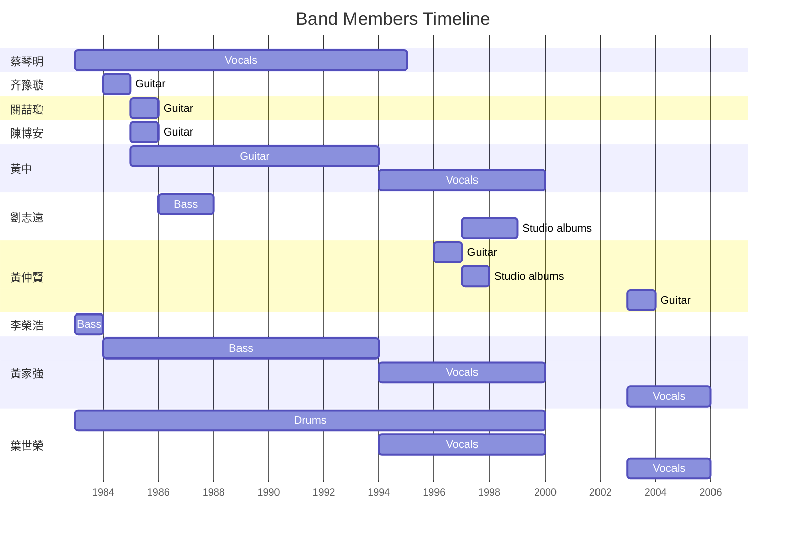

**Beyond**是一支香港摇滚乐团，1983年成立，原为地下乐队，于1987年开始迈入香港主流乐坛，其后凭着多首脍炙人口的经典歌曲如《大地》、《真的爱你》、《光辉岁月》、《海阔天空》等成为华语乐坛其中一队最具影响力的香港乐队。乐队成立以来以原创歌曲为卖点，在香港乐坛盛行改编歌曲的时期，Beyond各成员借着自己创作的音乐作品走红于香港乐坛，并通过编制包装和曲风迎合主流使其普及。

1992年，Beyond为了拓展自己的音乐到更多亚洲地区，开始进军日本及台湾发展，但由于Beyond的主音及作曲人黄家驹在1993年6月24日因参加日本富士电视台一档综艺节目时意外重创头部逝世，因此结束了以Beyond的四人时期，翌年转为三人继续发展。1999年，Beyond成员开始个人发展，2003年曾短暂重组，惟最后于2005年正式解散。

## 名称由来

乐队名字“Beyond”（解作“超越”）是由创队成员兼主音吉他手邓炜谦所改，Beyond是要表达他们要“超越”自己的意思，不过时常被误会是要超越某位歌手或乐队。[^1]

而在1998年出版的乐队自传《拥抱Beyond岁月》中，鼓手叶世荣解释，由于乐队喜爱自己创作，有别于当时其他乐队多数翻唱外国乐队的作品，故“Beyond”有超越一般乐队所涉足的音乐领域的意思，但叶世荣重申，Beyond不是要超越他人，而是要超越自己。[^2]

## 成员

1980年8月，吉他手黄家驹经位于土瓜湾下乡道的嘉林琴行老板介绍下认识鼓手叶世荣，联同邓炜谦（主音吉他）及李荣潮（贝斯）组成乐队，这支乐队也是Beyond的雏型。1983年，为了参加《吉他杂志》举办的比赛，Beyond正式组成，经过几次人事变动后，1984年，黄家驹的弟弟黄家强加入成为贝斯手；1985年，主音吉他手黄贯中加入。同年，Beyond在坚道的明爱中心自资举办《永远等待演唱会》，翌年再推出自资卡式带《再见理想》，之后在经理人陈健添（Leslie Chan）的协助下，从地下音乐正式进入商业流行乐坛。[^2]

1986年，刚从浮世绘解散的成员，键琴手及吉他手刘志远加入成为第五名队员。1988年4月30日，刘退出后，乐队一直维持在四人状态，亦是乐队的“光辉岁月”。1993年，年仅31岁的黄家驹于日本拍摄游戏节目时发生意外，昏迷6日后离世，此后，乐队以三人组合继续发展到2005年。

### 乐队成员

| **成员** | **出生日期** | **在籍时期** | **主要岗位** | **其他岗位** | **简介** |
| --- | --- | --- | --- | --- | --- |
| **主要成员** | | | | | |
| 黄家驹 | (1962-06-10)1962年6月10日  卒：1993年6月30日(1993-06-30)（31岁） | 1982-1993 | 主唱 | 节奏电吉他手、 | \- **创队队员**  \- 乐队的核心成员及领袖  \- 乐队的创作重心，包括曲、词、编、监、唱等多个范畴  \- 乐队分支Unknown队员  \- 认识李荣潮在先，后因叶世荣和关宝璇召募贝斯手时被带同应约而认识二人[^2]  \- 后认识了邓炜谦，并介绍叶世荣和李荣潮给他认识，成为了Beyond的雏型[^1]  \- 家中排行第四，- 中五毕业 |
| 黄贯中 | (1964-03-31) 1964年3月31日（62岁） | 1985-1993   1993-1999、2003-2005 | 主音吉他   主唱、主音吉他 | 主音、和音   和音 | \- 接替陈时安，**第4任吉他手**。  \- 四子中最迟加入的队员  \- 为乐队首个演唱会设计海报及场刊而认识  \- 乐队举办首个演唱会前2个月才被邀请加入当临时吉他手，顶替离队的陈时安  \- 乐队分支高速啤机队员  \- 家中排行最大，有两弟，二弟为Anodize（亚龙大）、The Postman吉他手黄贯其  \- 中学会考一优二良，前香港理工学院（现：香港理工大学）设计系毕业[^3] |
| 黄家强 | (1964-11-13) 1964年11月13日（61岁） | 1984-1993   1993-1999、2003-2005 | 贝斯   主音、贝斯 | 主音、和音   和音 | \- 接替李荣潮，**第2任贝斯手**。  \- 当邓炜谦和李荣潮相继离队后，乐队缺人时被哥哥 - 乐队分支Unknown队员  \- 家中孻子，排行第五，黄家驹为其胞兄（二哥）  \- 中五毕业 |
| 叶世荣 | (1963-08-19) 1963年8月19日（62岁） | 1983-1993   1993-1999、2003-2005 | 鼓   主音、鼓 | 敲击乐器、和音 | \- **创队队员**  \- 乐队分支高速啤机队员  \- 中六时与关宝璇召募贝斯手时认识了李荣潮及黄家驹[^2]  \- 后经黄家驹介绍下认识了邓炜谦[^1]  \- 乐队Band房二楼后座为其家人物业，初期只占单位中的一个小房间  \- 家中排行最大，有两妹  \- 预科毕业（中七） |
| **历代成员** | | | | | |
| 邓炜谦  （William Tang）  （William=邬林） | \- | 1983 | 主音吉他 | | \- **创队队员**，**第1任吉他手**。  \- 为乐队命名  \- 乐队分支 - 认识黄家驹在先，经他介绍下认识了叶世荣及李荣潮[^1] |
| 关宝璇  （Owen Kwan）  （Owen=欧文） | \- | 1984 | 主音吉他 | | \- 接替邓炜谦，**第2任吉他手**。  \- 与叶世荣召募贝斯手时认识了李荣潮及黄家驹[^2] |
| 陈时安 | (1962-12-00)1962年12月0日  卒：2022年1月20日(2022-01-20)（60岁） | 1984-1985  （约1年） | 主音吉他 | | \- 接替关宝璇，**第3任吉他手**。  \- 英语根底深厚，创作了多首英语歌曲，作品被认为且诗意及文学气息[^4]  \- 参与乐队英语作词  《Long Way Without Friends》  《Myth》  \- 乐队举办首个演唱会前因往外地升学而离队。 |
| 刘志远 | (1969-03-08) 1969年3月8日（57岁） | 1986-1988 | 主音吉他 | 键盘、和音 | \- 额外加入的成员，**第6位吉他手**。[^5]  \- 最年幼的队员  \- 五人时期的键琴手，吉他手  \- 加入前为二人乐队浮世绘队员，离队后不久亦重组  \- 与黄家强意见不合而离队，但后来已冰释前嫌  \- 参与乐队专辑  1987年《亚拉伯跳舞女郎》  1988年《现代舞台》  1997年《惊喜》  1998年《不见不散》  \- 参与乐队演出  2016年《家驹爱心延续慈善演唱会》1首歌  2017年《围炉音乐会》2首歌 |
| 李荣潮 | \- | 1983 | 贝斯 | | \- **创队队员**，**第1任贝斯手**。  \- 认识黄家驹在先，后来叶世荣和关宝璇召募贝斯手时带同黄家驹应约[^2]  \- 后经黄家驹介绍下认识了邓炜谦 |
| **支援成员** | | | | | |
| 黄仲贤 | 1964年12月 | 专辑 :  1997  演唱会 :  1996  2003  2005 | 主音吉他 | | \- 参与制作专辑  1997年《惊喜》  \- 参与支援演唱会  1996年《Beyond的精彩演唱会》[^6][^7]  2003年《Beyond超越Beyond演唱会》[^8]  2005年《Beyond The Story演唱会》[^9]  2016年《黄家驹爱心延续慈善演唱会》[^10][^11] |

### 成员在籍时间线

此图准确度以年为单位

**※较幼线代表以支援身份参与**（刘志远、黄仲贤）

### 解散后活动纪录

| 演唱会 | 2008年[^12] | 2009年[^13] | 2016年[^14] | 2017年[^15] |
| --- | --- | --- | --- | --- |
| **主要演出** | | | | |
| 黄贯中 | ✅ | ✅ | ✅ | ✅ |
| 黄家强 | ✅ | ✅ | | |
| 叶世荣 | ✅ | | ✅ | ✅ |
| **嘉宾演出** | | | | |
| 刘志远 | | | ✅ | ✅ |
| **支援演出** | | | | |
| 黄仲贤 | | | ✅ | |

## 发展历程

八十年代初，黄家驹与叶世荣经土瓜湾嘉林琴行的老板介绍结识并成为好友，并发觉彼此都受英国摇滚乐影响，音乐取向一致，于是合组乐队，负责主音吉他的邓炜谦把乐队命名“**Beyond**”。

### 1983–1986年：地下时期

#### 1983年

乐队组建后，参加了《吉他杂志》所举办的“Players Festival香港吉他／乐队大赛”，以歌曲《脑部侵袭 BRAIN ATTACK》获得冠军（Best Group Award）。当时的Beyond并未有固定的班底，他们同时又和其他乐队合作，像黄家驹、黄家强和当时尚未成立的太极乐队吉他手邓建明、唐奕聪、朱翰博组成Laser乐队[^16]；黄家驹、黄家强、邓建明三人也组成了NASA乐队。当年Beyond创作的歌曲，如《大厦》、《脑部侵袭》等，以英文歌词和纯音乐为主，曲风都是艺术摇滚（Art Rock），较讲求技术，着重音乐上的变化。1983年底，李荣潮与邓炜谦相继离队，其后黄家驹之弟黄家强与关宝璇加入，分别担任贝斯手与主音吉他手。

#### 1984年

在“香港吉他／乐队大赛”获奖后，成员一边工作，一边创作音乐，乐队偶尔在一些酒吧等地方作小型演出。

《吉他杂志》集合了电吉他／乐队大赛优胜组合灌录了一张名为《香港》的黑胶唱片，当中有Beyond的两首英文原创歌曲《脑部侵袭 BRAIN ATTACK》和《大厦 BUILDING》。

当年Beyond的作品仍是以英文歌曲为主，包括《Long Way Without Friends》（这歌其后被改成中文歌《东方宝藏》收录在《亚拉伯跳舞女郎》唱片里，而英文版本则收录于《孤单一吻》盒带内）和《Myth》；之后也开始尝试用粤语创作歌曲，例如《永远等待》。

#### 1985年

这时Beyond的成员为黄家驹、黄家强、叶世荣和陈时安。

1985年Beyond在坚道明爱中心自资举辨他们的第一个演唱会，乐队电吉他手陈时安举办首个演唱会前因往外地升学而离队，由黄贯中顶替，成为第4任电吉他手。

#### 1986年

对音乐的狂热，让Beyond又完成了另一创举：租录音室，将自己创作的歌曲做成名为《再见理想》的专辑盒带；从唱片的包装设计，到录制配唱，到找唱片行寄卖等等，完全一手包办。

当时乐队需要额外一名吉他手分担主音歌手在现场表演的工作，乐队浮世绘前成员刘志远在叶世荣的引荐下加入了Beyond乐队，担任键盘手兼吉他手。

是年Beyond和小岛、达明一派合录了一张盒带《劲歌金曲》，其中收录了他们的四首歌曲；Beyond和小岛也在七月份应台北泛亚音乐节之邀到台北参与演出，因为他们的音乐颇受欢迎，他们是当中唯一加场演出的乐队。

同时，叶世荣和黄贯中与邓炜谦、马永基组成一支重金属乐队——高速啤机，这也是Beyond的分支乐队，以玩票性质参加一些地下音乐会的演出，并参加了八六年度“嘉士伯流行音乐节”。Beyond也于本年正式签下Kinn's Music Ltd，为进军流行乐坛做准备，条件是陈健添在宝丽金高层关维麟及陈汝雄（德哥）的首肯下，与Kinn's共同拥有母带版权，同时负责唱片的发行。

### 1986–1988年：五人时期

虽然Beyond已经成立多年，但直至1987年推出首张EP《永远等待》及第二张专辑《亚拉伯跳舞女郎》后，才开始踏入香港主流乐坛为人认识。

#### 1987年

Beyond出第一张EP《永远等待》，其中《昔日舞曲》、《Water Boy》及标题歌《永远等待》随即成为的士高的热门歌曲；而《昔日舞曲》还曾走上香港电台流行榜，并被电视台拍成MTV，这也是Beyond第一首作品被拍成MTV；这张EP，成了他们前进流行乐坛的跳板。不过实际上Beyond仍未被大众接受，他们的装扮更被评得一文不值；当时的Beyond，就走在这吃力不讨好的两难局面中：旧日的追随者指责他们背弃理想和原则走向商业化，而初接触的又批评他们过于前卫；他们在首次接受港台DJ车淑梅访问中，亦被取笑是否常被称作“长毛飞”。

此时乐队风正在流行，香港爆发劲Band浪潮：达明一派、太极、风云、Beyond、小岛等二十余支劲旅震撼流行乐坛；Beyond称这不是复苏，而是一场音乐革命，他们对未来寄予厚望。

同年7月，Beyond发行第一张非自资的专辑大碟《亚拉伯跳舞女郎》（《阿拉伯跳舞女郎》）。唱片封面取景自新加坡，是一张充满中东风情的专辑；在音乐上他们有特别的表现，但在形像上却再次受到严厉的批评。Beyond正尝试寻找介于商业和摇滚之间的平衡点，不过，这倒让他们成了非主流中的主流音乐；他们在音乐中加入了多一些的电子元素，使音乐比较柔和，易于让人接受。除主题曲夺得流行榜冠军外，《无声的告别》和《孤单一吻》也相继打入排行榜。不过销售成绩仍欠理想，Beyond的命运仍是未知数。

10月，Beyond在高山剧场举行了“Beyond超越亚拉伯”演唱会，虽然仅只一场，但Beyond当时只出版了一张专辑，在短短的十个月内便能够成功举办了一个有二千人入坐的买票专场演唱会，成绩殊不简单。自此之后，经理人陈健添为他们接下不少演出工作，各大小商业典礼都有他们的踪迹，这无疑是成功的商业策略，但对于Beyond自身来说，便显得无奈。

#### 1988年

Beyond的音乐风格和形象仍然未能为大众接受，唱片销量并不理想，在当时的偶像组合团体横行年代，曾一度被社会认为是反叛与非主流的一个团体。1988年3月推出专辑《现代舞台》，重新收录了《旧日的足迹》，音乐走向较以前柔和，有些歌曲走流行路线，Beyond式的慢板情歌也于这时出现，如《冷雨夜》、《天真的创伤》，讽刺社会的《现代舞台》，是Beyond开始批判社会现象的开始，黄贯中和黄家强首次有了自己的主唱歌曲。不过这张专辑的销量也欠佳，而经纪人也对他们言明如果专辑再不卖，他们就没有发片的机会了。

1988年2月，Beyond发行了一张《旧日足迹》精选集。

1988年4月30日，在大专会堂举办了一场苹果牌Beyond演唱会，黄家驹在歌曲《再见理想》开始前说了一段话并宣布有关刘志远将会退出乐队的消息，“Beyond的五子时代”结束[^17]。刘志远其后更与梁翘柏重组乐队“浮世绘”，乐迷一直猜疑刘志远离队的原因。直至2008年6月的媒体访问中，刘志远才坦承当年与贝斯手黄家强意见不合，一时意气下决定离队。[^18][^19]

也许是有即将不再发片的忧患意识，但同一时间华纳从宝丽金旗下的新艺宝挖走太极乐队，在陈少宝的介入下，Beyond终于签约新艺宝唱片公司，而Beyond因应市场作出“妥协”，歌曲走向更加“商业化”。Beyond成员被要求作出各种改变，例如把头发剪短及西装等重新包装，务求要一洗反叛青年的形象。第三张专辑《秘密警察》更尝试走向大众化，重新收录四人合唱的《再见理想》，而合唱歌曲也成了他们最受欢迎的风格之一；《大地》有着强烈东方色彩的Rock，更是深深的唱入了听众的心，成了Beyond的第一首经典名曲；而《喜欢你》成了极受欢迎的情歌之一。这张专辑销量理想，获得双白金的佳绩，而专辑内的《喜欢你》、《大地》亦成为当时的流行歌曲，Beyond更凭借《大地》一曲获选1988年度十大劲歌金曲，首次夺得电子传媒的奖项，又与达明一派、小岛乐队合作录制了香港摇滚史上第一张混音作品集，Beyond的混音加长版作品共三首，即《过去与今天Remix》、《孤单一吻Remix》、《昔日舞曲Remix》。

是年2月，香港电台为六十周年台庆推出纪念杂锦大碟，其中收录了Beyond与达明一派、Blue Jeans蓝战士、Fundamental、Raidas、太极、CoCos共七支乐队合唱的《劲Band super jam（特别即兴）》，这是香港摇滚乐坛唯一一首串烧合唱歌；同时Beyond也为达明一派的大碟《你还爱我吗》担任两首歌的和音。

是年10月15日至16日，Beyond前往北京首都体育馆举办演唱会，成为最早在中国大陆演唱的香港乐队。由于Beyond是以唱粤语歌为主，所以一般大陆听众并未接受，但Beyond仍成功的办完了这场演唱会。

虽然歌曲渐为大众受落，但这些并非Beyond真正喜欢的音乐类型，加上当时部分地下时期追随的乐迷批评他们失去乐队原有的风格，故被骂为“摇滚叛徒”，这段日子Beyond过得并不容易。

### 1989–1991年：香港时期

不过Beyond并没有理会外人的指责，黄家驹表示，他们知道自己在做什么，要在商业化的香港市场玩自己真正喜欢的音乐，就必须先打响乐队的知名度，更多人听Beyond的歌之后，就会玩回自己喜欢的音乐。于是，乐队成员陆续接拍电视剧及电影，甚至做节目主持，更进一步自行塑造青春健康的形象，吸引不少年轻乐迷。

真正推Beyond上高峰的，是1989年以歌颂母爱为题材的《真的爱你》。

《真的爱你》一曲大举成功，被广大家庭观众欢迎及接受（香港媒体粤语俗称为“入屋”）。

#### 1989年

Beyond于北京办完演唱会，返港后参加了电影《黑色迷墙》的配乐工作，并为其演唱主题曲《午夜迷墙》（收录在EP《Beyond 四拍四》）。

4月，推出第四张EP《Beyond 四拍四》。

7月，推出第四张专辑《Beyond IV》，其中以歌颂母爱为题的《真的爱你》（电影《开心鬼救开心鬼》 插曲）夺得当年的十大劲歌金曲及十大中文金曲两大奖项，由于歌曲大热，其后专辑《Beyond IV》获得双白金奖。

此时Beyond的发展更为广泛，音乐的商业色彩也更显浓厚，音乐风格与前一大碟《秘密警察》截然不同。Beyond也开始成为人们眼中的偶像乐队，香港导演杜琪峰也邀请他们参演《吉星拱照》（周润发、张艾嘉领衔主演）及创作和演唱主题歌《午夜怨曲》。

11月，Beyond与宝丽金参加台湾“永远的朋友”演唱会，第一次演唱国语歌曲。

12月，在伊利沙白体育馆举行七场“真的见证演唱会”，随后，发行第五张粤语专辑《真的见证》，收录了多首他们为其他歌手创作的歌曲。

#### 1990年

Beyond乐队接拍了为乐队度身打做剧本的电影《开心鬼救开心鬼》的演出，并为其演唱主题曲《战胜心魔》和《文武英杰宣言》；应邀为“绿色一代新主张”写了一首《送给不知怎去保护环境的人（包括我）》，又为电影《天若有情》演唱了插曲，并跟同为配乐的华语音乐教父罗大佑结下交情，还举办了澳门万人劲Rock音乐会。同年9月推出的粤语专辑《命运派对》更获得三白金佳绩（逾15万张唱片销量）；专辑内的《光辉岁月》和《俾面派对》亦分别夺得当年的十大劲歌金曲和十大中文金曲，黄家驹更凭《光辉岁月》一曲夺得十大劲歌金曲的“最佳填词奖”。

这年他们正式向东南亚进军，发行了首张国语大碟《大地》，值得一提的是《文武英杰宣言》的国语版（并未收录在此张专辑中）。而同年也出了一张大碟《命运派对》，其中的《俾面派对》是讽刺演艺圈光怪陆离的现象；而在这张专辑中，有不少关怀第三世界的歌曲，如《光辉岁月》就是家驹为南非第一位黑人总统曼德拉致敬所写的；家驹也凭借《光辉岁月》成为了年度最佳填词人。本年Beyond也成为了香港世界宣明会的代言人；反对种族歧视，希望世界和平，一直是Beyond的心愿。 Beyond也开始一点一滴，朝着国际化迈进。

Beyond一向爱好和平，并以自己的音乐向人们呼唤和争取和平，指引人们用爱驱散世上罪恶的战争。 1990年海湾战争后，世界进入了一个相对的短暂和平时期。家驹便写了《Amani》这首歌，《Amani》是Beyond非洲之行回来创作的，歌曲表达一种对战争的控诉，感慨战争最大的受害者是无辜天真的儿童的情感，呼吁和平。《Amani》是非洲的语言，大意是和平，当时黄家驹只用十分钟就写好了这首歌的副歌部分，抒发了对战后和平长久的渴望，也警示了人们必须要以自己的努力斗争来争取和平，一味地求助于神灵是不行的。这首歌堪称是颂和平歌之最。同时，Beyond成为香港世界宣明会的代言人。

#### 1991年

Beyond应世界宣明会之邀到非洲等地去探访第三世界的穷困人民，并成立了一个第三世界基金；4月发行了第二张国语专辑《光辉岁月》，并在台湾举行了一个小型的演唱会，这是他们继1986年演出之后，另一个在台湾的现场演出；同时电影公司为他们量身定做了一部《Beyond日记之莫欺少年穷》的励志电影，而他们也为电影创作了《谁伴我闯荡》、《不再犹豫》等多首歌曲；7月22日，参加由香港电台举办的慈善活动“太阳计划”，并演唱歌曲《太阳的心》；同年，成为香港世界宣明会的代言人。2月1日至8日，应世界宣明会之邀，前往非洲探访第三世界的穷困人民，并成立第三世界基金，7月7日，参加第四届太阳计划音乐会，并演唱主题曲；7月27日，参加由香港演艺界发起的“忘我大汇演”活动，并演唱歌曲《大地》；8月，义务出演电影《豪门夜宴》，所得款项捐给华东水灾灾区。同年，Beyond为无线电视（香港电视广播有限公司）主持一个为其度身订做的暑期综艺节目《Beyond放暑假》，在其中访问歌手及演出短剧等；黄家强和黄贯中参与电视台剧集《淘气双子星》，主题曲更由Beyond包办，自传式音乐特辑《劲BAND四斗士》；第七张专辑《犹豫》使他们被人批评为最商业的一张专辑，叶世荣也有了一首自己主唱的歌曲，即《完全的拥有》。同年9月，Beyond推出广东话专辑《犹豫》，获得双白金的成绩。专辑内Beyond在非洲之旅后由黄家驹创作的《Amani》，表达对非洲之行后的感想，更流露出他对和平的憧憬。 Beyond亦凭此曲夺得当年的十大中文金曲。他们又踏上香港歌手心目中最佳的演唱会圣地——红磡香港体育馆，举办了“生命接触演唱会”，更是活跃于香港的辉煌时期。然而在Beyond的坚持原创精神及摇滚风格被广泛接纳时，在充满不自由的音乐创作及表演环境中，计划远赴外地，开拓香港以外的原创音乐市场。 在年底的一个偶然的机会，他们在NHK（日本放送协会）的节目上出现，签约为Amuse经纪人。

### 1992–1993年：日本时期

#### 1992年

年初，Beyond结束了与新艺宝4年合作的关系转投华纳唱片，并长居日本，正式进军日本乐坛，积极开拓市场。与前几年相比，前半年他们沉寂了不少，香港乐坛似乎少了Beyond的踪迹。成为国际化的乐队，一直是Beyond的遥远梦想；如今梦想有了实现的机会，他们便努力抓住。不过日本对于音乐制作上的严格要求，加上语言不通，他们颇为消沉了一阵子，但为了让香港音乐能在日本乐坛上发出一点光，他们仍是十分努力，于是一张与以往Beyond音乐不同的专辑《继续革命》出现了。他们的形像也从亲切温和而转变为冷酷高调；《长城》更被邀请到日本音乐大师喜多郎制作片头音乐；整张专辑编曲华丽漂亮，让人耳目一新。不过由于沉寂了一段时间，使他们的声势有点下坠。

1992年底，Beyond在台湾发行了第三张国语专辑《信念》，重新签约滚石为其发行国语唱片。此外，Beyond还担任嘉宾录制了综艺节目《暑假玩到尽》；7月11日在香港海洋公园停车场举办了“Salem劲Band摇摆夜”；8月11日，在香港荃湾大会堂举办了“继续革命”音乐会。从年中推出的这些专辑中，可见Beyond创作曲风已和新艺宝时期有明显区别。不过Beyond的国语唱片在台湾一直叫好不叫座；他们为打入日本市场积极努力，不过成绩平平。

#### 1993年

Beyond结束了在台湾的宣传期，赴日本去创作新专辑为着在日本发行新专辑而努力。 5月初，他们回到了香港，带回《乐与怒》这张专辑。 Beyond对这张专辑非常满意，在录音及编曲上也更为自由；《海阔天空》这首充满了Beyond十年心路历程的歌曲，在本年成了本地最佳原创歌曲。随后Beyond在香港和马来西亚各举办了一场大型不插电的演出， 分别系5月2日，于香港电台举办的“我哋呀Unplugged音乐会”；5月27日，在吉隆坡国家室内体育馆举办的“马来西亚Unplugged音乐会”和5月28日在＂新山＂所举办的“Unplugged音乐会”；并在6月25日推出了日语单曲遥かなる梦に～Far away～。

1993年是他们成立十周年的日子，年底也打算举办一场纪念十周年的大型演唱会。可是谁也没有想到，在1993年6月24日凌晨，乐队于日本东京富士电视台录制著名游戏节目《想做什么，就做什么（日语：ウッチャンナンチャンのやるならやらねば!）》时发生意外，主音歌手黄家驹从舞台不慎坠下，头部着地重伤昏迷，在东京女子医科大学医院留医6日后，于1993年6月30日下午4时15分（该时间为日本当地时间，而香港当地时间是当天下午3时15分）与世长辞，终年31岁。这对于Beyond是一个沉重而悲惨的打击。家驹一直是乐队的主要唱作人，整张专辑词曲，大部分都是由家驹包办，而他一离开，也为Beyond的命运带来重大转折。

收录于《乐与怒》专辑的歌曲《海阔天空》，成为了Beyond最后一首由黄家驹主唱的派台作品，亦是黄家驹客死异乡以后的绝响；而其他黄家驹遗作有《情人》、《为了你，为了我》等作品。 Beyond亦凭《海阔天空》一曲夺得当年的十大中文金曲及叱咤乐坛流行榜 —— “叱咤乐坛我最喜爱的本地创作歌曲大奖”。

Beyond于日本的两年期间，共计推出两张日语大碟《超越》、《This Is Love 1》，以及三张日语细碟《The Wall～长城～》、《リソラバ～International～》、《くちびるを夺いたいc/w 遥かなる梦に～Far away～》。

12月，Beyond三子参加创作人音乐会，这是Beyond三子在家驹离开后，第一次在舞台上表演。

### 1994–1999年：三人时期

#### 1994年

1994年，三人阵容的Beyond签约香港滚石唱片后，开始灌录第十张粤语专辑《二楼后座》。这张专辑试图延续之前的曲风，阿Paul的唱腔，也开始转为愤怒呐喊；家强不自觉的和家驹的唱腔接近；《醒你》这首批评香港乐迷盲目崇拜偶像的歌曲使得他们被受争议。其后另外推出了两张日语大碟《Second Floor》、《遥かなる梦 Beyond 1992-1995》及两张日语细碟《Paradise》、《アリガトウ》。与Amuse的合约结束后，Beyond没有推出日语专辑，集中火力在香港及台湾市场。签约滚石后，推出国语专辑《Paradise》同时在香港发行。同年成立了Beyond Publishing Co Ltd 自行管理歌曲版权，唱片公司负责发行。他们的形像也开始改变，走另类乐队的路线。

#### 1995年

Beyond和Jim Lee开始合作，远赴美国洛杉矶、加拿大温哥华等地录制新专辑，于6月底发行新专辑《Sound》，也于香港文化中心举行了一场大型的户外演出，以光纤电缆将演唱会实况传送到各大商场。Beyond极注重吉他方面的表现，及音乐上的丰富性；而在专辑中加入一首纯音乐，也是从此时开始。他们留心电子音乐的发展，三人乐队的音乐形态就此成型。《教坏细路》这首抨击TVB的歌曲，也为他们带来和TVB间的嫌隙；香港的节目上，他们的宣传大减。11月，Beyond在台湾发行了第五张国语专辑《Love & Life》（《爱与生活》），创作了四首全新的国语歌曲，并且办了三场名为“土洋大战”的音乐会。不过这张专辑的销售量不佳，使Beyond隔两年半才推出新国语大碟。同年Beyond也远赴韩国参加音乐活动，受到当地歌迷的欢迎。之后，乐队开始走向电子音乐。

#### 1996年

3月，Beyond在香港体育馆举行黄家驹去世后的首个大型演唱会《Beyond的精彩演唱会》。这四场演唱会展示Beyond依然强大的实力和乐队顽强不屈的生命力。在最后一场演唱会上，黄家强含泪清唱《祝您愉快》并演奏《海阔天空》给远方的哥哥，感动台下所有歌迷，成为华语乐坛史上最感人的场面之一。办完演唱会后，乐队沉寂了一段时间。同年Beyond将自己多年以来一直使用的Band房“二楼后座”改建为录音室，使他们成为了一支有自己录音室的乐队，此后他们着手培训新人，拿到本年度的最佳团体金奖，摆脱了长久以来都是拿银奖的命运，成为香港民众票选最爱的乐队。

#### 1997年

Beyond经过漫长的时间后，终于推出了大碟《请将手放开》。整张大碟充满了试验性，Beyond的音乐也开始溶入迷幻电子音乐；《请将手放开》、《大时代》那种表现香港末世纪心态的歌曲，写得十分出色；他们也为保护动物基金会及聋人基金会写了歌曲，分别是《谁命我名字》和《回响》，不过《回响》被批评有Oasis的味道；《吓！讲乜嘢话》被指模仿Anodize的歌曲；不过整张专辑是在“二楼后座”录音室录制的，这是Beyond的自傲之处。

年底，他们又发行了一张大碟《惊喜》，Beyond的电子音乐风格仍在这张专辑中呈现。Beyond试着在唱腔上改变，想给歌迷全新之感；不过乐评人却觉得Beyond的音乐逐渐走向“黄贯中+黄家强+叶世荣”的感觉，而纯摇滚音乐也似乎不复以往；《回家》是写香港人回归后心态的歌；《雾》、《深》这类印象派歌曲，成了Beyond的新特色；而世荣用Drum Loop创作的《无事无事》，更展现了他们音乐上的另一种新风貌；在纯音乐方面，Beyond亦交出了精彩作品。而他们也积极的录制国语专辑。同年还在九龙高山剧场举办了“摇摆预备Show”。

#### 1998年

2月20日，农历年过后，Beyond再度发行新国语大碟《这里那里》。他们在台宣传也比上一张专辑多了一些。

3月14日，Beyond办了场演唱会，歌迷除了台湾的，更有来自香港和韩国的，这让台湾媒体也见识到Beyond的魅力；后于同年4、5月份在台湾参加了几场校园演唱，他们希望能打入台湾市场的心情可见一斑。4月份在香港出了一张精选辑，《管我》这首歌改成了粤语版，并请香港各大学的乐队来参与配唱。

7月，美国华纳电影邀请Beyond为其即将上演的电影《轰天炮4》演唱主题曲。

9月，台湾发行了一张精选辑《Beyond Files》。而年底，他们推出全新粤语大碟《不见不散》。

#### 1999年

3月7日，Beyond在新城电台的主导下举办了一场纪念十五周年的“Beyond 2000”演唱会；不过由于音响不佳，主办单位的失职，歌迷们颇有指责。8月，在台湾台北市立体育馆举办了“夏日音乐高峰会”；11月发行专辑《Good Time》；12月圣诞节举行了“Good Time”演唱会并宣布暂时解散，三人各自开始发展自己的音乐事业。

三人时期的作品中，除了《抗战二十年》是黄家驹的作品，三人时期的Beyond作品风格亦有所改变，比四人时期的Beyond更大胆、更创新。

### 2000–2002年：暂时解散及个人发展

这段期间，三人各有不同的发展。主音吉他手黄贯中与几位好友组成了自己的乐队“汗”，且推出四张专辑、两张EP和一张国语专辑，另外亦是三位成员中唯一一位在香港体育馆举行个人大型演唱会；至于黄家强，先后推出三张个人专辑和一张现场录音专辑，并于2004年成立个人音乐品牌“Picasso Horses”（《毕加索的马》），除了歌唱事业外，黄家强近年也从事幕后制作和经理人的工作，协助旗下乐队Kolor制作首张专辑；鼓手叶世荣方面，他分别在2001年和2003年推出个人EP，2005年才推出首张个人专辑《叶子红了》，和另外两位成员不同的是叶世荣比较少在香港进行发展，目标放在中国大陆的市场。叶世荣偶然亦会客串电视剧及电影。

### 2003–2005年：半复合时期

#### 2003年

2003年4月，Beyond为纪念乐队成立20周年，再次聚首举行五场《Beyond超越Beyond演唱会》。虽然演唱会举行期间正值SARS肆虐，演唱会仍然顺利举行，还得到不错的口碑，同年六月再加开三场。三子并把黄家驹一首遗作重新编曲出版，成为纪念周年作《抗战二十年》，推出纪念EP《Together》（《同在》）。乐队举办了首次世界巡回演唱会，并先后在中国内地、北美洲和东南亚等地区演出。巡回结束后Beyond再次活跃于乐坛之中，另外并参加了不少音乐会的演出。

#### 2004年

2004年，Beyond乐队凭电影《无间道II》主题曲《长空》荣获当年香港电影金像奖之“最佳电影原创歌曲奖”。然而这首歌曲却成为Beyond解散前最后一首原创音乐。同年11月，乐队公开宣布因三人音乐理念不同、再加上对香港乐坛的不满等问题，决定第二年举办世界巡回演唱会后正式解散。然而当时有些媒体却指出，乐队解散的真正原因是因为黄家强和黄贯中两人之间的恶劣关系。在2014年，黄家强正式在微博证实此事。[^20]

#### 2005年

2005年Beyond举行“Beyond The Story Live 2005”世界告别巡回演唱会，最后一站为新加坡。乐队解散后，三人继续以“音乐人”姿态发展自己的音乐事业。

### 2006–今：解散后

#### 2008年

2008年6月10日，黄家驹46岁生忌当天，黄贯中、黄家强、叶世荣于《别了家驹十五载——海阔天空音乐会》上再度同台演出。而盛传不和的两位成员黄家强与黄贯中亦在台上拥抱。之后黄贯中于一个活动透露，Beyond是否复合不是自己能决定，亦要顾及另外两位队员及其公司意向。黄贯中亦表示自己对于Beyond复合没有太大的问题。

同年，部分只有黄家驹哼唱作曲而从未出版的遗作得到重新填词，并由黄家强主唱，制作成《弦续——别了家驹15载》纪念专辑，歌曲有《无人的演奏》、《他的吉他》、《奥林匹克》、《We Are The People》等。

#### 2009年

2009年7月24日至26日，黄家强与黄贯中于香港体育馆举行《This is Rock n Roll 一生乐与怒》演唱会，这个演唱会被视为Beyond复合的一个好机会。至于另一名战友叶世荣则因为档期不合而没有加入。三场演唱会气氛高涨，顺利完成。

#### 2010年

2010年，Beyond入选华语金曲奖30年经典评选中全部奖项，包括“30年30人”、“30年30碟”（以《乐与怒》入选）及“30年30歌”（以《海阔天空》入选）。这是Beyond解散后以乐队名义所获得的最高奖项。

#### 2015年

2015年，叶世荣有意于年底以三人形态再度站到台上开骚，宣传黄家驹对爱的理念，黄贯中方面看似有意参与，但黄家强仍毅然否决。

2015年5月25日，黄家强再表示，Beyond缘已尽，重组已无可能。[^21]

#### 2016年

2016年6月10日，黄家驹54岁寿辰当天，《家驹爱心延续慈善演唱会》举行，刘志远、黄贯中、叶世荣3人重聚，3人同台演出歌曲为《再见理想》1首。[^22]而Beyond御用吉他手黄仲贤亦有参与。[^10][^23]

#### 2017年

2017年6月22日，由大陆四川卫视原创出品的《围炉音乐会》大型音乐故事秀节目，刘志远、黄贯中、叶世荣3人再次重聚，演出多首Beyond作品，其中刘志远参与《灰色轨迹》、《光辉岁月》2首。[^24]

#### 2022年

2022年1月20日，精通英语的第3任吉他手陈时安因病去世，享年59岁。[^25]

2022年4月12日，滚石唱片于2011年9月上传YouTube的名曲《海阔天空》MV，于YouTube点击突破1亿。[^26][^27]

## 影响

2008年由香港电台制作的《不死传奇——黄家驹》纪念特辑中，记述了Beyond的音乐90年代在中国内地、大中华地区的流行情况。缺乏开拓市场的宣传活动、电台媒体播放或互联网流传下，内地Beyond歌迷单靠以复制卡式录音带的方式将Beyond的音乐在民间流传，纵使Beyond的歌曲普遍以粤语而非国语歌唱，而Beyond的音乐却深深打进了正藉改革开放时期的年青人心扉。这彰显Beyond的音乐感染力无远弗届，亦应验了“音乐无疆界，是不受语言或地域限制的艺术”，有受访者甚至称呼主唱黄家驹为艺术家，并非单纯的偶像。

Beyond对后辈的音乐影响也颇大，内地组合羽泉的陈羽凡、水木年华、董成鹏、马来西亚歌手曹格、台湾歌手周蕙、乐队八三夭、香港歌手谢霆锋等都因他们而投身音乐当中。全华语歌手公开翻唱粤语歌曲次数也是全香港歌手最高。

Beyond的音乐题材广泛且影响力深远，当中的经典作品如社会国家题材的《大地》、《长城》；亦有宣扬和平大爱精神的世界观如《Amani》、《光辉岁月》，至今仍历久不衰，被不同媒体或活动中采用播放；《海阔天空》的音乐影片是影片分享网站YouTube上观看次数最多的粤语音乐影片。

授权改编自《光辉岁月》的励志歌曲《大学问》，由香港填词人林夕重新以国语填词，为中国广东省汕头大学的毕业礼歌曲。

在非情歌为题的粤语流行音乐类型中，《真的爱你》成为华人社会中歌颂母爱和母亲节的经典之一。

2008年汶川大地震，香港演艺人协会选用《海阔天空》作为了中国版的《We Are the World》——刘德华为这首歌谱写了国语版歌词，取名《承诺》，并于“演艺界512关爱行动”由两岸三地群星演唱，作为筹款赈灾的主题曲之用。

同年北京奥运会，刘翔因伤退赛时，场内突然播起《海阔天空》；2013和2015年，广州恒大足球队两次夺得亚冠联赛锦标时，天河体育场内都唱起了它。

2017年，有香港人在足球赛事前播放国歌时喝倒采[^28]，指出《海阔天空》在“雨伞运动”时曾试过万人大合唱，产生共鸣，认为《义勇军进行曲》不能代表香港，建议应以《海阔天空》或另一位歌手罗文的《狮子山下》代替，反映《海阔天空》在已被大众推崇为“香港精神”的代表曲之一。

同年，有关摇滚梦想主题的中国电影《缝纫机乐队》在最后一场戏中找来了千人现场合唱歌曲《不再犹豫》来致敬，叶世荣和黄贯中亦有客串参与。

## 音乐作品

Beyond曾发行过粤语、英语、国语及日语的歌曲。

乐队成立初期的歌曲以英语为主，不久便开始创作粤语歌曲以推动香港粤语摇滚乐坛。乐队成名后为打入华语地区而制作国语歌曲，作品主要是将歌曲的粤语版本翻译成国语版本。1992年，乐队进军日本市场，部分歌曲亦是由粤语版本翻译成日语版本。

-   详细请见Beyond歌曲对照表

### 专辑

全部专辑为乐队原创作品。

#### 粤语

| **次序** | **发行日期** | **专辑名称** | **发行厂商** | **销量** | **附注** |
| --- | --- | --- | --- | --- | --- |
| **四子时期** | | | | | |
| \- | 1986年3月 | 再见理想 | 独立发行 | 800盒 | **乐队首张自资专辑**，以盒带形式只发行共800盒 |
| **五子时期** | | | | | |
| 1 | 1987年7月17日 | 亚拉伯跳舞女郎 | Kinn's Music Ltd. | 约20000张 | **乐队首张专辑** |
| 2 | 1988年2月27日 | 现代舞台 | Kinn's Music Ltd. | 约20000张 | 刘志远离队前最后一张参与的专辑 |
| **四子时期** | | | | | |
| 3 | 1988年9月6日 | 秘密警察 | 新艺宝唱片 | 白金唱片 | |
| 4 | 1989年7月11日 | Beyond IV | 新艺宝唱片 | 双白金 | |
| 5 | 1989年12月5日 | 真的见证 | 新艺宝唱片 | 白金 | |
| 6 | 1990年9月6日 | 命运派对 | 新艺宝唱片 | 三白金 | |
| 7 | 1991年9月6日 | 犹豫 | 新艺宝唱片 | 双白金 | |
| 8 | 1992年7月10日 | 继续革命 | 华纳唱片 | 白金 | 加入华纳唱片的第一张专辑 |
| 9 | 1993年5月14日 | 乐与怒 | 华纳唱片 | 四白金 | **黄家驹遗作** |
| **三子时期** | | | | | |
| 10 | 1994年6月4日 | 二楼后座 | 滚石唱片 | 双白金 | 首张由滚石唱片制作和发行的粤语专辑 |
| 11 | 1995年6月15日 | Sound | 滚石唱片 | | |
| 12 | 1997年4月8日 | 请将手放开 | 滚石唱片 | 金唱片 | |
| 13 | 1997年12月19日 | 惊喜 | 滚石唱片 | | 前成员刘志远、支援成员黄仲贤参与制作 |
| 14 | 1998年12月 | 不见不散 | 滚石唱片 | | 前成员刘志远参与制作 |
| 15 | 1999年11月 | Good Time | 滚石唱片 | | |

#### 国语

| **次序** | **发行日期** | **专辑名称** | **发行厂商** | **销量及附注** |
| --- | --- | --- | --- | --- |
| **四子时期** | | | | |
| 1 | 1990年10月 | 大地 | 新艺宝唱片 | 白金 |
| 2 | 1991年4月 | 光辉岁月 | 新艺宝唱片 | |
| 3 | 1992年12月4日 | 信念 | 滚石唱片 | 首张由滚石唱片制作和发行的国语专辑 |
| 4 | 1993年9月9日 | 海阔天空 | 滚石唱片 | **黄家驹未完成的遗作** |
| **三子时期** | | | | |
| 5 | 1994年7月13日 | Paradise | 滚石唱片 | |
| 6 | 1995年10月27日 | 爱与生活 | 滚石唱片 | |
| 7 | 1998年2月20日 | 这里那里 | 滚石唱片 | |

#### 日语

| **次序** | **发行日期** | **专辑名称** | **发行厂商** | **附注** |
| --- | --- | --- | --- | --- |
| 1 | 1992年9月26日 | 超越（专辑） | Fun House | |
| 2 | 1993年7月25日 | This Is Love 1 | Fun House | **黄家驹未完成的遗作** |
| 3 | 1994年12月19日 | Second Floor | Fun House | |

### EP

全部EP为乐队原创作品。

| **发行日期** | **名称** | **发行厂商** | **附注** |
| --- | --- | --- | --- |
| **五子时期** | | | |
| 1987年1月2日 | 永远等待 | 宝丽金唱片、Kinn's Music Ltd. | |
| 1987年8月 | 新天地 | Kinn's Music Ltd. | |
| **四子时期** | | | |
| 1989年4月9日 | 四拍四 | 新艺宝唱片 | 收录获得第9届香港电影金像奖“最佳电影歌曲”提名的电影《黑色迷墙》主题曲《午夜迷墙》 |
| 1990年6月 | 天若有情 | 新艺宝唱片 | 收录电影《天若有情》主题曲及插曲 |
| 1990年7月 | 战胜心魔 | 新艺宝唱片 | 收录乐队主演电影《开心鬼救开心鬼》主题曲及插曲 |
| 1993年1月7日 | 无尽空虚 | 华纳唱片 | |
| **三子时期** | | | |
| 1996年2月14日 | Beyond得精彩 | 滚石唱片 | |
| 1998年7月 | Action | 滚石唱片 | |
| 2003年4月 | Together | EMI | |

### 单曲

全部单曲为乐队原创作品。

| **发行日期** | **名称** | **语言** | **发行厂商** | **附注** |
| --- | --- | --- | --- | --- |
| **五子时期** | | | | |
| 1987年9月 | 孤单一吻 | 粤语 | Kinn's Music Ltd. | |
| **四子时期** | | | | |
| 1992年7月25日 | The Wall c/w Only Heaven Knows（无语问苍天） | 日语、粤语 | Fun House | |
| 1992年9月2日 | リゾ・ラバ ～International～ c/w The Morning Train（早班火车） | 日语、粤语 | Fun House | |
| 1993年6月25日 | 我想夺取你的唇 c/w 遥远的梦～Far away～ | 日语 | Fun House | 收录〈完全地爱吧〉及〈海阔天空〉日文版  **黄家驹遗作** |
| **三子时期** | | | | |
| 1994年11月2日 | Paradise c/w 冷雨没暂停 | 日语 | Fun House | |
| 1995年3月15日 | 谢谢 c/w 祝您愉快 | 日语 | Fun House | 退出日本市场前的单曲 |

### 合辑

| **发行日期** | **专辑名称** | **语言** | **发行厂商** | **收录乐队作品** | **附注** |
| --- | --- | --- | --- | --- | --- |
| 1984年9月 | 香港 | 粤语 | 郭达年 | 脑部侵袭、大厦 | 香港吉他比赛冠军精英辑 |
| 1988年3月 | 香港电台六十周年纪念 | 粤语 | \- | 劲Band Super Jam | 与Blue Jeans、太极乐队、Fundamental、Cocos、Raidas、达明一派合唱 |
| 1990年4月 | 新艺宝五周年 | 粤语 | 新艺宝唱片 | 太阳的心 | 1990年7月22日，香港电台“太阳计划”主题曲 |
| 1992年5月 | 华纳群星难忘您许冠杰 | 粤语 | 华纳唱片 | 半斤八両 | 纪念许冠杰荣休重新编曲翻唱致敬作品 |
| 1999年9月8日 | Love Our Bay | 多语 | 滚石唱片 | Love Our Bay（英语）、  Love Our Way（国语） | 日本发行  **Beyond with Funky末吉（日语：ファンキー末吉）**名义 |
| 2000年 | 超级Band Band Band | 汉语 | 滚石唱片 | Run Free、我害怕 | 台湾发行 |

### 精选辑

-   粤语
    -   《旧日足迹精选集》（1988年12月）
    -   《昔日今日明日金曲》（1990年11月）
    -   《Tracking》（1991年）
    -   《Control》（1992年）
    -   《Recognition》（1992年6月）
    -   《精选辑 ENCORE》（1992年10月）
    -   《遥望黄家驹不死音乐精神 特别纪念集92~93》（1993年7月）
    -   《各有各精彩 13周年纪念版》（1996年3月）
    -   《Play Back 自典 字典》（1997年4月）
    -   《Files!》（1998年）
    -   《The Best Of Beyond》（1999年）
    -   《原来》（1999年12月）
    -   《全部》（2000年）
    -   《一世》（2000年）
    -   《Millennium》（2000年1月）
    -   《Beyond精选滚石香港黄金十年》（2003年2月）
    -   《最动听的Beyond》（2004年2月）
    -   《劲Band四斗士Beyond音乐特辑1990》（2004年6月）
    -   《Beyond The Ultimate Story》（2005年1月）
    -   《Beyond 25th Anniversary》（2008年3月）
    -   《大地 20周年》（2011年1月）
    -   《Beyond 音乐大全101 (5CD + DVD)》（2011年9月）
    -   《Beyond 30th Anniversary》（2013年7月）
    -   《MULTIVERSE OF CINEPOLY 40TH ANNIVERSARY - Beyond》（2025年9月）
-   日语
    -   《遥かなる梦 Beyond 1992-1995》（1995年5月）
    -   《The Best Of Beyond》（1999年）

### 演唱会专辑

-   《Beyond 台北演唱会》（1986年演出，1997年发行台北演唱会现场专辑）
-   《Beyond 超越亚拉伯演唱会》（1987年10月4日演出，1993年发行该演唱会现场专辑）
-   《Beyond 北京演唱会》（1988年10月15日-16日演出，该演唱会现场专辑有3种不同版本）
-   《Beyond 真的见证演唱会》（1989年12月5日-11日于伊利沙伯体育馆举行，该演唱会现场专辑发行时间1999年5月）
-   《Beyond 1990 澳门万人劲Rock音乐会》（1990年演出，收录于1999年《真的beyond III》）
-   《Beyond Live 1991 生命接触演唱会》（1991年9月19日-23日演出，12月发行该演唱会现场专辑）
-   《Word & Music-Final Live With 家驹》（1993年8月）
-   《祝您愉快演唱会》（滚石群星怀念家驹）（1994年7月）
-   《Beyond 的精彩 Live & Basic》(1996年)
-   《Beyond Good Time Live Concert》（1999年，该演唱会现场专辑2001年发行）
-   《Beyond超越Beyond Live 2003》（2003年）
-   《Beyond The Story Live 2005》（2005年）

（注：其中《祝您愉快演唱会》这张演唱会专辑是滚石群星怀念家驹而开设的一场演唱会）

## 派台歌曲纪录（1987年至今）

| **派台歌曲成绩** | | | | | | |
| --- | --- | --- | --- | --- | --- | --- |
| 唱片 | 歌曲 | 903 | RTHK | 997 | TVB | 备注 |
| **1987年** | | | | | | |
| 亚拉伯跳舞女郎 | 亚拉伯跳舞女郎 | | **1** | | \- | **首支冠军歌** |
| 亚拉伯跳舞女郎 | 无声的告别 | | \- | | 10 | |
| 亚拉伯跳舞女郎 | 孤单一吻 | | 9 | | \- | |
| **1988年** | | | | | | |
| 现代舞台 | 旧日的足迹 | 21 | 7 | | 7 | |
| 现代舞台 | 天真的创伤 | 24 | \- | | \- | |
| 现代舞台 | 赤红热血 | 26 | \- | | \- | |
| 现代舞台 | 午夜流浪 | \- | \- | | \- | |
| 香港电台六十周年纪念（杂锦碟） | 劲Band Super Jam | \- | **1** | | 5 | 纪念香港电台广播六十周年歌曲，与Blue Jeans、太极乐队、Fundamental、Cocos、Raidas、达明一派合唱 |
| 秘密警察 | 冲开一切 | **1** | 10 | | 10 | |
| 秘密警察 | 大地 | **(1)** | 2 | | **1** | |
| 秘密警察 | 喜欢你 | 2 | \- | | 3 | |
| **1989年** | | | | | | |
| 四拍四 | 午夜迷墙 | 13 | / | | \- | |
| Beyond IV | **真的爱你** | **(1)** | **1** | | **1** | **三台冠军歌** |
| Beyond IV | 逝去日子 | 8 | \- | | 4 | 黄贯中主演、黄家强合演无线电视剧《淘气双子星》主题曲 |
| Beyond IV | 爆裂都市 | 6 | 4 | | **1** | |
| Beyond IV | 原谅我今天 | 11 | \- | | 8 | |
| 真的见证 | 岁月无声 | 8 | 10 | | 6 | 黄家驹作曲，第一版本由麦洁文主唱 |
| 真的见证 | 无悔这一生 | 5 | 5 | | 3 | 无线电视剧《香港云起时》主题曲 |
| **1990年** | | | | | | |
| 真的见证 | 午夜怨曲 | 11 | 12 | | **1** | |
| 命运派对 | 送给不知怎去保护环境的人（包括我） | 27 | \- | | \- | |
| 天若有情 | 灰色轨迹 | 9 | \- | | 6 | 电影《天若有情》插曲 |
| 战胜心魔 | 战胜心魔 | 12 | / | | 3 | 乐队主演电影《开心鬼救开心鬼》主题曲 |
| 命运派对 | 俾面派对 | 2 | **1** | | **1** | |
| 命运派对 | 怀念您 | 22 | \- | | \- | |
| 命运派对 | 光辉岁月 | **1** | 2 | | **1** | |
| 命运派对 | 两颗心 | 19 | \- | | \- | |
| 命运派对 | 无泪的遗憾 | 18 | \- | | \- | |
| **1991年** | | | | | | |
| 命运派对 | 可知道 | 18 | \- | | \- | |
| 犹豫 | Amani | 3 | **1** | | **1** | |
| 犹豫 | 不再犹豫 | 2 | **1** | | \- | 乐队主演电影《Beyond日记之莫欺少年穷》主题曲 |
| 犹豫 | 谁伴我闯荡 | \- | \- | | \- | 乐队主演电影《Beyond日记之莫欺少年穷》插曲 |
| 犹豫 | 系要听ROCK N' ROLL | \- | \- | | \- | |
| 犹豫 | 我早应该习惯 | \- | \- | | \- | 无线电视剧《横财3000万》主题曲 |
| 犹豫 | 谁来主宰 | \- | \- | | \- | 无线电视剧《笑傲在明天》主题曲 |
| **1992年** | | | | | | |
| 华纳群星难忘您许冠杰 | 半斤八両 | **1** | 7 | | \- | 原唱者为许冠杰，纪念其荣休重新编曲翻唱作品 |
| 继续革命 | **长城** | **1** | **1** | | **1** | **三台冠军歌** |
| 继续革命 | 遥望 | 5 | 5 | | 6 | |
| 继续革命 | 不可一世 | 13 | 13 | | \- | |
| 继续革命 | 继续沉醉 | 19 | \- | | \- | |
| 无尽空虚 | 点解．点解 | 13 | 17 | | \- | |
| **1993年** | | | | | | |
| 无尽空虚 | 无尽空虚 | 17 | \- | | \- | |
| 乐与怒 | 爸爸妈妈 | 6 | **1** | | \- | **黄家驹遗作** |
| 乐与怒 | 海阔天空 | 7 | 3 | | \- | **黄家驹遗作** |
| 乐与怒 | 情人 | \- | \- | | \- | **黄家驹遗作** |
| **1994年** | | | | | | |
| 二楼后座 | 遥远的Paradise | 6 | 6 | \- | \- | **纪念黄家驹的作品** |
| 二楼后座 | 醒你 | 3 | 7 | **1** | \- | |
| 二楼后座 | 打救你 | 18 | \- | \- | \- | |
| 二楼后座 | 总有爱 | 22 | \- | \- | \- | |
| **1995年** | | | | | | |
| Sound | 教坏细路 | 13 | \- | \- | \- | |
| Sound | 叹息 | 4 | 7 | \- | \- | |
| Sound | 缺口 | **(1)** | 10 | \- | \- | |
| Sound | 门外看 | **1** | \- | \- | \- | |
| Sound | 困兽斗 | 24 | \- | \- | \- | |
| 爱与生活 | Love | 19 | \- | \- | \- | |
| **1996年** | | | | | | |
| Beyond得精彩 | 想你 | **1** | 2 | **(1)** | \- | |
| Beyond得精彩 | 活着便精彩 | **(1)** | **1** | **1** | \- | **三台冠军歌** |
| Beyond得精彩 | 太空 | **1** | \- | \- | \- | |
| **1997年** | | | | | | |
| 请将手放开 | 请将手放开 | \- | 17 | \- | \- | |
| 请将手放开 | 预备 | **1** | 4 | \- | \- | |
| 请将手放开 | 谁命我名字 | **1** | \- | \- | \- | |
| 惊喜 | 回家 | **1** | \- | \- | \- | |
| 惊喜 | 雾 | **{1}** | 4 | \- | \- | |
| **1998年** | | | | | | |
| 惊喜 | 惊喜 | **1** | \- | \- | \- | |
| Play Back 自典 字典 | 别怪我 | 12 | \- | \- | \- | |
| 不见不散 | 奉信 | **1** | \- | \- | \- | |
| Action | 打不死 | \- | 12 | 3 | \- | |
| Action | 喜欢一个人 | 20 | \- | 9 | \- | |
| 不见不散 | 牺牲 | **1** | 9 | **1** | \- | |
| **1999年** | | | | | | |
| 不见不散 | 不见不散 | 5 | \- | **1** | \- | |
| 不见不散 | 扯火 | 14 | \- | \- | \- | |
| Good Time | Good Time | **1** | 6 | **1** | \- | |
| **2000年** | | | | | | |
| Good Time | 十八 | 3 | \- | \- | \- | |
| **2003年** | | | | | | |
| Together | 抗战二十年 | **1** | 12 | 9 | \- | **乐队成立20周年作品** |
| 无间道II电影原声大碟 | 长空 | 7 | \- | \- | \- | 电影《无间道II》主题曲，获第23届香港电影金像奖最佳原创电影歌曲 |

| **各台冠军歌总数** | | | | |
| --- | --- | --- | --- | --- |
| 903 | RTHK | 997 | TVB | 备注 |
| **20** | **8** | **7** | **8** | **四台冠军歌总数：3**[^29] |
| 26 | 9 | 7 | 8 | 冠军周数 |

-   仍在榜上（\*）
-   两星期冠军（**(1)**）
-   四星期冠军（**{1}**）

## 演唱会

Beyond是继温拿乐队、太极乐队及达明一派之后，第四队在香港体育馆举行演唱会的本地乐队。

注：仅列出大型或具特别意义的演唱会，个人时期演唱会请参见各队员条目

| **日期** | **名称** | **地区** | **场地** | **附注** |
| --- | --- | --- | --- | --- |
| **四子时期** | | | | |
| 1985年7月20日 | Beyond永远等待演唱会 | 香港 | 坚道明爱中心 | 自资，首个演唱会 |
| **五子时期** | | | | |
| 1986年4月 | 剖析聚会 | 香港 | 中环艺穗会 | 自资，2场 |
| 1986年8月23日-25日 | 台北演唱会 | 台湾 | 台北荣星公园 | 首届亚太流行音乐节  8月23日-24日与小岛乐队同场演出  8月25日为加开的专场演出 |
| 1986年11月29日 | Baleno Pop Rock Show | 香港 | 九龙高山剧场 | “Baleno / 班尼路”赞助的两场小型摇滚音乐会，11月28日表演乐队 (小岛 & 太极) + 11月29日表演乐队 (Beyond & Chyna) |
| 1987年10月4日 | Beyond超越亚拉伯演唱会 | 香港 | 九龙高山剧场 | |
| 1988年4月30日 | 苹果牌Beyond演唱会 | 香港 | 九龙大专会堂 | |
| **四子时期** | | | | |
| 1988年10月15日-16日 | 香港Beyond演唱会 | 中国大陆 | 北京首都体育馆 | 2场 |
| 1988年12月26日 | Beyond连锁歌迷唱聚 - 心内演唱会 - 心外演唱会 | 香港 | 九龙大专会堂 | 2场  宣传乐队散文集《心内心外》 |
| 1989年12月5日-11日 | Beyond真的见证演唱会 | 香港 | 伊利沙伯体育馆 | 7场 |
| 1991年9月19日-23日 | Beyond生命接触演唱会 | 香港 | 红磡香港体育馆 | 5场，首个红馆演唱会 |
| 1991年11月24日 | Beyond马来西亚演唱会 | 马来西亚 | 吉隆坡国家室内体育馆 | |
| 1992年7月11日 | Salem劲Band摇滚夜 | 香港 | 香港海洋公园 | 赴日本发展后首次回港开演唱会，首次发表新歌《长城》 |
| 1992年8月11日 | Beyond继续革命音乐会 | 香港 | 荃湾大会堂 | 商业二台主办 |
| 1993年5月2日 | Beyond我哋呀！Unplugged音乐会 | 香港 | 香港电台1号录音室 | 香港电台第二台节目《音乐同志》主办  **黄家驹最后一个香港演唱会** |
| 1993年5月27日 | Beyond Unplugged Live演唱会 | 马来西亚 | 吉隆坡国家室内体育馆 | **华纳发行演唱会录影带** |
| 1993年5月28日 | Beyond Unplugged Live演唱会 | 马来西亚 | 柔佛新山室内体育馆 | **黄家驹最后一个演唱会** |
| **三子时期** | | | | |
| 1996年3月3日-3月6日 | Beyond的精彩Live&Basic演唱会 | 香港 | 红磡香港体育馆 | 4场，**黄家驹逝世后首个红馆演唱会** |
| 1996年5月31日 | Beyond的精彩大马演唱会 | 马来西亚 | 吉隆坡默迪卡体育场 | |
| 1999年3月7日 | Beyond"2000"演唱会 | 香港 | | 新城电台主办 |
| 1999年12月24日-26日 | Beyond Good Time演唱会 | 香港 | 香港会议展览中心新翼 | 3场 |
| 1999年12月31日 | Beyond世纪末马来演唱会 | 马来西亚 | 云顶云星剧场 | |
| 2003年4月29日-5月4日 | Beyond超越Beyond演唱会 | 香港 | 红磡体育馆 | 5场 |
| 2003年6月21日-6月23日 | Beyond超越Beyond演唱会II | 香港 | 红磡体育馆 | 3场（加场） |
| 2003年8月23日 | Beyond超越Beyond演唱会（世界巡回） | 中国大陆 | 北京工人体育场 | |
| 2003年10月11日 | Beyond超越Beyond演唱会（世界巡回） | 马来西亚 | 吉隆坡默迪卡体育场 | |
| 2003年11月15日 | Beyond超越Beyond演唱会（世界巡回） | 中国大陆 | 广州天河体育场 | |
| 2003年11月21日 | Beyond超越Beyond演唱会（世界巡回） | 中国大陆 | 上海体育场 | |
| 2003年11月27日 | Beyond超越Beyond演唱会（世界巡回） | 美国 | 大西洋城 | |
| 2003年12月4日 | Beyond超越Beyond演唱会（世界巡回） | 加拿大 | 多伦多 Niagara Arena | |
| 2003年12月8日 | Beyond超越Beyond演唱会（世界巡回） | 加拿大 | 温哥华Queen Elizabeth Theatre | |
| 2003年12月20日 | Beyond超越Beyond演唱会（世界巡回） | 中国大陆 | 深圳体育场 | |
| 2005年1月27日-2月1日 | Beyond The Story Live 2005 | 香港 | 香港体育馆 | 6场，告别演唱会 |
| 2005年4月9日 | Beyond The Story Live 2005（世界巡回） | 美国 | 大西洋城 | |
| 2005年4月16日 | Beyond The Story Live 2005（世界巡回） | 加拿大 | 多伦多 | |
| 2005年5月27日 | Beyond The Story Live 2005（世界巡回） | 中国大陆 | 北京首都体育馆 | |
| 2005年5月29日 | Beyond The Story Live 2005（世界巡回） | 中国大陆 | 黑龙江人民体育场 | |
| 2005年6月3日 | Beyond The Story Live 2005（世界巡回） | 中国大陆 | 沈阳五里河体育场 | |
| 2005年6月11日 | Beyond The Story Live 2005（世界巡回） | 中国大陆 | 天津体育中心 | |
| 2005年7月16日 | Beyond The Story Live 2005（世界巡回） | 中国大陆 | 长沙贺龙体育场 | |
| 2005年7月22日 | Beyond The Story Live 2005（世界巡回） | 中国大陆 | 郑州清华园体育馆 | |
| 2005年8月27日 | Beyond The Story Live 2005（世界巡回） | 中国大陆 | 重庆中心体育场 | |
| 2005年9月3日 | Beyond The Story Live 2005（世界巡回） | 中国大陆 | 上海大舞台 | |
| 2005年9月7日 | Beyond The Story Live 2005（世界巡回） | 中国大陆 | 武汉新华路体育场 | |
| 2005年9月16日 | Beyond The Story Live 2005（世界巡回） | 中国大陆 | 杭州黄龙体育中心 | |
| 2005年9月23日 | Beyond The Story Live 2005（世界巡回） | 中国大陆 | 昆明拓东体育场 | |
| 2005年10月15日 | Beyond The Story Live 2005（世界巡回） | 新加坡 | | |

## 演出

### 电视剧

| **日期** | **名称** | **制作单位** | **黄家驹** | **黄贯中** | **黄家强** | **叶世荣** | **附注** |
| --- | --- | --- | --- | --- | --- | --- | --- |
| 1987年 | 小说家族  \- 单元故事《对倒》[^30] | 香港电台 | 街头歌手  （客串） | 街头乐手  （客串） | | | 剧内演唱了《金属狂人》及《飞越苦海》，分别收录于乐队1986年自资专辑《再见理想》及1987年EP《永远等待》内。 |
| 1987年8月 | 暴风少年  \- 单元故事《黑仔强》[^31] | 香港电台 | 孪毛  （客串） | 黑仔强  （**主演**） | | | “孪毛”一角官方字幕版为“鬈毛”  主题曲《过去与今天》由Beyond主唱，为乐队首次主唱的电视主题曲，收录于1987年专辑《亚拉伯跳舞女郎》内。 |
| 1989年6月 | 淘气双子星 | 无线电视 | | 查星宙  （宙仔）  （**主演**） | 杨有智  （YY博士）（**主演**） | | 主题曲《逝去日子》及第8集片尾曲《与你共行》由Beyond主唱，两曲收录于1989年专辑《Beyond IV》内。 |

### 音乐特辑

| **日期** | **名称** | **制作单位** | **附注** |
| --- | --- | --- | --- |
| 1989年10月 | 够Hit斗玩Beyond加草蜢 | 无线电视 | 与草蜢合演 |
| 1990年10月 | Beyond特辑之劲Band四斗士 | 无线电视 | 故事根据乐队真实历史改编而成 |

### 综艺节目

| **日期** | **名称** | **制作单位** | **附注** |
| --- | --- | --- | --- |
| 1991年7月9日–  1991年9月24日  （逢星期二晚播放） | Beyond放暑假 | 无线电视 | 共12集  主题曲《高温派对》收录于1991年专辑《犹豫》内 |
| 1992年 | 暑假玩到尽 | 无线电视 | |

### 电影

| **日期** | **名称** | **黄家驹** | **黄贯中** | **黄家强** | **叶世荣** | **附注** |
| --- | --- | --- | --- | --- | --- | --- |
| 1983年 | 半边人 | （客串） | | | （客串） | 与早期成员邓炜谦、李荣潮参与客串演出 |
| 1986年 | 恋爱季节 | 乐队客串演唱 | | | | 演唱《永远等待》 |
| 1987年3月 | 肝胆相照 | 乐队客串演唱 | | | | |
| 1987年10月 | 靓妹正传 | 乐队客串演唱 | | | | 5人时期成员刘志远有份参与演出  演唱了《昔日舞曲》，歌曲收录于1987年EP《永远等待》内 |
| 1989年 | 黑色迷墙 | 乐队客串演唱 | | | | 电影主题曲及配乐由乐队负责制作  **主题曲《午夜迷墙》更获得第9届香港电影金像奖“最佳电影歌曲”提名**  歌曲同时收录于1989年EP《四拍四》及1989年专辑《Beyond IV》内 |
| 1990年1月 | 吉星拱照 | 游向东 | 游向南 | 游向西 | 游向北 | |
| 1991年 | 忍者龟 | （配音） | （配音） | （配音） | （配音） | |
| 1990年6月 | 开心鬼救开心鬼 | **Behind乐队** 文 | **Behind乐队** 杰 | **Behind乐队** 英 | **Behind乐队** 武 | **乐队主演电影**  主题曲《战胜心魔》及插曲《文武英杰宣言》收录于1989年EP《战胜心魔》内  歌曲《战胜心魔》同时收录于1990年专辑《命运派对》内 |
| 1991年7月 | Beyond日记之莫欺少年穷 | **Begin乐队** 吴驹 | **Begin乐队** 谭贯中 | **Begin乐队** 陈志强 | **Begin乐队** 林世荣 | **乐队主演电影**  主题曲《不再犹豫》及插曲《谁伴我闯荡》收录于1991年专辑《犹豫》内 |
| 1991年11月 | 豪门夜宴 | 客串 | 客串 | 客串 | 客串 | 香港演艺界为1991年华东水灾筹款的电影  乐队以吉他及鼓为粤曲《帝女花》 伴奏 |
| 1992年 | 忍者龟II | （配音） | （配音） | （配音） | （配音） | |
| 1992年 | 笼民 | 毛仔 | | | | **黄家驹遗作**  电影曾夺得第12届香港电影金像奖最佳电影、最佳导演、最佳编剧等多个奖项 |
| 2004年9月 | 墨斗先生 | | 劫匪  （客串） | 巴士司机  （客串） | David  （客串） | |
| 2009年 | 同门 | | 咖啡  （帮派大佬） | | | |
| 2011年 | 开心魔法 | | | | 毕家辉 | |
| 2013年 | 狂舞派 | | 太极大师 | | | |
| 2013年 | 古惑仔：江湖新秩序 | | 邓智勇  （大佬B） | | | |
| 2014年 | 末日派对 | | 健豪  （警探）  （**主演**） | | | 别名为《命运派对》，与1990年专辑同名 |

## 历年奖项及荣誉

### 无线电视：十大劲歌金曲颁奖典礼

Beyond曾连续3年夺得“十大劲歌金曲”。

-   1988年度劲歌金曲（第四季季选）：大地
-   1988年度十大劲歌金曲颁奖典礼
    -   十大劲歌金曲：大地
-   1989年度劲歌金曲（第二季季选）：真的爱你
-   1989年度十大劲歌金曲颁奖典礼
    -   十大劲歌金曲：真的爱你
-   1989年度劲歌金曲（第三季季选）：逝去日子
-   1989年度劲歌金曲（第四季季选）：岁月无声
-   1990年度劲歌金曲（第一季季选）：午夜怨曲
-   1990年度劲歌金曲（第三季季选）：战胜心魔
-   1990年度劲歌金曲（第四季季选）：光辉岁月
-   1990年度十大劲歌金曲颁奖典礼
    -   十大劲歌金曲：光辉岁月
    -   最佳填词：光辉岁月（黄家驹）
-   1991年度劲歌金曲（第二季季选）：Amani
-   1992年度劲歌金曲（第三季季选）：长城
-   1993年度十大劲歌金曲
    -   荣誉大奖：黄家驹

### 香港电台：十大中文金曲颁奖音乐会

Beyond曾夺得4首“十大中文金曲”。

-   1987年度第十届十大中文金曲颁奖音乐会
    -   最有前途新人奖（八强）：Beyond
-   1989年度第十二届十大中文金曲颁奖音乐会
    -   十大中文金曲：真的爱你
-   1990年度第十三届十大中文金曲颁奖音乐会
    -   十大中文金曲：俾面派对
-   1991年度第十四届十大中文金曲颁奖音乐会
    -   十大中文金曲：Amani
-   1993年度第十六届十大中文金曲颁奖音乐会
    -   十大中文金曲：海阔天空
    -   无休止符纪念奖：黄家驹
-   2002年度第二十五届十大中文金曲颁奖音乐会
    -   金曲银禧荣誉大奖：Beyond

### 商业电台：叱咤乐坛流行榜颁奖典礼

Beyond曾夺得7次“叱咤乐坛组合：银奖”（1988-1995，1993年除外），并分别连续4年夺得“叱咤乐坛组合：金奖”（1996-1999）及连续5年夺得“叱咤乐坛我最喜爱的组合：金奖”（1996-2000）。

-   1988年度叱咤乐坛流行榜颁奖典礼
    -   叱咤乐坛组合：银奖（上榜歌曲：旧日的足迹、天真的创伤、赤红热血、喜欢你、**冲开一切**、**大地**）
-   1989年度叱咤乐坛流行榜颁奖典礼
    -   叱咤乐坛组合：银奖（上榜歌曲：午夜迷墙、逝去日子、爆裂都市、原谅我今天、岁月无声、无悔这一生、**真的爱你**）
-   1990年度叱咤乐坛流行榜颁奖典礼
    -   叱咤乐坛组合：银奖（上榜歌曲：无悔这一生、午夜怨曲、送给不知怎去保护环境的人(包括我)、灰色轨迹、战胜心魔、俾面派对、怀念您、两颗心、无泪的遗憾、**光辉岁月**）
-   1991年度叱咤乐坛流行榜颁奖典礼
    -   叱咤乐坛组合：银奖（上榜歌曲：无泪的遗憾、可知道、Amani、不再犹豫）
-   1992年度叱咤乐坛流行榜颁奖典礼
    -   叱咤乐坛组合：银奖（上榜歌曲：遥望、不可一世、继续沉醉、点解．点解、**半斤八两**、**长城**）
-   1993年度叱咤乐坛流行榜颁奖典礼
    -   叱咤乐坛我最喜爱的本地创作歌曲大奖：海阔天空
-   1994年度叱咤乐坛流行榜颁奖典礼
    -   叱咤乐坛组合：银奖（上榜歌曲：遥远的Paradise、醒你、打救你、总有爱）
-   1995年度叱咤乐坛流行榜颁奖典礼
    -   叱咤乐坛组合：银奖（上榜歌曲：教坏细路、叹息、困兽斗、Love、**缺口**、**门外看**）
-   1996年度叱咤乐坛流行榜颁奖典礼
    -   叱咤乐坛组合：金奖（上榜歌曲：**想你**、**活着便精彩**、**太空**）
    -   叱咤乐坛我最喜爱的组合：Beyond
-   1997年度叱咤乐坛流行榜颁奖典礼
    -   叱咤乐坛组合：金奖（上榜歌曲：**预备**、**谁命我名字**、**回家**、**雾**）
    -   叱咤乐坛我最喜爱的组合：Beyond
    -   叱咤乐坛十周年大奖：Beyond
    -   叱咤殿堂十大作曲人：黄家驹
-   1998年度叱咤乐坛流行榜颁奖典礼
    -   叱咤乐坛组合：金奖（上榜歌曲：别怪我、喜欢一个人、牺牲、**雾**、**惊喜**、**奉信**）
    -   叱咤乐坛我最喜爱的组合：Beyond
-   1999年度叱咤乐坛流行榜颁奖典礼
    -   叱咤乐坛组合：金奖（上榜歌曲：不见不散、扯火、**牺牲**、**Good Time**）
    -   叱咤乐坛我最喜爱的组合：Beyond
-   2000年度叱咤乐坛流行榜颁奖典礼
    -   叱咤乐坛我最喜爱的组合：Beyond

### 新城电台：新城劲爆颁奖礼

-   -   1993年度新城劲爆颁奖礼
    -   新城劲爆组合金奖：Beyond
-   1994年度新城劲爆颁奖礼
    -   香港劲爆摇滚歌曲：醒你
    -   大学生眼中最受欢迎乐队：Beyond
    -   香港劲爆乐队╱组合：Beyond
-   1995年度新城劲爆颁奖礼
    -   香港劲爆摇滚歌曲：教坏细路
-   1996年度新城劲爆颁奖礼
    -   摇滚歌曲奖：活着便精彩
-   1997年度新城劲爆颁奖礼
    -   新城劲爆组合：Beyond
    -   新城劲爆摇滚：请将手放开
-   1998年度新城劲爆颁奖礼
    -   新城劲爆组合：Beyond
-   1999年度新城劲爆颁奖礼
    -   新城劲爆组合：Beyond

### 香港电影金像奖

-   1990年度第九届香港电影金像奖
    -   最佳电影歌曲（提名）：午夜迷墙《黑色迷墙》
-   2004年度第廿四届香港电影金像奖
    -   最佳原创电影歌曲：长空《无间道II》

### 其他

-   1983年《結他雜誌》Guitar Players Festival 吉他大赛：冠军[^1]
-   1994年第一届香港唱片设计大赏
    -   传媒最热爱封面歌手：二楼后座
-   1996年度有线至尊榜总选
    -   至尊广东歌：想你
    -   至尊最爱MTV奖
    -   至尊国语歌：活得精彩
-   2005年华语音乐传媒大奖：华语乐坛特别贡献乐队
-   2010年华语金曲奖30年经典评选：30年30人、30年30碟、30年30歌

## 评价

### 香港

-   刘卓辉：去了趟非洲回来就能写出《光辉岁月》和《Amani》这么好的歌曲，除了天才，还能说什么。

### 中国大陆

-   水木年华：Beyond的音乐影响了几代人，我们上学的时候偶像是Beyond，我们很喜爱他们的歌。1993年是我们最伤心的一年，因为我们的偶像黄家驹离我们远去，当我们听到Beyond要解散的消息时很心痛。家驹当时的创作条件很艰苦，只能工作一年取得一点经验和经济基础来创作音乐，我们很钦佩。2003年，在首都体育场，“Beyond二十年”北京演唱会，全场观众一起用粤语从头唱到尾，我相信这是任何一个台湾歌手、香港歌手都做不到的。很多歌手靠很高的曝光率维持人气，而Beyond在二十年后杀回北京，还有这么多人喜欢，足以证明他们的魅力。
-   赵明义（黑豹乐队鼓手） ：Beyond是一支非常了不起的乐队，很多人喜欢他们的音乐，更欣赏他们的精神。 1991年的时候，黑豹最初到香港发展，和Beyond签的是同一家经纪公司，所以我们已经是10多年的朋友了。Beyond从来不介意人们争论他们算不算摇滚，但是我觉得他们是最摇滚的，尤其是个性。
-   王小峰：2013年6月21日发文《Beyond：撒了一点人文佐料的心灵鸡汤》（页面存档备份，存于互联网档案馆）评价了beyond的音乐，称“从大众文化中寻找心灵慰藉是70后有别于60后的特征。80后没什么心灵，所以也无所谓鸡汤。90后无所谓心灵鸡汤，只要不是白开水就行”，引发争议。
-   黄霑＂华语金曲奖＂评 Beyond的音乐富有朝气、充满力量。他们的音乐旋律性很强，非常容易吸引歌迷，更难得的是他们的作品关注现实，对文化、人文、社会环境乃至政治都高度敏感。他们壹些作品的深刻思想意义是香港乐坛少有的，比如《光辉岁月》呼吁消除种族隔阂、《AMANI》指责战火的残酷并憧憬和平的前景、《海阔天空》直抒热爱自由的胸怀。他们将摇滚的“乐与怒”精神提升到了“和平与爱”的高度。

### 台湾

-   罗大佑曾在《家驹为什么会死》一文中写到 ：“不会再出一个黄家驹了，这样的人降临人世本来就是奇迹，上帝让黄家驹下凡，但是凡人没有珍惜他，反而谩骂他，诅咒他，结果，上帝把黄家驹收回了。上帝不会再派一个音乐天使下凡的。”

### 日本

-   Funky：Beyond的音乐至今对中国做乐队的后辈影响都非常大，我接触过很多乐队，都是听Beyond长大的，我觉得他们就是中国的甲壳虫乐队。前两个月，我去香港看Beyond的告别演唱会，看完后，我对他们说，这是你们这些年来演出最摇滚的一次。

### 马来西亚

-   曹格：黄家驹真的是一个很有才华的人，他不仅是一个歌手，更是一位诗人，他这么早离开实在是太过可惜了，而且Beyond在我心目中就是华人世界的Beatles！

[^1]: 《我与Beyond的日子》2010年 邓炜谦著
[^2]: Beyond官方自传《拥抱Beyond岁月》1998年 黄贯中、黄家强、叶世荣著
[^3]: 《時尚 Trendsmag》2004年9月號 - 黃貫中 男人四十. [2017-08-01]. （原始内容存档于2008-05-11）.
[^4]: 关栩溢. 〈Myth〉. 踏著Beyond的轨迹 I - 歌词篇. 香港: 非凡出版. 2023: P.36
[^5]: ①黄家驹②邓炜谦③关宝璇④陈时安⑤黄贯中⑥刘志远
[^6]: 《Beyond的精彩演唱會》. [1996]. （原始内容存档于2022-04-21）.
[^7]: 43:48 叶世荣正式介绍黄仲贤
[^8]: 《Beyond超越Beyond演唱會》. [2003]. （原始内容存档于2022-04-21）.
[^9]: 《Beyond The Story演唱會》. [2005]. （原始内容存档于2022-04-21）.
[^10]: 《黃家駒愛心延續慈善演唱會》. [2016-06-10]. （原始内容存档于2022-04-21）.
[^11]:  36:33 黄仲贤solo...等等
[^12]: 《别了家驹十五载——海阔天空音乐会》
[^13]: 《This is Rock n Roll 一生乐与怒》
[^14]: 《家驹爱心延续慈善演唱会》
[^15]: 《围炉音乐会》
[^16]: 太極前傳 (1979-85). [2020-03-16]. （原始内容存档于2020-04-07）.
[^17]: 劉志遠宣佈退出Beyond (1988年5月). [2024-05-27]. （原始内容存档于2024-05-27）.
[^18]: 《黄家驹逝世15周年专辑香港乐坛忆念家驹15年》《苹果日报》C10-C11版，2008年6月10日
[^19]: 黃家駒逝世15周年專輯 香港樂壇憶念家駒15年. 苹果日报. 2008-06-10 [2017-12-26]. （原始内容存档于2017-12-26）.
[^20]: 黃家強爆黃貫中8宗罪　揭Beyond解散真相. [2014-10-11]. （原始内容存档于2014-10-12）.
[^21]: 黃家強：Beyond已緣盡. [2016-02-28]. （原始内容存档于2016-05-04）.
[^22]: Beyond 黃家駒 愛心延續慈善演唱會 2016. [2016-06-10]. （原始内容存档于2022-04-21）.
[^23]: 36:33...等等
[^24]: Beyond三子重组！. [2017-06-22].
[^25]: Beyond早期成員陳時安去世，享年59歲。.
[^26]: 【《海闊天空》永垂不朽 破1億點擊 | 成為YouTube史上第一首破億點擊廣東歌】. [2022-04-12]. （原始内容存档于2024-04-02）.
[^27]: Beyond《海闊天空》成YT首支破億點閱廣東歌. [2022-04-15]. （原始内容存档于2022-04-16）.
[^28]: 再噓國歌　「00後」球迷冀唱《海闊天空》　「60後」球迷：丟架. [2020-09-25]. （原始内容存档于2020-08-21）.
[^29]: 包舍未设新城榜时期的三台冠军歌
[^30]: 香港電台 - 文藝港台 (第5集) - 1987年《小說家族》之《對倒》. [2017-09-23]. （原始内容存档于2017-09-23）.
[^31]: 香港電台 - 「光影我城」II (第28集) - 1987年《暴風少年》之《黑仔強》. [2017-09-23]. （原始内容存档于2017-09-23）.
