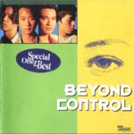

此條目介紹的是Beyond專輯。關於2019年電子遊戲，請見「**控制 (遊戲)**」。

| Control | Control |
| --- | --- |
|  | |
| <ContentLink uid="wiki/beyond">Beyond</ContentLink>的精選輯 | <ContentLink uid="wiki/beyond">Beyond</ContentLink>的精選輯 |
| 發行日期 | 1992年 |
| 類型 | 搖滾 粵語流行音樂 |
| 語言 | 粵語 |
| 唱片公司 | 新藝寶唱片 |

《**Control**》是<ContentLink uid="wiki/beyond">Beyond</ContentLink>在1992年1月發行Control新曲+精選。

## 曲目

1.  報答一生
1.  灰色軌跡
1.  大地
1.  歲月無聲
1.  與妳共行
1.  舊日的足跡
1.  Amani
1.  交織千個心
1.  光輝歲月
1.  未曾後悔
1.  冷雨夜
1.  懷念您
1.  再見理想
