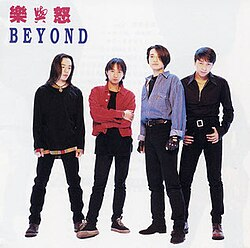

此條目的主題是Beyond的專輯《樂與怒》。關於音樂風格Rock and Roll，請見「**搖滾**」。

| 樂與怒 | 樂與怒 |
| --- | --- |
|  | |
| <ContentLink uid="wiki/beyond">Beyond</ContentLink>的錄音室專輯 | <ContentLink uid="wiki/beyond">Beyond</ContentLink>的錄音室專輯 |
| 發行日期 | 1993年5月14日，​33年前 |
| 錄製時間 | 1993年1月－4月 |
| 類型 | 搖滾、粵語流行音樂 |
| 語言 | 粵語 |
| 唱片公司 | 華納唱片 |
| 監製 | <ContentLink uid="wiki/beyond">Beyond</ContentLink>、梁邦彥 |
| <ContentLink uid="wiki/beyond">Beyond</ContentLink>專輯年表 | <ContentLink uid="wiki/beyond">Beyond</ContentLink>專輯年表 |

| <ContentLink uid="wiki/繼續革命">繼續革命</ContentLink> （1992年） | **樂與怒** （1993年） | <ContentLink uid="wiki/二樓後座">二樓後座</ContentLink> （1994年） |
| --- | --- | --- |

《**樂與怒**》是香港殿堂級搖滾樂隊<ContentLink uid="wiki/beyond">Beyond</ContentLink>發行第9張粵語專輯，亦是樂隊主音歌手<ContentLink uid="wiki/黃家駒">黃家駒</ContentLink>生前最後一張參與的專輯。[^1]

《樂與怒》是一張講究搖滾精神與實力的唱片，Beyond對這張專輯非常滿意，在錄音及編曲上也更為自由，1993年5月初由日本返回香港宣傳本專輯，5月2日在香港電台辦了一場Unplugged Live（原音樂演唱會）[^2]，並接受電台方面的訪問，期間透露一些心底話[^3]。樂隊於5月27日在馬來西亞吉隆坡亦辦了另一場Unplugged演唱會[^4]，並於演唱會末段宣佈擬在1994年初重回當地辦一次更大型的演唱會，於是結束了香港及馬來西亞的宣傳，匆匆回日本工作，1993年是Beyond成立十週年的日子，年底打算於香港辦一場紀念十週年的大型演唱會，怎料一個多月後黃家駒便意外身亡。[^5]

充滿Beyond十年心路歷程的主打歌《<ContentLink uid="wiki/海闊天空-beyond歌曲">海闊天空</ContentLink>》成為黃家駒最具代表性的遺作，歌曲及後於2008年被重新填詞為512關愛行動的主題曲；另外《海闊天空》與Beyond的《<ContentLink uid="wiki/命運派對">光輝歲月</ContentLink>》、《抗戰二十年》等均被視七一大遊行、「和平佔中」和「雨傘運動」等爭取自由民主的社會運動主題曲。[^6][^7][^8]<ContentLink uid="wiki/黃家強">黃家強</ContentLink>在香港電台《不死傳奇》的節目中透露，當年黃家駒在編寫《海闊天空》一曲時，曾將歌詞其中一句定為「也會怕有一天會跌倒 Oh Yeah」，但黃家強認為意思不對，遂修改為「……Oh No」，沒料到黃家駒在完成此曲後不足2個月真的意外身亡[^9]。

## 獎項

-   1993年度十大中文金曲頒獎典禮[^10]
    -   「十大中文金曲」：《海闊天空》
-   1993年度叱咤樂壇流行榜頒獎典禮
    -   「叱咤樂壇我最喜愛的本地創作歌曲大獎」：《海闊天空》
-   2010年華語金曲獎30年經典評選
    -   「30年30碟」
    -   「30年30歌」：《海闊天空》

## 曲目

| 次序 | 歌名 | 作曲 | 填詞 | 編曲 | 演唱 |
| --- | --- | --- | --- | --- | --- |
| 1. | 我是憤怒 | <ContentLink uid="wiki/黃家駒">黃家駒</ContentLink> | <ContentLink uid="wiki/黃貫中">黃貫中</ContentLink> | <ContentLink uid="wiki/beyond">Beyond</ContentLink>, 梁邦彥 | <ContentLink uid="wiki/黃家駒">黃家駒</ContentLink> |
| 2. | 爸爸媽媽 | <ContentLink uid="wiki/黃家駒">黃家駒</ContentLink> | <ContentLink uid="wiki/黃貫中">黃貫中</ContentLink> | <ContentLink uid="wiki/beyond">Beyond</ContentLink>, 梁邦彥 | <ContentLink uid="wiki/黃家駒">黃家駒</ContentLink> |
| 3. | 和平與愛 | <ContentLink uid="wiki/黃貫中">黃貫中</ContentLink> | <ContentLink uid="wiki/黃家強">黃家強</ContentLink> | <ContentLink uid="wiki/beyond">Beyond</ContentLink>, 梁邦彥 | <ContentLink uid="wiki/黃家駒">黃家駒</ContentLink> |
| 4. | 命運是你家 | <ContentLink uid="wiki/黃家駒">黃家駒</ContentLink> | <ContentLink uid="wiki/黃貫中">黃貫中</ContentLink> | <ContentLink uid="wiki/beyond">Beyond</ContentLink>, 梁邦彥 | <ContentLink uid="wiki/黃家駒">黃家駒</ContentLink> |
| 5. | 全是愛 (This Is Love) | <ContentLink uid="wiki/黃家駒">黃家駒</ContentLink> | <ContentLink uid="wiki/黃家駒">黃家駒</ContentLink> | <ContentLink uid="wiki/beyond">Beyond</ContentLink>, 梁邦彥 | <ContentLink uid="wiki/黃家駒">黃家駒</ContentLink> |
| 6. | <ContentLink uid="wiki/海闊天空-beyond歌曲">海闊天空</ContentLink> | <ContentLink uid="wiki/黃家駒">黃家駒</ContentLink> | <ContentLink uid="wiki/黃家駒">黃家駒</ContentLink> | <ContentLink uid="wiki/beyond">Beyond</ContentLink>, 梁邦彥 | <ContentLink uid="wiki/黃家駒">黃家駒</ContentLink> |
| 7. | 狂人山莊 | <ContentLink uid="wiki/beyond">Beyond</ContentLink> | <ContentLink uid="wiki/黃家駒">黃家駒</ContentLink> | <ContentLink uid="wiki/beyond">Beyond</ContentLink>, 梁邦彥 | <ContentLink uid="wiki/黃家駒">黃家駒</ContentLink> |
| 8. | 妄想 | <ContentLink uid="wiki/beyond">Beyond</ContentLink> | <ContentLink uid="wiki/黃家駒">黃家駒</ContentLink> | <ContentLink uid="wiki/beyond">Beyond</ContentLink>, 梁邦彥 | <ContentLink uid="wiki/黃貫中">黃貫中</ContentLink> |
| 9. | 完全地愛吧 | <ContentLink uid="wiki/黃家強">黃家強</ContentLink> | <ContentLink uid="wiki/黃家強">黃家強</ContentLink> | <ContentLink uid="wiki/beyond">Beyond</ContentLink>, 梁邦彥 | <ContentLink uid="wiki/黃家強">黃家強</ContentLink> |
| 10. | 情人 | <ContentLink uid="wiki/黃家駒">黃家駒</ContentLink> | <ContentLink uid="wiki/劉卓輝">劉卓輝</ContentLink> | <ContentLink uid="wiki/beyond">Beyond</ContentLink>, 梁邦彥 | <ContentLink uid="wiki/黃家駒">黃家駒</ContentLink> |
| 11. | 走不開的快樂 | <ContentLink uid="wiki/黃家駒">黃家駒</ContentLink> | <ContentLink uid="wiki/黃家強">黃家強</ContentLink> | <ContentLink uid="wiki/beyond">Beyond</ContentLink>, 梁邦彥 | <ContentLink uid="wiki/黃家駒">黃家駒</ContentLink> |
| 12. | 無無謂 | <ContentLink uid="wiki/葉世榮">葉世榮</ContentLink> | <ContentLink uid="wiki/葉世榮">葉世榮</ContentLink> | <ContentLink uid="wiki/beyond">Beyond</ContentLink>, 梁邦彥 | <ContentLink uid="wiki/beyond">Beyond</ContentLink> |

## 音樂錄影帶

| 歌名 | 演唱 | 首播日期 | 首播頻道 | 導演 |
| --- | --- | --- | --- | --- |
| [爸爸媽媽](https://www.youtube.com/watch?v=IC4Ko6yf73M) （[頁面存檔備份](//web.archive.org/web/20200420063103/http://www.youtube.com/watch?v=IC4Ko6yf73M)，存於互聯網檔案館） | 黃家駒 | 1993年 | 無綫電視 | 袁劍偉 |
| [海闊天空](https://www.youtube.com/watch?v=iA_qIycirRA) （[頁面存檔備份](//web.archive.org/web/20201119045350/http://www.youtube.com/watch?v=iA_qIycirRA)，存於互聯網檔案館） | 黃家駒 | 1993年 | 無綫電視 | 盧冰心 |

### 華納天碟MV版本

由華納唱片（香港）的專屬YouTube頻道「Timeless 天碟」上傳。

| 歌名 | 演唱 |
| --- | --- |
| [海闊天空](https://www.youtube.com/watch?v=V4GUy2EHMMs&list=PLdHH0GpoKKjPl-QPHrG6QtbKGUx2hAVtP) | 黃家駒 |
| [情人](https://www.youtube.com/watch?v=mgJNiPRsXNo&list=PLdHH0GpoKKjPl-QPHrG6QtbKGUx2hAVtP&index=2) | 黃家駒 |
| [我是憤怒](https://www.youtube.com/watch?v=MEDxmS3ni6A&list=PLdHH0GpoKKjPl-QPHrG6QtbKGUx2hAVtP&index=4) | 黃家駒 |
| [完全地愛吧](https://www.youtube.com/watch?v=wpxx9btl-_M&list=PLdHH0GpoKKjPl-QPHrG6QtbKGUx2hAVtP&index=5) | 黃家強 |
| [和平與愛](https://www.youtube.com/watch?v=x3iCWbQXL2M&list=PLdHH0GpoKKjPl-QPHrG6QtbKGUx2hAVtP&index=12) | 黃家駒 |
| [爸爸媽媽](https://www.youtube.com/watch?v=LN4DhTWSwCE&list=PLdHH0GpoKKjPl-QPHrG6QtbKGUx2hAVtP&index=14) | 黃家駒 |
| [妄想](https://www.youtube.com/watch?v=6sqtBnuZ94k&list=PLdHH0GpoKKjPl-QPHrG6QtbKGUx2hAVtP&index=15) | 黃貫中 |

### 滾石版本

為懷念黃家駒，滾石唱片製作了《海闊天空》另外一個版本的MV。

| 歌名 | 演唱 |
| --- | --- |
| [海闊天空](https://www.youtube.com/watch?v=qu_FSptjRic) （[頁面存檔備份](//web.archive.org/web/20210403090245/https://www.youtube.com/watch?v=qu_FSptjRic)，存於互聯網檔案館） | Beyond |

## 資料來源

## 外部連結

-   [香港華納唱片](https://web.archive.org/web/20100208215839/http://www.warnermusic.com.hk/)

[^1]: [黄贯中：音乐，是我唯一能够对抗不快的武器-新华网](http://www.xinhuanet.com/ent/20211104/2d03cc643bba4e89babb6d1ec2af346a/c.html). 新華網. [2021-12-27]. （原始內容[存檔](https://web.archive.org/web/20211105001004/http://xinhuanet.com/ent/20211104/2d03cc643bba4e89babb6d1ec2af346a/c.html)於2021-11-05）.

[^2]: [BEYOND 我哋呀（我們啊）！ UNPLUGGED LIVE](https://www.youtube.com/watch?v=sQ98BhqF9QU). 香港電台. 1993-05-02 [2010-02-20]. （原始內容[存檔](https://web.archive.org/web/20150714155840/https://www.youtube.com/watch?v=sQ98BhqF9QU)於2015-07-14） （中文（繁體））.

[^3]: [《不死傳奇 - 流行音樂的清泉，黃家駒》1/8](https://www.youtube.com/watch?v=Uz0JZDiyKVw&feature=related). 香港電台. 2008-01-26 [2010-02-20]. （原始內容[存檔](https://web.archive.org/web/20160415170115/https://www.youtube.com/watch?v=Uz0JZDiyKVw&feature=related)於2016-04-15） （中文（繁體））.

[^4]: [Beyond Unplugged Live Malaysia](https://www.youtube.com/watch?v=M4XUMgW0RtI&feature=related). 華納唱片. 1993-05-28 [2010-02-20]. （原始內容[存檔](https://web.archive.org/web/20160413211100/https://www.youtube.com/watch?v=M4XUMgW0RtI&feature=related)於2016-04-13） （中文（繁體））.

[^5]: [那些曾经红极一时的音乐组合，你知道几个，最喜欢的是哪个呢](https://m.huanqiu.com/article/9CaKrnKaRhm). m.huanqiu.com. [2021-12-27]. （原始內容[存檔](https://web.archive.org/web/20211227081138/https://m.huanqiu.com/article/9CaKrnKaRhm)於2021-12-27）.

[^6]: [因為不羈放縱愛自由 Beyond《海闊天空》成佔中主題曲](http://www.ettoday.net/news/20140930/407523.htm?from=easynews) （[頁面存檔備份](//web.archive.org/web/20141001171237/http://www.ettoday.net/news/20140930/407523.htm?from=easynews)，存於互聯網檔案館）, ETtoday, 2014/09/30

[^7]: [香港佔中／「佔中」打死不退！ 空拍13萬人遍地開花](http://news.tvbs.com.tw/entry/548590) （[頁面存檔備份](//web.archive.org/web/20141006085438/http://news.tvbs.com.tw/entry/548590)，存於互聯網檔案館）, TVBS, 2014/09/30

[^8]: [Beyond挺！ 黃貫中與民眾唱「海闊天空」](http://news.ebc.net.tw/apps/newsList.aspx?id=1412131789) 互聯網檔案館的[存檔](https://web.archive.org/web/20141006065640/http://news.ebc.net.tw/apps/newsList.aspx?id=1412131789)，存檔日期2014-10-06., 東森新聞, 2014/10/1

[^9]: [《不死傳奇 - 流行音樂的清泉，黃家駒》8/8](https://www.youtube.com/watch?v=P4VKxSo_WbA). 香港電台. 2008-01-26 [2010-02-20]. （原始內容[存檔](https://web.archive.org/web/20210203121150/https://www.youtube.com/watch?v=P4VKxSo_WbA)於2021-02-03） （中文（繁體））.

[^10]: [黄家驹逝世二十周年纪念：再见家驹 再见理想_娱乐_腾讯网](https://ent.qq.com/a/20130628/001147_all.htm). ent.qq.com. [2021-12-27]. （原始內容[存檔](https://web.archive.org/web/20211227081902/https://ent.qq.com/a/20130628/001147_all.htm)於2021-12-27）.
