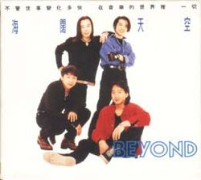

此條目介紹的是香港殿堂級搖滾樂隊<ContentLink uid="wiki/beyond">Beyond</ContentLink>的1993年國語專輯。關於Beyond的同名粵語歌曲，請見「**<ContentLink uid="wiki/海闊天空-beyond歌曲">海闊天空 (Beyond歌曲)</ContentLink>**」。關於上述歌曲所屬粵語專輯，請見「**<ContentLink uid="wiki/樂與怒">樂與怒</ContentLink>**」。關於在台灣被翻譯成此名的內地電影，請見「**中國合夥人**」。關於此名稱的其他用法，請見「**海闊天空**」。

| 海闊天空 | 海闊天空 |
| --- | --- |
|  | |
| <ContentLink uid="wiki/beyond">Beyond</ContentLink>的錄音室專輯 | <ContentLink uid="wiki/beyond">Beyond</ContentLink>的錄音室專輯 |
| 發行日期 | 1993年9月9日，​32年前 |
| 類型 | 華語流行音樂 |
| 唱片公司 | 滾石唱片 |
| 導演 | <ContentLink uid="wiki/beyond">Beyond</ContentLink>, 梁邦彥 |
| 監製 | 總監製：<ContentLink uid="wiki/beyond">Beyond</ContentLink>, 梁邦彥 執行監製：Sumio Matsuzaki, Akira Matsuno |
| <ContentLink uid="wiki/beyond">Beyond</ContentLink>專輯年表 | <ContentLink uid="wiki/beyond">Beyond</ContentLink>專輯年表 |

| 信念 （1992年） | **海闊天空** （1993年） | <ContentLink uid="wiki/paradise-beyond專輯">Paradise</ContentLink> （1994年） |
| --- | --- | --- |

《**海闊天空**》（英語：Hold On To My Dream）是香港殿堂級搖滾樂隊<ContentLink uid="wiki/beyond">Beyond</ContentLink>發行的第4張國語專輯，其中收錄的《<ContentLink uid="wiki/海闊天空-beyond歌曲">海闊天空</ContentLink>》是Beyond成立十週年的歌曲。1993年6月24日<ContentLink uid="wiki/黃家駒">黃家駒</ContentLink>發生意外昏迷，6月30日逝世，原定計劃無法實現，滾石唱片公司以這張專輯保留黃家駒原聲以及詞曲創作來完成黃家駒未完成的計劃和心願。黃家駒逝世後，其餘3名成員決定進入錄音室，由<ContentLink uid="wiki/黃家強">黃家強</ContentLink>和<ContentLink uid="wiki/黃貫中">黃貫中</ContentLink>演唱完成計劃中的國語專輯。歌曲結合粵語專輯《<ContentLink uid="wiki/樂與怒">樂與怒</ContentLink>》和日語專輯《<ContentLink uid="wiki/this-is-love-1">This Is Love 1</ContentLink>》。

## 曲目

| 次序 | 歌名 | 中文翻譯 | 英文名 | 作曲 | 填詞 | 主唱 | 備注 |
| --- | --- | --- | --- | --- | --- | --- | --- |
| 1. | <ContentLink uid="wiki/海闊天空-beyond歌曲">海闊天空</ContentLink> | 不適用 | Hold On To My Dream | <ContentLink uid="wiki/黃家駒">黃家駒</ContentLink> | <ContentLink uid="wiki/黃家駒">黃家駒</ContentLink> | <ContentLink uid="wiki/黃家駒">黃家駒</ContentLink> | 粵語歌曲； 主打歌； 專輯"<ContentLink uid="wiki/樂與怒">樂與怒</ContentLink>"之第6首 |
| 2. | 爸爸媽媽 | 不適用 | Pop And Mom | <ContentLink uid="wiki/黃家駒">黃家駒</ContentLink> | <ContentLink uid="wiki/黃貫中">黃貫中</ContentLink> | <ContentLink uid="wiki/黃家駒">黃家駒</ContentLink> | 粵語歌曲； 專輯"<ContentLink uid="wiki/樂與怒">樂與怒</ContentLink>"之第2首 |
| 3. | 愛不容易說 | 不適用 | Hard To Express Love | <ContentLink uid="wiki/黃家強">黃家強</ContentLink> | 廖瑩如 | <ContentLink uid="wiki/黃家強">黃家強</ContentLink> | 國語歌曲； 專輯"<ContentLink uid="wiki/樂與怒">樂與怒</ContentLink>"之第9首"完全地愛吧"國語版 |
| 4. | 和平與愛 | 不適用 | Peace And Love | <ContentLink uid="wiki/黃貫中">黃貫中</ContentLink> | <ContentLink uid="wiki/黃家強">黃家強</ContentLink> | <ContentLink uid="wiki/黃家駒">黃家駒</ContentLink> | 粵語歌曲； 專輯"<ContentLink uid="wiki/樂與怒">樂與怒</ContentLink>"之第3首 |
| 5. | 身不由己 | 不適用 | Cannot Help | <ContentLink uid="wiki/beyond">Beyond</ContentLink> | Michael | <ContentLink uid="wiki/黃貫中">黃貫中</ContentLink> | 國語歌曲； 專輯"<ContentLink uid="wiki/樂與怒">樂與怒</ContentLink>"之第8首"妄想"國語版 |
| 6. | 全是愛 | 不適用 | For Love Reason | <ContentLink uid="wiki/黃家駒">黃家駒</ContentLink> | <ContentLink uid="wiki/黃家駒">黃家駒</ContentLink> | <ContentLink uid="wiki/黃家駒">黃家駒</ContentLink> | 粵語歌曲； 專輯"<ContentLink uid="wiki/樂與怒">樂與怒</ContentLink>"之第5首； 另其英文名為"This Is Love" |
| 7. | 情人 | 不適用 | The Lover | <ContentLink uid="wiki/黃家駒">黃家駒</ContentLink> | <ContentLink uid="wiki/劉卓輝">劉卓輝</ContentLink> | <ContentLink uid="wiki/黃家駒">黃家駒</ContentLink> | 粵語歌曲； 專輯"<ContentLink uid="wiki/樂與怒">樂與怒</ContentLink>"之第10首 |
| 8. | 無無謂 | 不適用 | Take It Easy | <ContentLink uid="wiki/葉世榮">葉世榮</ContentLink> | <ContentLink uid="wiki/葉世榮">葉世榮</ContentLink> | <ContentLink uid="wiki/beyond">Beyond</ContentLink> | 粵語歌曲； 專輯"<ContentLink uid="wiki/樂與怒">樂與怒</ContentLink>"之第12首； 另其英文名為"What For?" |
| 9. | <ContentLink uid="wiki/我想奪取妳的唇">くちびるを奪いたい</ContentLink> | 我想奪取你的唇 | Am I Just The Fool | <ContentLink uid="wiki/黃家強">黃家強</ContentLink> | 森浩美（日語：森浩美） | <ContentLink uid="wiki/黃家強">黃家強</ContentLink>, <ContentLink uid="wiki/黃家駒">黃家駒</ContentLink> | 日語歌曲； "愛不容易說"日文版； 專輯"<ContentLink uid="wiki/this-is-love-1">This Is Love 1</ContentLink>"之第2首 |
| 10. | <ContentLink uid="wiki/遙遠的夢-far-away">遙かなる夢に~Far Away~</ContentLink> | 遙遠的夢 | A Dream Far Away | <ContentLink uid="wiki/黃家駒">黃家駒</ContentLink> | 森浩美（日語：森浩美） | <ContentLink uid="wiki/黃家駒">黃家駒</ContentLink> | 日語歌曲； "海闊天空"日文版； 專輯"<ContentLink uid="wiki/this-is-love-1">This Is Love 1</ContentLink>"之第6首 |

本專輯所有歌曲之編曲者均為Beyond和Kunihiko Ryo

## 資料來源

## 外部連結

-   [Beyond / 海闊天空 (黑膠唱片LP)](https://www.books.com.tw/products/0020200170). 博客來. [2025-08-23].
