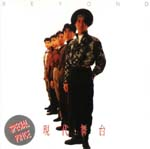

| 現代舞台 | 現代舞台 |
| --- | --- |
|  | |
| <ContentLink uid="wiki/beyond">Beyond</ContentLink>的錄音室專輯 | <ContentLink uid="wiki/beyond">Beyond</ContentLink>的錄音室專輯 |
| 發行日期 | 1988年2月27日，​38年前 |
| 錄製時間 | 1987年－1988年 |
| 類型 | 搖滾 粵語流行音樂 |
| 唱片公司 | Kinn's Music Ltd. |
| 監製 | <ContentLink uid="wiki/beyond">Beyond</ContentLink>、王紀華 |
| <ContentLink uid="wiki/beyond">Beyond</ContentLink>專輯年表 | <ContentLink uid="wiki/beyond">Beyond</ContentLink>專輯年表 |

| <ContentLink uid="wiki/亞拉伯跳舞女郎">亞拉伯跳舞女郎</ContentLink> （1987年） | **現代舞台** （1988年） | 秘密警察 （1988年） |
| --- | --- | --- |

《**現代舞台**》是香港搖滾樂隊 <ContentLink uid="wiki/beyond">Beyond</ContentLink> 發行的第二張粵語錄音室專輯，由 Kinn's Music Ltd. 製作及出品，寶麗金唱片有限公司發行。[^1]

## 專輯介紹

《現代舞台》這張專輯比上一張 <ContentLink uid="wiki/beyond">Beyond</ContentLink> 專輯《<ContentLink uid="wiki/亞拉伯跳舞女郎">亞拉伯跳舞女郎</ContentLink>》回歸搖滾，但同時 <ContentLink uid="wiki/beyond">Beyond</ContentLink> 的音樂作品開始加入商業元素。其中《舊日的足跡》、《赤紅熱血》、《冷雨夜》、《現代舞台》為 <ContentLink uid="wiki/beyond">Beyond</ContentLink> 的經典代表作。

## 曲目

全碟編曲：<ContentLink uid="wiki/beyond">Beyond</ContentLink> 樂隊

| 曲序 | 曲目 | 填詞 | 作曲 | 主唱 | 時長 |
| --- | --- | --- | --- | --- | --- |
| 1. | 舊日的足跡（最早的現場錄音版，收錄於樂隊 1986 年自資專輯《再見理想》內。此曲有多個錄音室版本，本專輯收錄的是以鍵琴為前奏的版本。） | <ContentLink uid="wiki/葉世榮">葉世榮</ContentLink> | <ContentLink uid="wiki/黃家駒">黃家駒</ContentLink> | <ContentLink uid="wiki/黃家駒">黃家駒</ContentLink> | 4:21 |
| 2. | 天真的創傷 | <ContentLink uid="wiki/黃家駒">黃家駒</ContentLink> | <ContentLink uid="wiki/黃家駒">黃家駒</ContentLink> | <ContentLink uid="wiki/黃家駒">黃家駒</ContentLink> | 4:00 |
| 3. | 赤紅熱血 | <ContentLink uid="wiki/黃家強">黃家強</ContentLink> | <ContentLink uid="wiki/黃家駒">黃家駒</ContentLink> | <ContentLink uid="wiki/黃家駒">黃家駒</ContentLink> | 3:58 |
| 4. | 衝上雲霄（<ContentLink uid="wiki/黃家駒">黃家駒</ContentLink>及<ContentLink uid="wiki/黃家強">黃家強</ContentLink>兄弟首支合唱歌曲） | <ContentLink uid="wiki/黃家強">黃家強</ContentLink> | <ContentLink uid="wiki/黃家駒">黃家駒</ContentLink> | - <ContentLink uid="wiki/黃家強">黃家強</ContentLink> - <ContentLink uid="wiki/黃家駒">黃家駒</ContentLink> | 3:35 |
| 5. | 冷雨夜 | <ContentLink uid="wiki/黃家強">黃家強</ContentLink> | <ContentLink uid="wiki/黃家駒">黃家駒</ContentLink> | <ContentLink uid="wiki/黃家強">黃家強</ContentLink> | 4:19 |
| 6. | 雨夜之後（純音樂） | | <ContentLink uid="wiki/劉志遠-香港音樂人">劉志遠</ContentLink> | | 0:39 |
| 7. | 現代舞台 | <ContentLink uid="wiki/劉卓輝">劉卓輝</ContentLink> | - <ContentLink uid="wiki/黃家駒">黃家駒</ContentLink> - <ContentLink uid="wiki/黃貫中">黃貫中</ContentLink> - <ContentLink uid="wiki/劉志遠-香港音樂人">劉志遠</ContentLink> | <ContentLink uid="wiki/黃家駒">黃家駒</ContentLink> | 4:11 |
| 8. | 午夜流浪 | <ContentLink uid="wiki/黃貫中">黃貫中</ContentLink> | <ContentLink uid="wiki/黃貫中">黃貫中</ContentLink> | <ContentLink uid="wiki/黃貫中">黃貫中</ContentLink> | 4:16 |
| 9. | Once Again | <ContentLink uid="wiki/黃貫中">黃貫中</ContentLink> | - <ContentLink uid="wiki/黃貫中">黃貫中</ContentLink> - <ContentLink uid="wiki/黃家強">黃家強</ContentLink> | <ContentLink uid="wiki/黃貫中">黃貫中</ContentLink> | 4:25 |
| 10. | 城市獵人（曲名源自當時日本人氣漫畫《城市獵人》） | 翁偉微 | <ContentLink uid="wiki/黃家駒">黃家駒</ContentLink> | <ContentLink uid="wiki/黃家駒">黃家駒</ContentLink> | 5:08 |
| 11. | 迷離境界（曲名源自當時無綫電視外購劇集《迷離境界》） | <ContentLink uid="wiki/黃家強">黃家強</ContentLink> | <ContentLink uid="wiki/黃家駒">黃家駒</ContentLink> | <ContentLink uid="wiki/黃家駒">黃家駒</ContentLink> | 4:27 |
| 總時長： | 總時長： | 總時長： | 總時長： | 總時長： | 43:19 |

| 2014年超越時代紀念版（附加曲目） | 2014年超越時代紀念版（附加曲目） |
| --- | --- |
| 曲序 | 曲目 |
| 12. | 現代舞台（ha, ha, ha remix） |
| 13. | 午夜流浪（野馬remix version） |
| 14. | 舊日的足跡（full version） |
| 15. | 衝上雲霄（guitar version） |
| 16. | 天真的創傷（2nd mix） |
| 17. | Once Again（2nd mix） |
| 18. | 赤紅熱血（1st mix） |

| 2014年超越時代紀念版（disc two: Live 88大專演唱會） | 2014年超越時代紀念版（disc two: Live 88大專演唱會） |
| --- | --- |
| 曲序 | 曲目 |
| 1. | 灰色的心 |
| 2. | 家強Bass Solo |
| 3. | 水晶球（featuring guitar solo） |
| 4. | 新天地（featuring 遠仔 vs. Paul guitar jam） |
| 5. | 冷雨夜（featuring 世榮drum solo & Paul guitar solo） |
| 6. | 赤紅熱血 |
| 7. | 卡門（featuring 家駒guitar solo） |
| 8. | 遠仔Guitar Solo |
| 9. | Once Again |
| 10. | 金屬狂人 |
| 11. | 家駒獨白：愛情 |
| 12. | 追憶 |
| 13. | 家駒獨白：:遠仔離隊 |
| 14. | 再見理想 |
| 15. | 舊日的足跡 |
| 16. | 城市獵人 |
| 17. | 孤單一吻（純音樂） |

## 音樂錄影帶

| 歌名 | 演唱 | 首播日期 | 首播頻道 | 導演 |
| --- | --- | --- | --- | --- |
| [舊日的足跡](https://www.youtube.com/watch?v=pPxouHncfts) （[頁面存檔備份](//web.archive.org/web/20210111234330/http://www.youtube.com/watch?v=pPxouHncfts)，存於互聯網檔案館） | 黃家駒 | 1988年 | 無綫電視 | 蕭潮順 |
| [午夜流浪](https://www.youtube.com/watch?v=KUiIP0JfQX4) （[頁面存檔備份](//web.archive.org/web/20200420032500/http://www.youtube.com/watch?v=KUiIP0JfQX4)，存於互聯網檔案館） | 黃貫中 | 1988年 | 無綫電視 | |

## 參考文獻

1.  香港電台十大中文金曲委員會 (編). Beyond. 香港粵語唱片收藏指南 ─ 粵語流行曲 (50's-80's). 香港: 三聯. 1998: 397–398. ISBN 962-04-1458-6.

[^1]: 香港電台十大中文金曲委員會 (編). Beyond. 香港粵語唱片收藏指南 ─ 粵語流行曲 (50's-80's). 香港: 三聯. 1998: 397–398. ISBN 962-04-1458-6.
