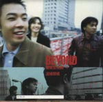

| 這裏那裏 | 這裏那裏 |
| --- | --- |
|  | |
| <ContentLink uid="wiki/beyond">Beyond</ContentLink>的錄音室專輯 | <ContentLink uid="wiki/beyond">Beyond</ContentLink>的錄音室專輯 |
| 發行日期 | 1998年2月20日 |
| 類型 | 搖滾、華語流行音樂 |
| 唱片公司 | 滾石唱片 |
| <ContentLink uid="wiki/beyond">Beyond</ContentLink>專輯年表 | <ContentLink uid="wiki/beyond">Beyond</ContentLink>專輯年表 |

| <ContentLink uid="wiki/愛與生活">愛與生活</ContentLink> （1995年） | **這裏那裏** （1998年） | |
| --- | --- | --- |

《**這裏那裏**》是香港搖滾樂隊<ContentLink uid="wiki/beyond">Beyond</ContentLink>發行的第七張國語專輯，當中有七首是把<ContentLink uid="wiki/黃家駒">黃家駒</ContentLink>的作品，重新填上國語詞及編曲，有着不一樣的風味，唯獨《命運是我家》這首的編曲是保留黃家駒原曲，為的是要保留黃家駒彈奏結他的部份，是對黃家駒的敬意與尊重。

新歌《想你》是翻自1996年的粵語EP《Beyond得精彩》。至於《緩慢》及《管我》，則早一步收錄在粵語大碟《驚喜》。

曲末的英文歌《Paradise》，成為Beyond最多種語言版本的歌曲（其餘三種語言為粵語、國語及日語）。

## 曲目[^1]

| 次序 | 歌名 | 填詞 | 作曲 | 備註 |
| --- | --- | --- | --- | --- |
| 1. | 忘記你 | 周耀輝 | <ContentLink uid="wiki/黃家駒">黃家駒</ContentLink> | 粵語版為《喜歡你》 |
| 2. | 想你 | 黃貫中、周耀輝 | 黃貫中 | 粵語版為《想你》 |
| 3. | 緩慢 | 李焯雄、周耀輝 | 黃家駒 | 粵語版為《冷雨夜》 |
| 4. | 管我 | 黃貫中 | 黃貫中 | 粵語版為《別怪我》 |
| 5. | 候診室 | 周耀輝 | 黃家駒 | 粵語版為《不再猶豫》 |
| 6. | 我的知己在街頭 | 無 | 黃貫中 | 純音樂，原收錄於《請將手放開》 |
| 7. | 情人 | 林夕 | 黃家駒 | 粵語版為《情人》 |
| 8. | 熱情過後 | 葉世榮 | 黃家駒 | 粵語版為《完全的擁有》 |
| 9. | 十字路口 | 劉卓輝 | 黃家駒 | 粵語版為《誰伴我闖蕩》 |
| 10. | Amani | 林夕 | 黃家駒 | 粵語版為《Amani》 |
| 11. | 命運是我家 | 詹德茂 | 黃家駒 | 粵語版為《命運你家》 |
| 12. | Paradise（英文） | 黃貫中、李振權 | 黃貫中 | 粵語版為《遙遠的Paradise》 |

1.  [BEYOND / 這裡 那裡](https://shop.rockmall.com.tw/product_view.php?id=53685). ROCKMALL 滾石購物網. [2025-11-25].

[^1]: [BEYOND / 這裡 那裡](https://shop.rockmall.com.tw/product_view.php?id=53685). ROCKMALL 滾石購物網. [2025-11-25].
