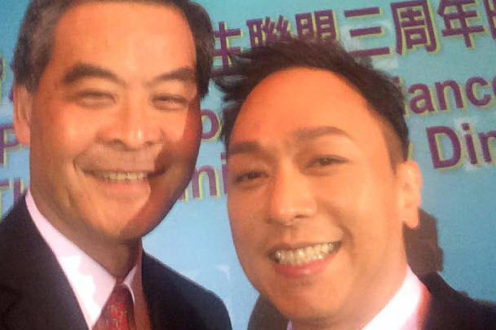

*Steve Wong poses with Chief Executive Leung Chun-ying.*

Former Beyond bassist Steve Wong Ka-keung was criticised by many fans of the now-dissolved rock band after he sang for the Beijing-loyalist Business and Professionals Alliance on Monday. Worse for fans, Chief Executive Leung Chun-ying took two selfies with Wong after the performance and posted it on Facebook. Critics said Wong had "betrayed" his music, as many of Beyond's Canto-pop songs carried themes such as freedom. One of its classics, Under the Vast Sky , was often sung by protesters and became one of the most symbolic songs of the 79-day Occupy protests last year. "You betrayed your anti-establishment rock-and-roll self in exchange for wealth and fame!" one angry internet user wrote on the bassist's Facebook page. But Wong explained on Tuesday that he was only told to perform at a private banquet and had no idea that Leung would take a selfie with him. Referring to entertainment mogul Peter Lam Kin-ngok, the BPA's council chairman, Wong said: "My boss invited me to perform, and I went there to do my job as a professional singer … I did not give up on my ideals." Tony Cheung

A food truck craze is set to sweep Hong Kong as the government officially unveiled a pilot scheme for developing the business on Monday. While Hongkongers were still wondering whether it would be a profitable business, pro-Beijing lawmaker Ann Chiang Lai-wan yesterday gave the question an assertive "yes", but emphasised that the products sold must be a fusion of East meets West. "We have to consider the taste of Asians but at the same time add a little bit of creativity," she said. Chiang, of the Democratic Alliance for the Betterment and Progress of Hong Kong, suggested selling French crepes with oriental fillings, such as bean sprouts or braised pork belly. Could Chiang's culinary creativity be turned into money? Only if you secure the estimated start-up cost of HK$600,000 to let the food truck hit the road. Jeffie Lam

The loss of Christopher Chung Shu-kun in the district council elections last month was seen as an embarrassment for the DAB, but a pro-establishment source told All Around Town that it was nothing compared to the defeat of Chung's party colleague Elizabeth Quat in Sha Tin. That, according to the source, was because Quat was a potential candidate for a "super seat" in the Legco polls in September, referring to the five District Council (Second) seats to be elected by a citywide electorate. Only district councillors can run for those seats, and with Quat unseated by Labour Party candidate Yip Wing last month, the source understood the DAB would have to consider other candidates, such as vice-chairman Holden Chow Ho-ding or New Territories West lawmaker Ben Chan Han-pan. Chow and Chan were re-elected in the Islands and Tsuen Wan district councils, respectively. DAB chairwoman Starry Lee Wai-king is the party's only representative among the five "super seats" and the DAB is keen to win more of them next year.
