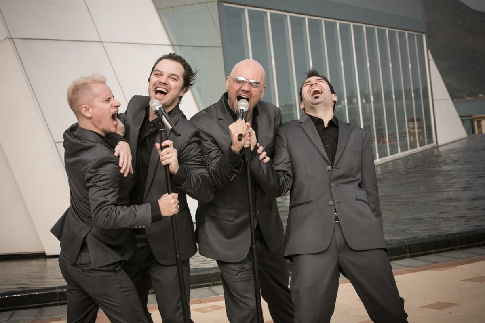

*Ahead of their first large-scale concert in Hong Kong, Eric Monson, Michael Lance, Sean Oliver and Kevin Thornton (L-R) talk about their journey to Hong Kong and how they started singing Cantopop.*

How did you four become a group?

Eric Monson: In 1998, I was contacted by an agent to perform on a cruise ship. He asked if I wanted to put a group together and I said, sure! We went on to have our first gig on a cruise ship to Vancouver. It started off as a six-month contract, and here we are, 18 years later.

Why did you decide to settle down in Hong Kong?

Eric Monson: On cruise ships we traveled to over 60 different countries, but after a while we always seemed to get bored of the cities we were visiting. Hong Kong was the first place that we actually felt could be home. So we decided, in 2008, to make Hong Kong our home base.
Kevin Thornton: I love Hong Kong! It’s the most exciting city in the world—plus I met the love of my life and got married here.

How did you start singing Cantopop?

Sean Oliver: We did our first Cantonese song “My Pride” [by Cantopop singer Joey Yung] in 2010, and then Beyond’s “Under a Vast Sky,” and it forever changed our lives. Our friends suggested the songs and that was our first exposure to Beyond.  We fell in love with them. I still think they are the best band that’s ever come out of Hong Kong. It opened our ears to music that we hadn’t heard before: from Taiwan, China, Hong Kong, the Philippines, everywhere. We were like kids in a candy store.

Did you master your Cantonese in the process?

Eric Monson: Siu siu [a little bit]. We made the locals laugh a lot because singing in Cantonese is incredibly hard, especially the rising tones. We have a coach, my wife, who comes in—she’s a singer as well. She worked with Sean for two months for “Under a Vast Sky.”
Sean Oliver: Because we’re not Chinese, we had to do it perfectly. But we added our own flavor to it.

What’s unique about your sound?

Sean Oliver: We grew up in a barbershop harmony society, and barbershop has a very fluid sound. A lot of contemporary a cappella groups focus more on rhythm, but we focus on fluid sounds. That gives us a bigger sound and it’s very dynamic.

What do you think of the a cappella scene in Hong Kong?

Michael Lance: A cappella wasn’t as mainstream as it is now. All these sing-off shows and the “Pitch Perfect” movies have brought the a cappella world into more of a mainstream environment. In the past six or seven years a cappella has gone huge in Hong Kong. I’d like to think we had a part in that.
Eric Monson: In the States, barbershop music has been around for centuries, and guys getting together singing a cappella is part of the university experience. Hong Kong is starting to find those opportunities we grew up with. We see more high school and university groups, and it’s much easier to start up a band.

How do you decide on your songs?

Sean Oliver: We have so much to choose from now because not only do we have the western market, but we also have the eastern market. We are looking to do some K-pop too. Our new venture now is to write our own music: We’ll debut a lot of our own tunes in the upcoming concert, and we will release an album of original songs in October.
