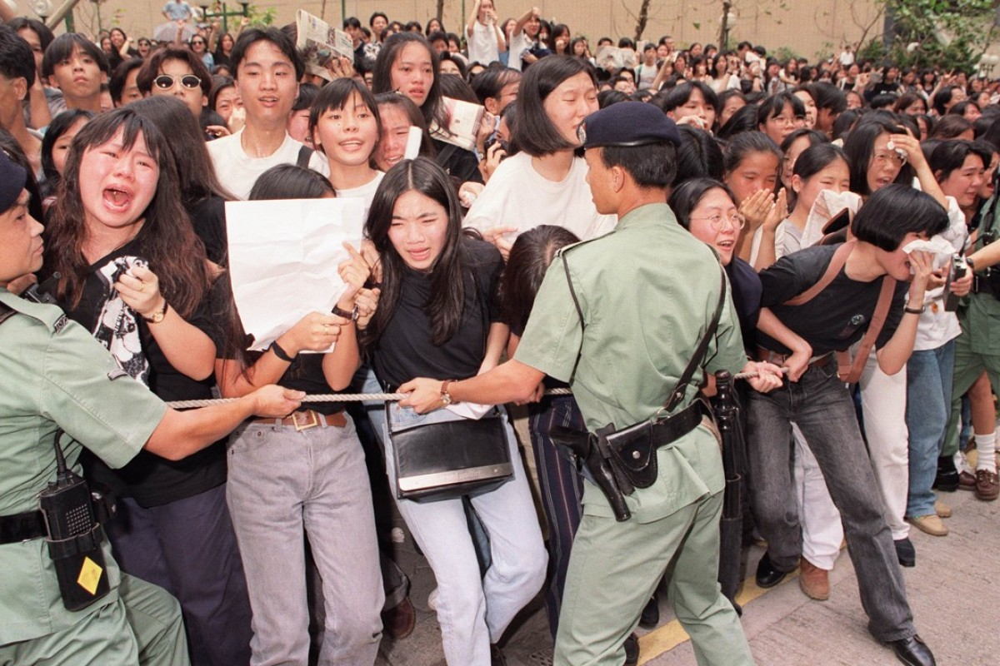
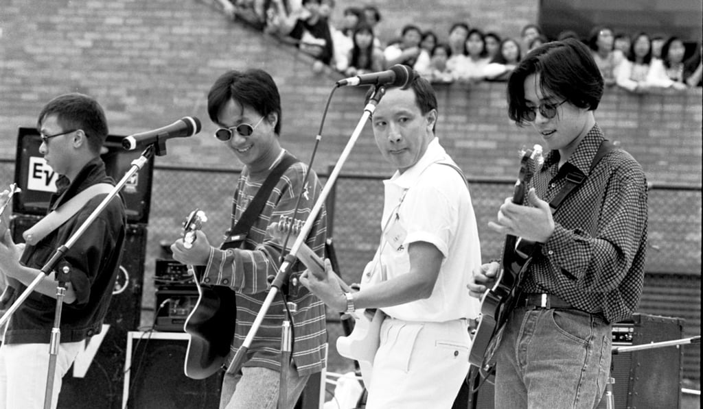
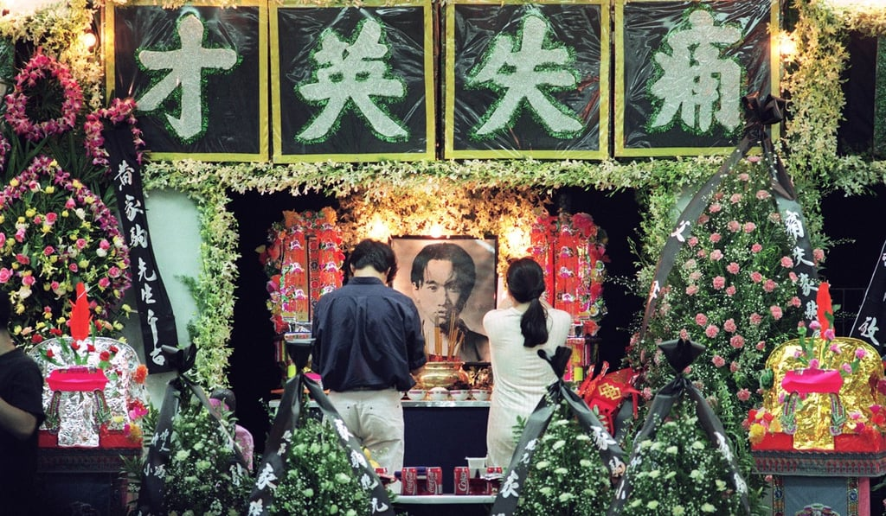

*Fans distraught as the hearse carrying Wong Ka-kui leaves Hong Kong Funeral Parlour, in July 1993.*

“Beyond singer in coma after fall in Japan”, ran the headline in the South China Morning Post on June 25, 1993. “Pop star Wong Ka-kui, lead vocalist for Hong Kong band Beyond, was in a coma last night, 19 hours after falling off a production set during the filming of a television variety show.”

*Wong Ka-kui*

Next day, the Post reported, “Wong, 31, plunged three metres and hit his head after slipping on water during filming of a slapstick fight scene for one of Japan’s most highly rated television comedy shows.”

Reviewing the band’s progress, on June 27, the newspaper’s entertainment editor wrote that Wong, his brother Ka-keung, Yip Sai-wing and Wong Koon-chung had formed Beyond in 1983 “as an independent, alter­native band”. They had “developed a follow­ing, playing punk and new wave shows at small venues […] and represented an important counterpoint to the all-pervasive Canto-pop”.

*Deputy secretary for health and welfare Ricky Fung (second from right) with members of pop band Beyond. From left: Wong Ka-keung, Wong Ka-kui and Wong Koon-chung at Hong Kong Polytechnic, in 1991.*

On July 1, under the headline “Fans pay homage to Beyond singer”, the Post reported the death of Wong from a cerebral haemorr­hage in Tokyo the day before. Fans had held a vigil outside the band’s studio in Sai Yee Street, Mong Kok.

On July 3, the Post reported: “Fans of the pop band Beyond wept at Kai Tak airport last night as the body of lead vocalist Wong Ka-kui was brought back from Tokyo. More than 100 fans, mostly teenage girls, waited in the arrivals hall for [...] the body.”

*Mourners pay their respects to Wong Ka-kui.*

The paper reported on his funeral on July 5. “Screaming fans broke through police barriers yesterday as the hearse carrying Wong Ka-kui […] left the Hong Kong Funeral Home, in Quarry Bay. More than 3,000 distraught fans packed the pavements, tram stops and footbridge outside the funeral parlour in King’s Road, yelling ‘Ka-kui’ and singing the band’s songs.

“Although Ka-kui isn’t here, we hope he can hear our voices and see how much we miss him,” a 14-year-old girl told reporters.
