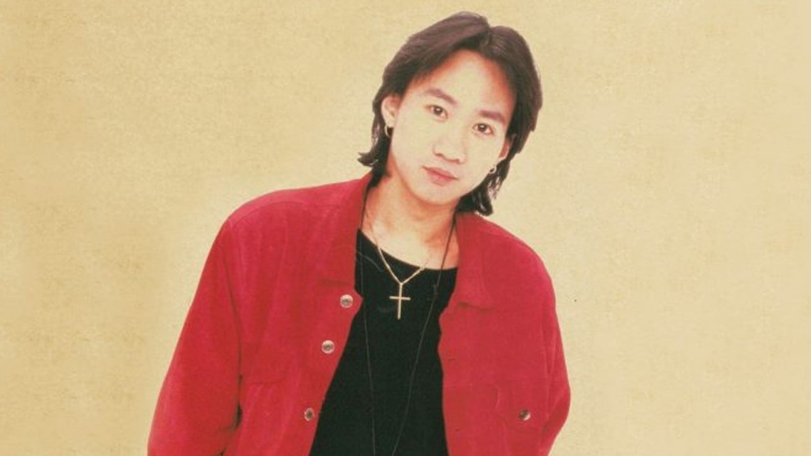
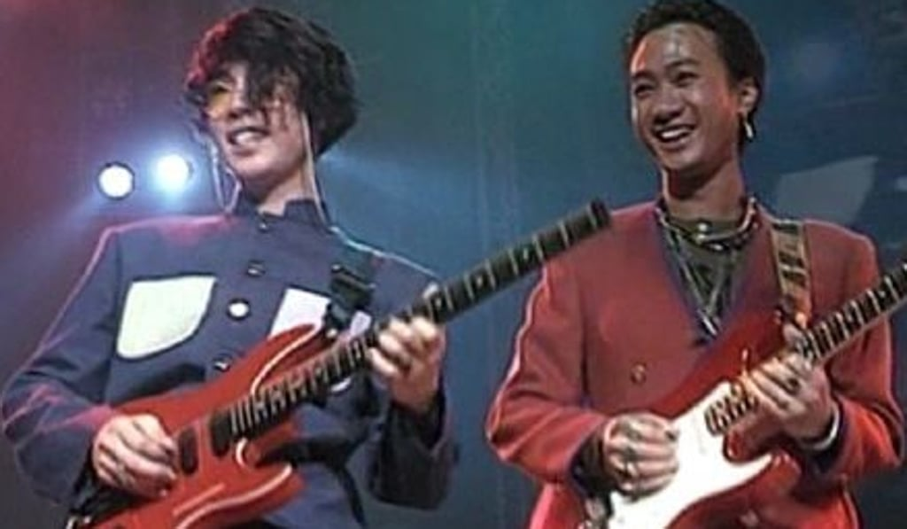
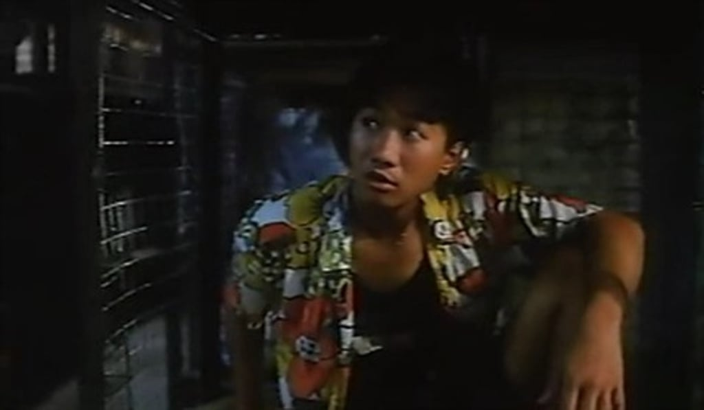

import YouTube from '@/components/patterns/YouTube.astro';

*Wong Ka-kui, who died at 31 years old in 1993, still lives on in the memories of many Hongkongers.*

Twenty five years after the untimely death of the local pop icon, Wong still holds a special place in the hearts of many Hongkongers

Hong Kong musician, singer and songwriter Wong Ka-kui (June 10, 1962 to June 30, 1993) was without doubt an icon. As lead vocalist for Hong Kong band Beyond, Wong enthralled his fans with songs about sticking to one’s beliefs and principles, and about the city’s culture.

By the time of his death at 31 years old – an age at which many of us are still searching for a sense of purpose in life – Wong was already a household name in Southeast Asia.

Twenty five years have now passed since Wong’s untimely death, caused by a fall from a production set in Tokyo during the filming of a television variety show. But the singer still lives on in the hearts of many Hongkongers.

Below are five less well-known facts about this famous son of Hong Kong.

*Beyond won a top award at the Guitar Players Festival in 1983, which helped to establish the band on the local music scene. (From left) bass guitarist Steve Wong Ka-keung, vocalist and guitarist Wong Ka-kui, drummer Gunno Yip Sai-wing and vocalist and guitarist Owen Kwan.*

## His worst solo performance?

During a concert in 1987 at Hung Hom’s Ko Shan Theatre, then a top spot for indie musicians, Wong attempted to perform a flamenco guitar solo while fans clapped along. However, it didn’t turn out quite as he had planned.

## His music idols

It is a well known fact that Wong was a fan of David Bowie. Not so well known, perhaps, is that he was also a big follower of flamenco guitarist and producer Paco de Lucia.

*Hundreds of distraught fans gathered near the Hong Kong Funeral Parlour where Wong Ka-kui’s body was kept following his unexpected death in Tokyo.*

## His guitars – which one was buried with him?

*Wong Ka-kui playing his red and white Fender Stratocaster, with which he was most closely associated.*

Wong Ka-kui owned a number of guitars, but it was his red and white Fender Stratocaster that he came to be most closely associated with. While many believe this is the guitar that was buried with him at Tseung Kwan O cemetery, it was in fact a Martin D-28 acoustic guitar from his collection.

## His portrayal of Raphael in ‘Teenage Mutant Ninja Turtles’?

Wong and other members of Beyond acted in various movies and TV shows in Hong Kong in the late 1980s and early 1990s – mainly comedies. Wong’s role as Mao Jai in Cageman, a docudrama about housing and social problems in the British colony which won the Hong Kong Film Award for Best Film at the 12th Hong Kong Film Awards, is regarded as his most important and serious role – and many believed he should have been nominated for best supporting actor at the awards.

What is less well known is that Beyond did the Cantonese character dubbing for the US movie Teenage Mutant Ninja Turtles in 1990, with Wong as Raphael, the red turtle.

*Many feel Wong Ka-kui’s part as Mao Jai in the docudrama ‘Cageman’ was his most important and serious role.*

## His most famous political fan – anti-apartheid revolutionary Nelson Mandela

During a short trip to South Africa, Wong witnessed the struggles of those fighting against apartheid, and was inspired by what he had heard about Nelson Mandela – who at that time was a prisoner. He wrote the song Glorious Days, a Cantonese anthem for idealistic youth, as a homage to Mandela.

According to a later interview with Wong’s younger brother, Steve Wong Ka-Keung – who played bass guitar in Beyond – Mandela heard about the song and was “deeply moved” by it when he was in hospital during his final days.

<YouTube id="DUPhRlPqMb4" />
