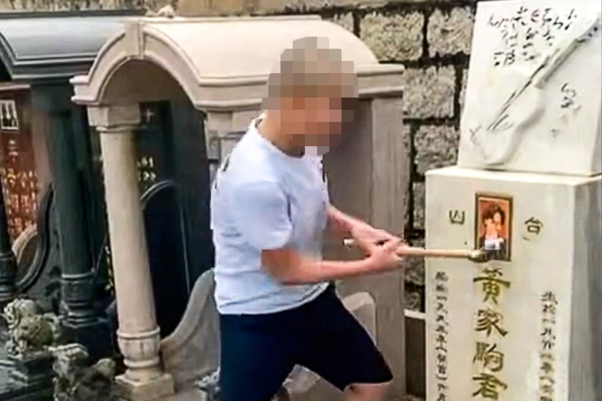
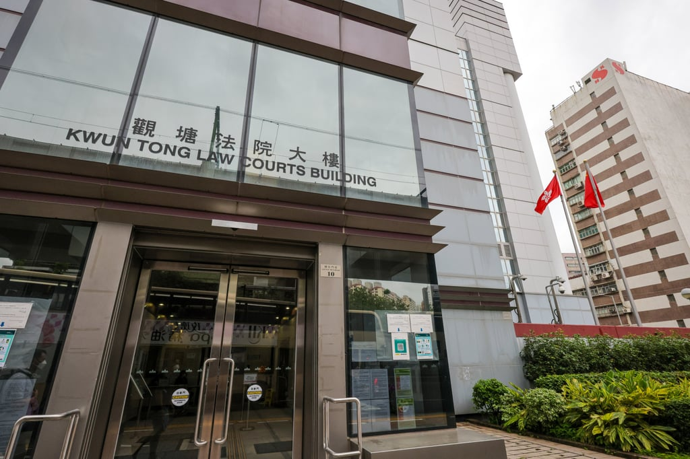

*The two videos that went viral on social media last Sunday show the minor and another man vandalising Wong’s grave site. Photo: Facebook*

A Hong Kong court has remanded in custody a 15-year-old charged with vandalising the grave and headstone of the band Beyond’s lead singer Wong Ka-kui, as the student committed the alleged offence while on bail for another criminal case.

But co-defendant Yip Tsz-to, 23, an air-conditioning technician, was granted bail by acting principal magistrate Winnie Lau Yee-wan after the pair were brought to Kwun Tong Court on Tuesday to face a joint count of criminal damage.

They are alleged to have intended the damage they inflicted on Wong’s burial site located at No 25, Stage No 6, Section 15 at Junk Bay Chinese Permanent Cemetery in Yau Tong on Sunday.

The court was told that the minor had autism and required special care in school, while his relationship with co-defendant Yip was not spelled out.

Two videos that went viral on social media on Sunday morning showed two men vandalising the site. One man kicked the rock singer’s portrait, and threw and kicked tribute items off a platform on the grave.

*Both of the accused were brought to Kwun Tong Court on Tuesday to face a joint count of criminal damage. Photo: Jelly Tse*

The pair were arrested after cemetery staff made a police report on the same day.

The prosecutor on Tuesday asked the two accused what their plea was, but agreed to the defence’s application for a six-week adjournment after the defendants asked for time to review legal documents and receive further legal advice.

Both defendants had applied for bail through separate legal representatives.

The prosecution did not object to Yip’s request but urged the court to deny the minor’s, given the latter had committed the alleged offence while he was on bail for another pending criminal case to be heard in West Kowloon Court.

Lau released Yip with several conditions – HK$5,000 (US$640) cash bail, the surrender of his travel documents within 24 hours and a requirement to report to a police station twice a week.

Yip is also forbidden from returning to the cemetery or getting in touch with prosecution witnesses, and is required to stay in Hong Kong and alert police if he has to change his current residential address in Wong Tai Sin.

Lau said the court decided to reject the boy’s application for bail after “careful consideration”, ordering him to be sent to the Tuen Mun Children and Juvenile Home.

He will be brought to court on May 29 for a bail review hearing.

Lau adjourned the case and asked both defendants to return before June 25 for a second hearing.
