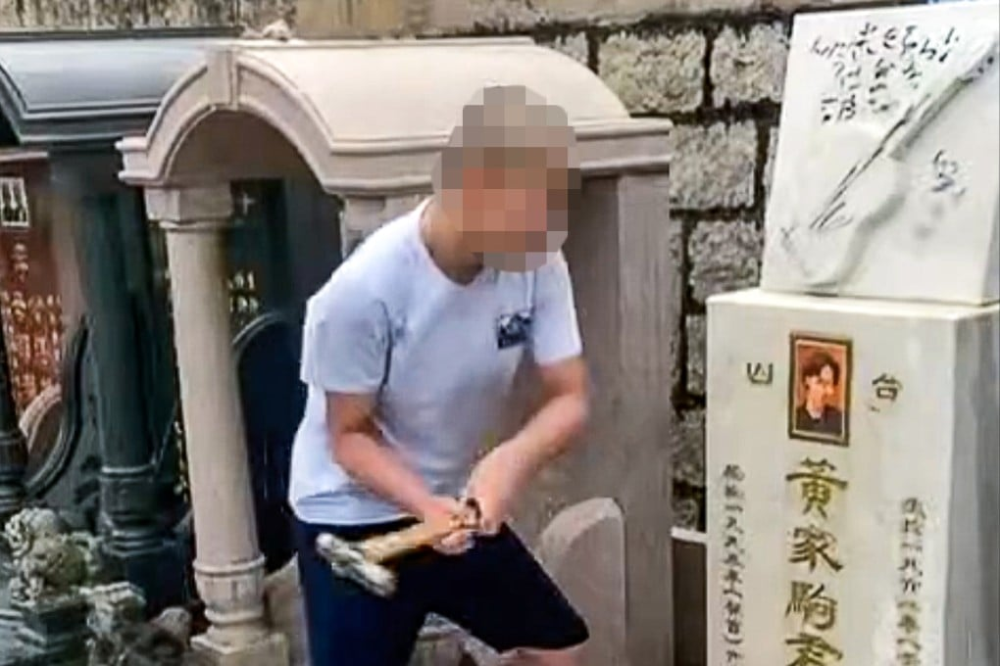

*Both defendants earlier pleaded guilty to criminal damage for vandalising Wong Ka-kui’s burial site. Photo: Facebook*

A 16-year-old boy diagnosed with autism has been sent to a Hong Kong rehabilitation centre for vandalising the grave and headstone of the band Beyond’s lead singer Wong Ka-kui, while his co-defendant has been sentenced to a detention centre.

Chief Magistrate So Wai-tak heard the prosecution ask the pair in Kwun Tong Court on Tuesday to pay HK$9,000 (US$1,150), but the student, who was 15 years old when he damaged the singer’s grave, said he was unable to compensate the owner for the damage.

Co-defendant Yip Tsz-to, 23, an air-conditioning technician, said he could pay HK$4,500 after he served his custodial sentence.

The two earlier pleaded guilty to a joint count of criminal damage for vandalism of Wong’s burial site at the Junk Bay Chinese Permanent Cemetery in Yau Tong on May 19.

“A gravestone is a sign of paying respect to the ancestor and commemorating him, but \[the boy] damaged it for effect and gaining fame, and that is rather a shame,” So said before passing the sentence.

Three videos found on Yip’s phone showed that the boy inflicted damage on Wong’s burial site, including biting flowers placed on the gravestone, splashing soda on it, smashing the photo of the singer with a hammer, and writing letters on the stone with a black marker pen.

He later told police he invited Yip, an acquaintance, to go visit the cemetery that morning as he was a fan of Beyond.

View in AppREAD FULL ARTICLE

He said Yip was there for video taking and subsequently uploaded it to a social media platform.

*Beyond’s lead singer, Wong Ka-kui, died in 1993.*

The defendant’s lawyer said the boy, diagnosed with neurodevelopmental disorder, was led by a group of people he met online, who incited others to carry out all kinds of antisocial behaviours to gain attention.

Magistrate So noted the boy had just turned 16, but he was a minor when he committed the offence. Criminal offences committed by teens aged 16 to 18 are dealt with in adult courts in Hong Kong.

After considering the recommendation by the Young Offender Assessment Panel, So ordered the boy be sent to a rehabilitation centre, where he would spend up to five months, then move to a second one for another four months.

Yip’s lawyer also asked the court to consider that the defendant made a mistake because he was easily influenced by others, but had turned a new page after understanding the seriousness of the offence.

Yip was sentenced to a detention centre, where he would be required to do physical labour and live a disciplined life for up to a year.
