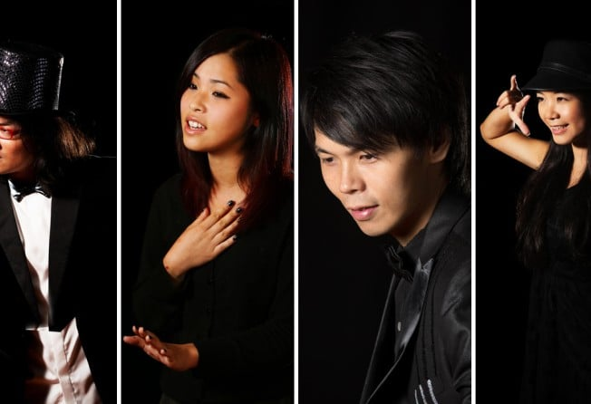

*From left: artistic director Banky Yeung; actress Wong Ka-yee; assistant artistic director Fung Sai-kuen; actress Mo Lai.*

-   BEYOND THE HORIZON
-   FM Theatre Power

Beyond lead singer Wong Ka-kui may have died two decades ago, but he still has a powerful influence on aspiring rock stars and idealists.

One such enthusiast is FM Theatre Power’s (FMTP) artistic director Banky Yeung Ping-kei. Yeung first staged Beyond the Horizon – a fictional story that expresses the spirit of the late singer – in 2003, and it returns for its fourth run this month.

According to Mo Lai Yan-chi, an actress who doubles as the company’s assistant artistic director, the latest incarnation of this piece of “theatre with music” has evolved into a work “closer to a musical”.

“When we created our production, we never meant to make it a biography of Ka-kui. No one can epitomise Ka-kui,” she says.

Rather, the work shows Wong’s spirit by means of a fictional story which touches on social issues such as conflicts over land use.

“The influence of Ka-kui is not confined to a specific generation of people. The reason why his songs are still popular and relevant today is because they are applicable to many social issues,” Lai says, referring to numbers which deal with war-torn African nations (Amani) and racism (Glorious Years).

“His music and songs are actually a form of social activism,” says Lai.

“Beyond the Horizon, to a certain extent, is also a form of activism. We don’t see it as simply a musical.”

The fourth edition features the prodigously talented Anson So Kai-fung, a 12-year-old guitarist who knows Wong’s music inside out.

During the audition, the talented youngster told Lai about his ambitions to change the world with music, and she was convinced he meant every word of it.

There is more to the production than just noble ideas, says Lai, and she hopes viewers will find it entertaining.

But she admits that it does have a serious side.

“We’re not just presenting a restaging of a Beyond concert. We hope the show will make the audience reflect on what kind of person they want to be, where they want to position themselves in society, and inspire them to reignite their passions that fuel their dreams,” she says.

“But viewers will have to experience the show for themselves to see if we have achieved our aims.”
