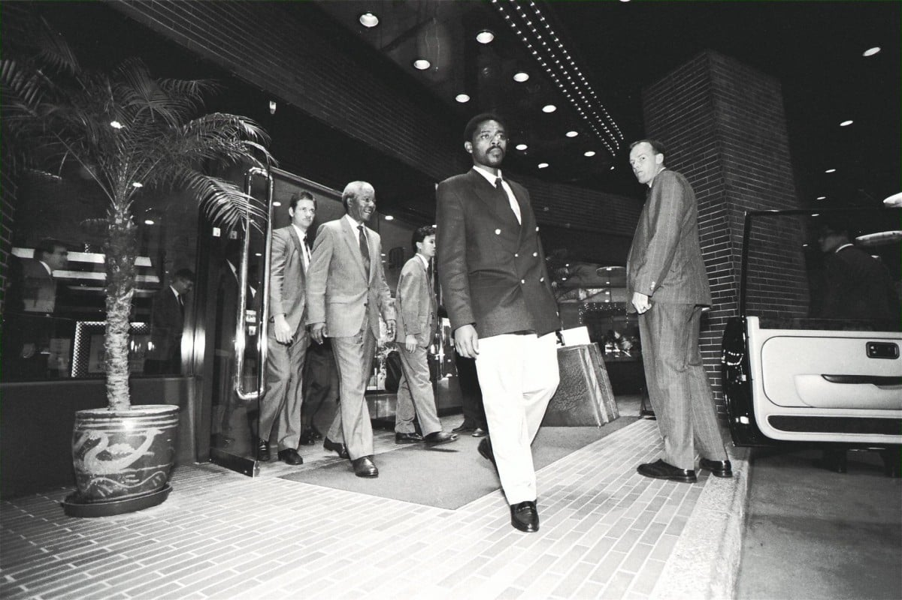

*Mandela in Hong Kong in 1991.*

Around the world, streets, avenues and high-rise housing blocks bear the name of Nelson Mandela, paying tribute to his lifelong struggle for freedom.

But in Hong Kong, the anti-apartheid icon has his name cemented in what is arguably a much longer-lasting form - song.

And not just any song. The 1991 track Glorious Days by the city's most famous rock band Beyond, which became a Cantonese anthem for idealistic youth, is from beginning to end a homage to Mandela.

"Never stop struggling with uncertainty. I believe the future can be altered. But who can achieve it?" the lyrics read in part.

Today, it is widely used as one of the theme songs in local demonstrations because of its message of anti-racism and aspiration to freedom.

Yesterday Hong Kong joined the rest of the world in mourning Mandela.

Phumelele Gwala, the South African consul general, spoke of her shock. "The loss we are feeling right now is deep, deep as individuals and deep for the whole country," she said.

Mandela's inauguration as president of South Africa was Gwala's favourite memory. She described his speech then as moving.

Chief Executive Leung Chun-ying led tributes on behalf of Hong Kong.

"We will remember Mr Mandela as a great man for his sacrifices, accomplishments and relentless quest for peace. … I express our profound sadness at the news of Nelson Mandela's death and our condolences to his family," the chief executive said.

Mandela shaped not only his own country's future and fortunes but helped navigate the difficult diplomatic terrain of China.

Taiwan was one of the biggest financial backers of Mandela's party, the African National Congress, in the 1994 elections and developed close links with Pretoria. Four years later diplomatic relations between Beijing and South Africa were established.

In April 1991, Mandela, who was then deputy president of the ANC, flew to Hong Kong to urge the territory to maintain sanctions on the apartheid-led regime.

Well-wishers can express their tributes in a book of condolence at the South African consulate from 1.30pm to 5pm Daily.

The consulate is Rooms 1216-1222, Regus Business Centre, 12 floor, China Resources Building, 26 Harbour Road, Wan Chai.
