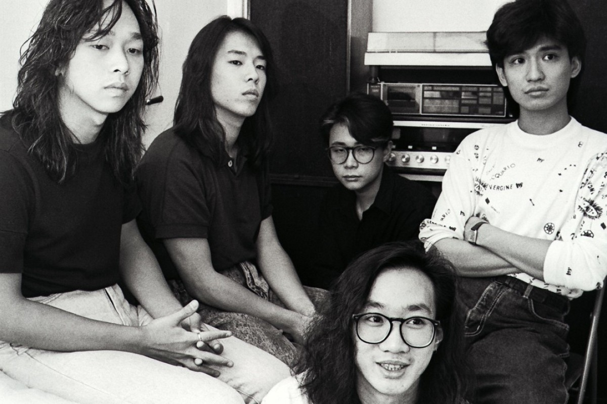
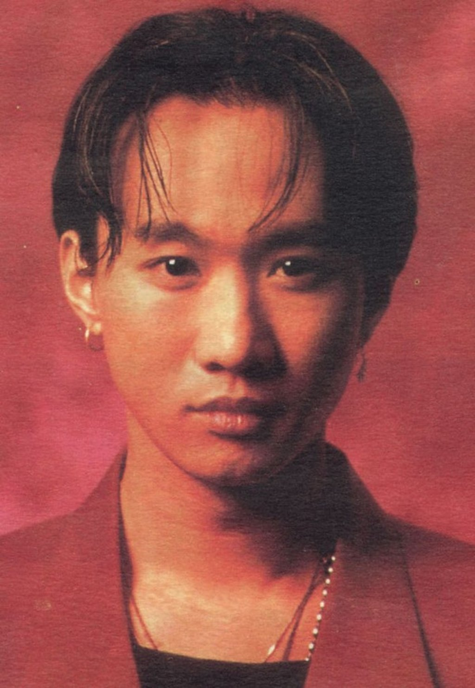
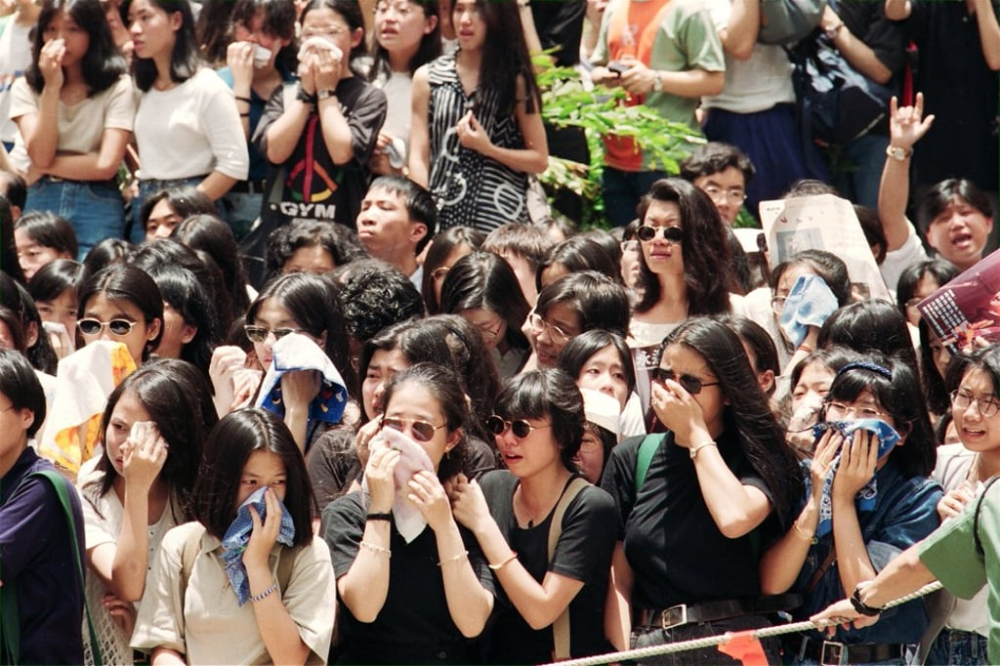
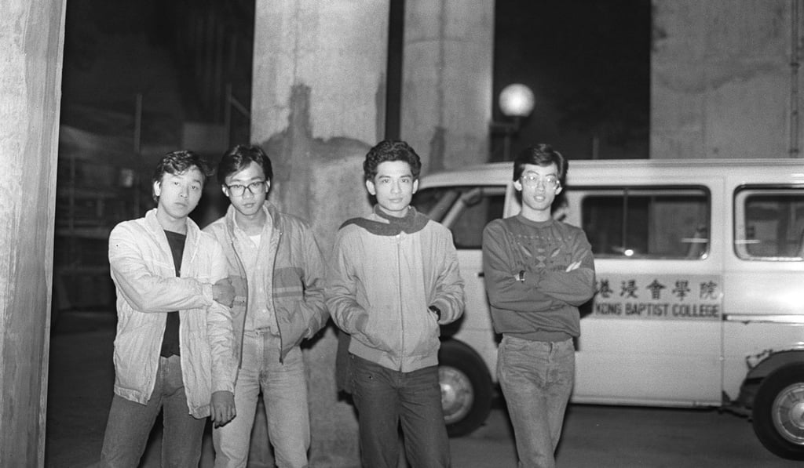
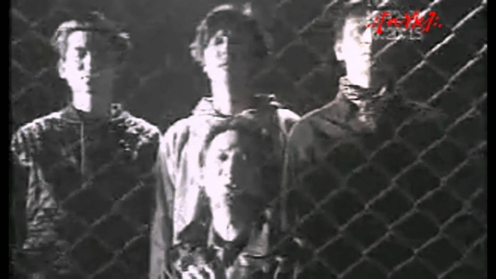

import YouTube from '@/components/patterns/YouTube.astro';

*Hong Kong rock band Beyond (from left): Steve Wong Ka-keung, Paul Wong Koon-chung, Lau Chi-yuen (a guitarist who left the line-up in 1989), Wong Ka-kui and Gunno Yip Sai-wing.*

Twenty-five years ago today, the frontman of Hong Kong’s biggest rock band was filming a television show in Tokyo when he plunged three metres off a stage, sustaining massive head injuries and falling into a coma.

Beyond, the band Wong Ka-kui had led since their formation 10 years earlier, were at the peak of their fame, having evolved from an underground rock’n’roll band into Canto-rock superstars whose anthems such as Amani, The Glorious Years and Truly Love You had soundtracked the lives of an entire generation.

*Wong Ka-kui.*

Radio stations played Beyond’s music on a loop and messages of hope and support flooded in from around the world for the singer-songwriter. Six days after the accident, Wong died from a cerebral haemorr­hage. He was 31.
Beyond fans in Hong Kong, as well as in Chinese communities around the world, were devastated. A vigil was held outside the band’s studio in Mong Kok. Hundreds waited in the arrivals hall at Kai Tak airport for the return of Wong’s body on July 3.

*Distraught teenage fans gather to say goodbye to Wong at his funeral.*

Two days later, a crowd of thousands of Beyond fans and celebrities thronged Wong’s service at the Hong Kong Funeral Home and his funeral procession brought various parts of the city to a standstill.
The three remaining three members of Beyond – Wong’s younger brother and bassist Wong Ka-keung, guitarist and vocalist Paul Wong Koon-chung and drummer Yip Sai-wing – struggled to continue for several years, but ended up going their separate ways. Ka-keung placed the final nail in the band’s coffin in 2015, saying during a radio interview that a reunion was impossible and it would be “meaningless” to continue without his elder brother.

Beyond may be gone, but their legacy lives on. Boundless Oceans, Vast Skies, the band’s last big hit released before Wong’s death, has become an indisputable Canto-rock classic. In the rock ballad written by Wong, he sings about the importance of following one’s dreams and living a life with no regrets. Twenty-five years on, the song is an integral part of Hong Kong’s collective memory and the city’s signature anthem of freedom. It has been played nearly 6.2 million times on Spotify, and is still sung at many political protests today.

Young Hong Kong musicians continue to find inspiration from Beyond and try their hand at some of the band’s classics.

Radio DJ and educator Wong Chi-chung, who was among the first DJs to play the band’s self-financed cassette debut Goodbye My Dreams on the radio in 1986, says Wong remains one of Hong Kong’s greatest musical heroes.

“Wong’s voice represents youth and rebellion, especially among the grass roots and the underdogs. His presence and impact went beyond the boundaries of Hong Kong. He had a talent for fusing many different styles of music and transforming them into accessible and yet quality Canto-rock,” he says.

*An undated photo of Beyond. Photo: Yau Tin-kwai*

The story of Beyond began in 1983 when Wong Ka-kui met Yip Sai-wing. The two shared similar musical interests and ideals, and decided to play music together. They collaborated with various underground musicians at the time, trying out various styles from art rock to punk and heavy metal. Wong also brought brother Ka-keung on board. Two years later, then design student Paul Wong’s guitar skills caught Wong’s eye and he was asked to join the band.
The four-piece staged Beyond’s first self-financed concert in 1985 at the Caritas Centre on Caine Road. They showcased many of their newly written songs – such as Footsteps of the Old Days and Arabian Dancing Girl – that would be released over the coming years.

The show was something of a bust, as Hong Kong was in the grip of Canto-pop fever and still in thrall to pop stars such as Alan Tam Wing-lun, Leslie Cheung Kwok-wing and Anita Mui Yim-fong, but it drew the attention of a music promoter who became their first manager. The band released their debut Goodbye My Dreams the following year.

Towards the end of the 1980s, Beyond had become local rock superstars and, along with other acts such as Tat Ming Pair and Tai Chi, provided a more rock’n’roll alternative to the Canto-pop which dominated the charts. Wong Chi-chung says frontman Wong Ka-kui also helped popularise overseas artists who inspired him – apart from Pink Floyd, he was a fan of British art rockers Japan and also admired John Lennon for including messages of peace in his music.

Beyond became one of very few Hong Kong grass roots rock bands to cross over to the mainstream and succeed in the local music industry without losing their integrity. Veteran music promoter Terry Wong says that one of the unique things about Beyond was that they constantly reinvented themselves musically.

“Whenever they released an album, they’d always add new ideas and blend new genres into their own music, such as funk or influences from bands such as Pink Floyd,” says Wong. “This was very inspiring for many young local musicians. Back in those days, everyone knew how to play Beyond’s music.”

Beyond’s songs were inspired by their life experiences and their visions of the world. Tracks such as Vast Land and Great Wall detail the band’s interest in China, and Amani, a song about the impact of war on children, was written after a trip to Africa.

<YouTube id="DUPhRlPqMb4" />

Meanwhile, The Glorious Years is the band’s tribute to Nelson Mandela, the South African political leader who spent 27 years in jail, and Truly Love You is a song dedicated to mothers and remains a staple song for Mother’s Day.

Beyond’s global ambitions also set them apart from other local bands. They held their first concert in Beijing in 1988, the first Hong Kong band to play in China, according to Gene Lau, who penned the lyrics of many Beyond songs including Great Wall, Vast Land and Lovers.

Lau published a book about Beyond in 2016 and described the show at Beijing’s Capital Indoor Stadium in detail. Although 18,000 seats were full as the show opened, people started streaming out when they realised the songs would be performed in Cantonese – but the influx was halted when the band performed a Mandarin version of Vast Land that brought down the house.

*Beyond were the biggest rock band to come out of Hong Kong.*

“Under Wong Ka-kui’s leadership, Beyond certainly were not satisfied with just being a band in Hong Kong,” says Terry Wong. “They aimed to be reach a global audience. And to a certain extent they succeeded. Chinese people who did not speak Cantonese would practise the language just to be able to sing Beyond’s songs at karaoke lounges. Once when I was in Xian, a taxi driver showed off his Cantonese skills and knowledge about Hong Kong by singing Boundless Oceans, Vast Skies.”

Beyond’s global ambitions led them to sign a deal with Japanese label Amuse in 1991, but any hopes of becoming international superstars died along with their frontman in 1993. The remaining members continued to perform as Beyond until the mid-2000s and still managed to hit the charts and experiment with new sounds such as psychedelica and electronica.

Paul Wong, Ka-keung and Yip also embarked on solo careers while occasionally reuniting to perform as Beyond, but various disputes and rivalries drove them apart.

Regardless, Beyond’s music continues to inspire many young musicians today, says Samuel Chai, director general of the Renaissance Foundation, which organises programmes and events to nurture young musical and creative talent. “The pursuit of freedom and love for the community contained in Beyond’s music still motivates and galvanises young musicians today,” Chai says.

Wong was influenced by bands such as Pink Floyd.
Wong was influenced by bands such as Pink Floyd.
And many people are still waiting for “the next Beyond”. Chai says some people would compare Taiwan’s May Day with Beyond, or are hoping that Hong Kong’s Supper Moment would one day match the success and influence of the iconic band. Wong Chi-chung, however, says the chances of another band like Beyond emerging are slim as Hong Kong’s music culture is now fragmented.
“But I think we now have many local indie bands that share some of Wong’s spirit and influences,” says Wong.

Terry Wong adds: “To a certain extent, Wong Ka-kui’s death cemented Beyond’s status as a legendary band, because he had gone for good and left so much great music with us.”
