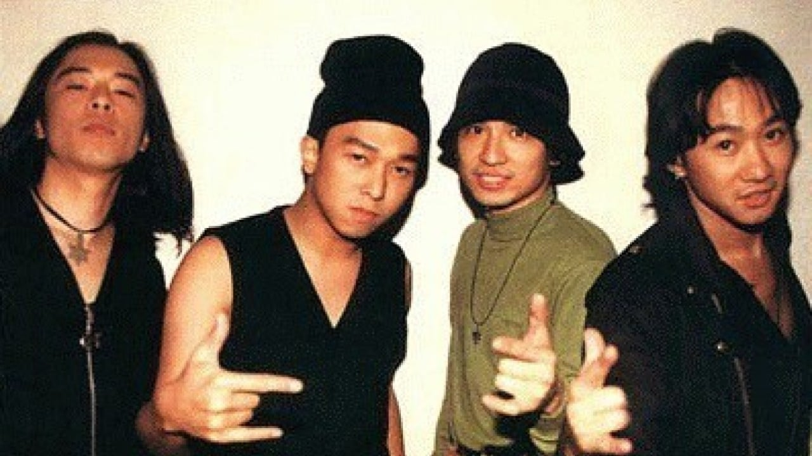
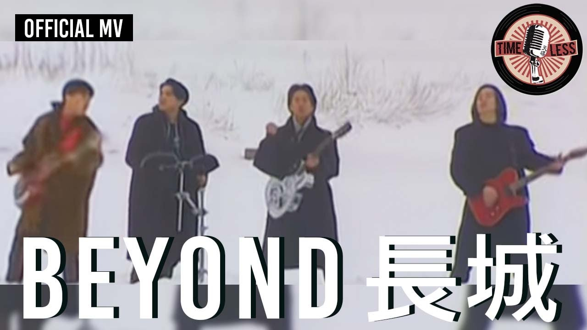
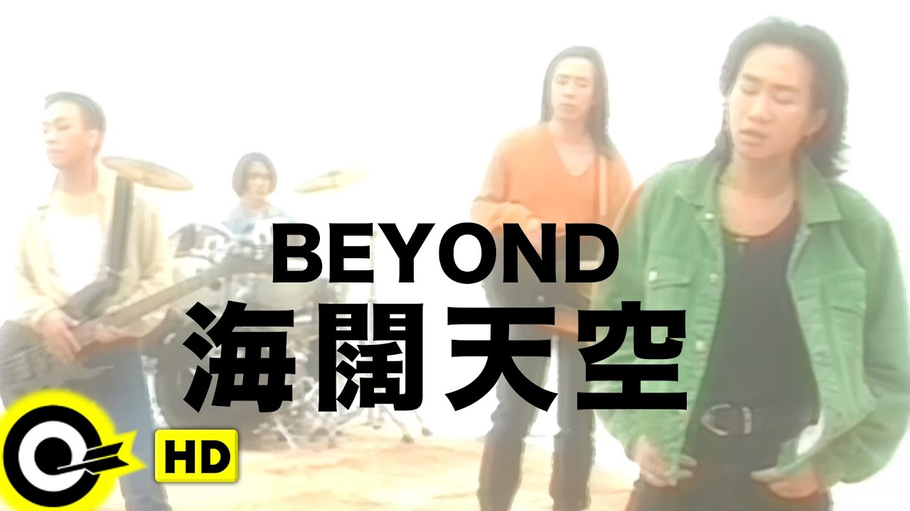

import YouTube from '@/components/patterns/YouTube.astro';

*Beyond were one of Hong Kong’s defining bands. From left: Paul Wong, Wong Ka-keung, Yip Sai-wing, Wong Ka-kui. Photo: @doc_tang*

STYLE looks back at the legacy of Wong Ka-kui, the lead singer of Canto-rock band Beyond, who died aged 31 in an accident on a Japanese game show 27 years ago this June 30

James Dean, Marilyn Monroe and Tupac were all legends that died too soon. In Hong Kong we can add the frontman of one of the city’s home-grown rock bands, Beyond, to that list. Alongside Tai Chi and Raidas, Beyond helped bring local rock music into the public consciousness, the group insisted on forging their style of Canto-rock when charts were dominated by pop icons such as Leon Lai and Andy Lau.

The group’s frontman, Wong Ka-kui, died from an accident on the set of a Japanese game show at 31 years old – 27 years ago this June 30 – and his brother Wong Kar-keung took over as lead from then on. We can only wonder how the landscape of Hong Kong’s music scene would’ve been different if he was still with us.

## Goodbye Ideals

The band’s breakout album and song by the same title, Goodbye Ideals, tells of the struggles of artistic dreams and reality. The tempo makes this more of a rock ballad, which fits the lyrics. The sombre fade out with the lyrics, “Everybody sing rock 'n' roll”, drives the point home.

## Zhen De Ai Ni

With pop charts flooded with songs about love and heartbreak, Wong decided to write a song to honour his mother for all her support through the years. Translating to “I really love you” from Cantonese, the tune was a hit as there weren’t any tunes on that subject matter. It is still used in commercials around mother’s day.

## Pat Ho Yat Sai

In The Dragon Syndicates, author Martin Booth writes, “By 1990, the Hong Kong film industry was the biggest in the world after those of Hollywood and Bombay. It was then that the triads started to muscle in on the business, trying to coral top stars such as Anita Mui, Jackie Chan, Leslie Cheung, or Chow Yun-fat, as well as the sex goddess Amy Yip.”

This phenomenon led to a lot of distress in the entertainment industry as celebrities were being harassed and blackmailed to participate in triad sponsored movies. It was reported that Pat Ho Yat Sai – a Chinese idiom for arrogance – was Wong’s response to what has happening with famous lyrics, “I detest so-called big brothers, we do not need you any more, go to hell.”

## Glorious Years

<YouTube id="DUPhRlPqMb4" />

One of the most popular songs produced by Beyond, Glorious Years is an anthem to commemorate the struggles Nelson Mandela suffered under the apartheid. It was a huge success and the album, “Party of Fate”, went on to achieve triple platinum status.

## Amani

Jaded by the superficial side of the music industry, Beyond went on a soul searching tour to Tanzania which inspired Wong to write Amani. The title means peace in Swahili and talks about the ravages of war and the desire for peace. It is still often covered at charity and fundraising events.

## The Great Wall

<YouTube id="IOXoAvF6r_A" />

Released in 1992, The Great Wall reflects on the culture of a closed off country, like China, in the late 80s. The lyrics talk about the hurt the country has been through and how current generations glorify the victory of revolution and war without paying attention to the suffering.

## Boundless Oceans, Vast Skies

<YouTube id="qu_FSptjRic" />

The sixth song on the band’s “Rock 'n' Roll” album was released only a month before Wong’s death. Boundless Oceans, Vast Skies went on to become one of the group’s bestsellers and was taken up as an anthem by the Umbrella Movement in Hong Kong. It has been argued that I Am Angry would be a better example of Wong’s style and songwriting, but he died before any interviews about the album had taken place.
