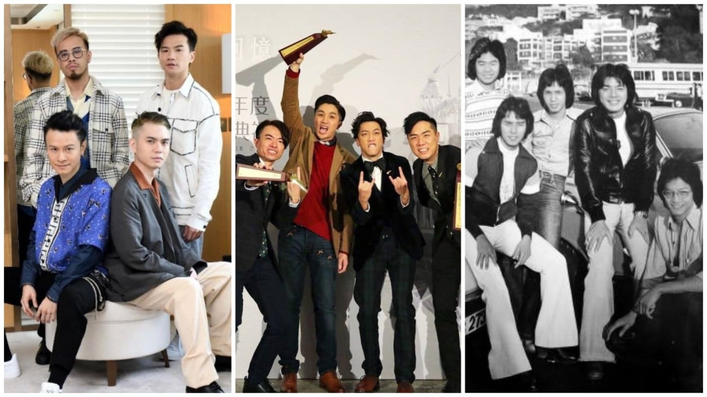
*Some of Hong Kong’s OG Canto-pop sensations: C Allstar, Supper Moment and The Wynners. Photos: C Allstar International Fanclub; Supper Moment; The Wynners/Facebook*

-   Before Mirror’s Keung To rose to fame, Mr. member Alan Po impressed with his vocals on If I Were Eason Chan, while ToNick’s Hang Chiu performed with Hacken Lee
-   Beyond wrote Golden Years about Nelson Mandela, which the former South African president was ‘deeply moved’ by during his final days in hospital

Hong Kong boy bands Mirror and Error have seen great success recently, and some have deemed their popularity a resurgence for Canto-pop in general. From collecting merchandise to keeping up with their social media updates and even trying to catch a glimpse of the band members in person at events, the fan culture surrounding the groups mirrors that of older Canto-pop sensations back in their heyday.

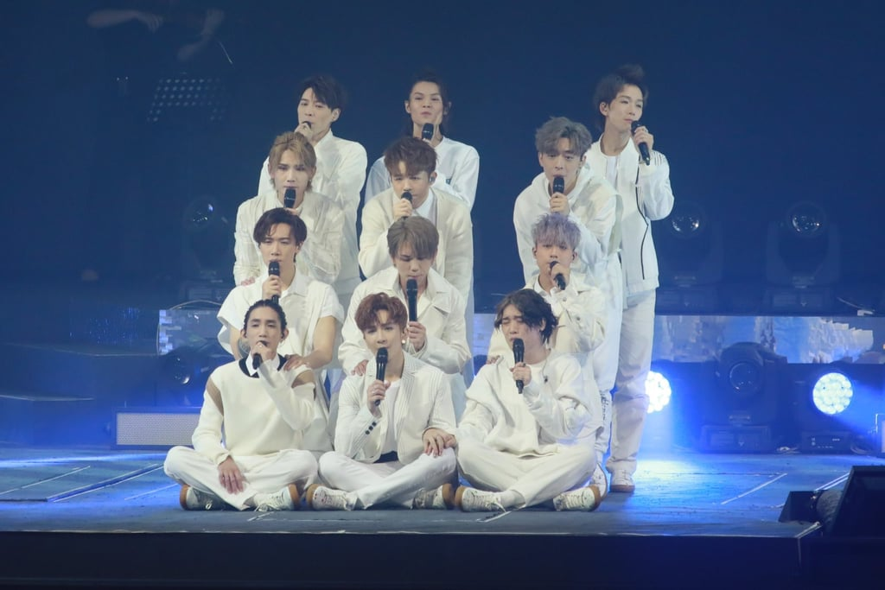
*Members of popular Canto-pop boy bands Mirror and Error performing in a concert earlier this year in Hong Kong. Photo: Getty Images*

Nowadays, fans will go to great lengths to show their love for their favourite singers and musicians. This includes buying products endorsed by star and often even buying up adverts on public transport to wish them happy birthday.

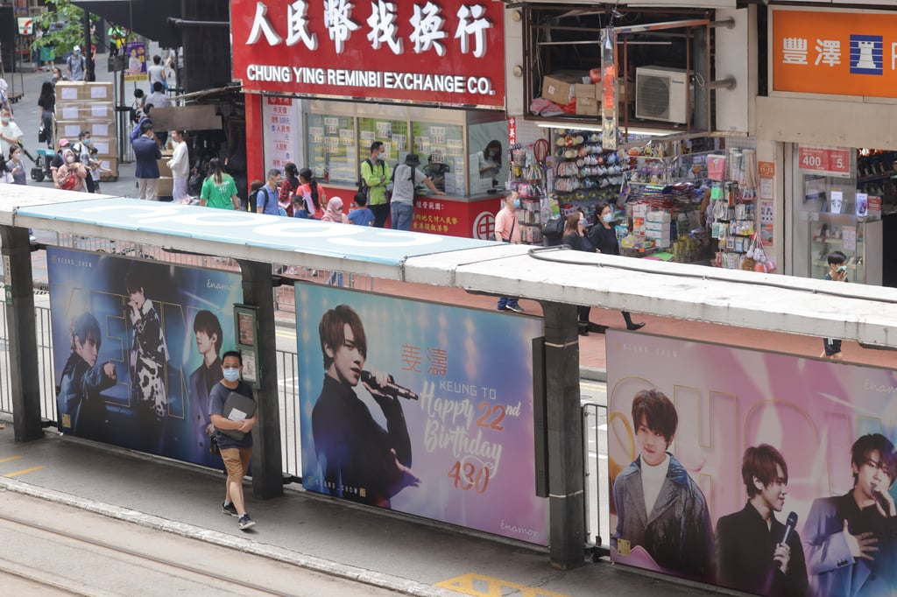
*When popular Canto-pop star Keung To turned 22 in May, his fans bought advertising space near tram stops in Causeway Way Bay to wish him happy birthday. Photo: May Tse*

But what about the OG Canto-pop groups who were just as popular as these new kids on the block? Read on to get to know some of Hong Kong’s older, timeless boy bands who shook up the city’s music scene.

## Beyond

Formed in 1983, Beyond is considered one of the most successful and influential Canto-pop bands. Comprised of brothers Wong Ka-kui and Wong Ka-keung, Yip Sai-wing and Paul Wong, the band rotated through multiple members in its early years, but eventually settled with the four members in 1988.

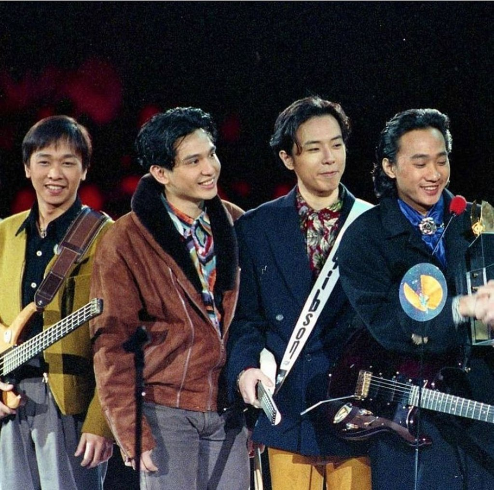
*Beyond was not only popular in Hong Kong, but throughout Asia. Photo: @beyond_hkband/Instagram*

The group’s popularity exploded soon after its debut, and it released multiple iconic songs like *Great Land* and *Boundless Oceans*, *Vast Skies*. In particular, *Glorious Days* stood out among other Canto-pop hits at the time for its subject matter of racism and Nelson Mandela’s struggle. According to an interview with Ka-keung, Mandela even heard the song during his final days in hospital and was “deeply moved”.

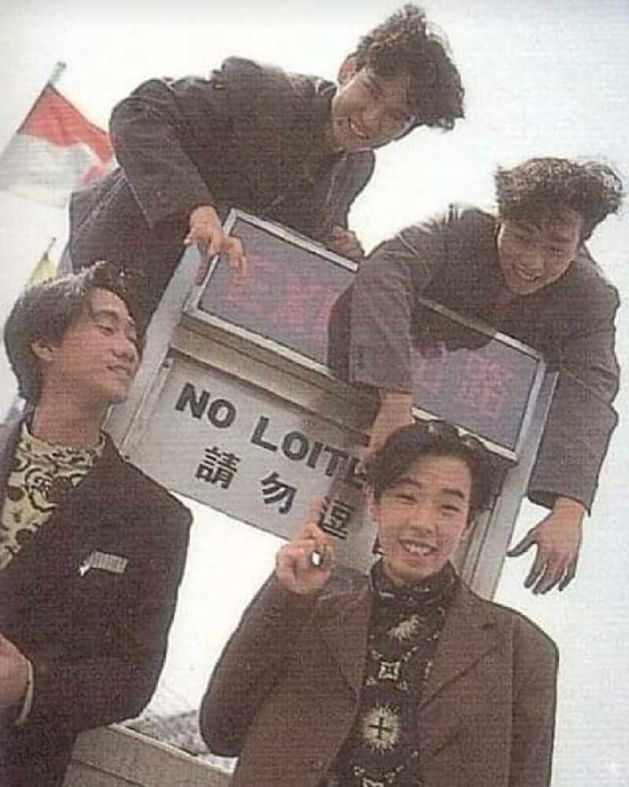
*Beyond released hit songs like Boundless Oceans, Vast Skies and Glorious Years. Photo: @beyondband.lover/Instagram*

Beyond’s reach expanded across Asia too, but it was during overseas promotions at the height of the group’s fame that tragedy struck. On June 24, 1993, the band appeared on a Tokyo Fuji Television game show, standing on a stage platform that was roughly 2.7 metres tall. Ka-kui and Japanese actor Teruyoshi Uchimura fell from the stage – which turned out to be broken – and sustained critical head injuries. Uchimura survived, but Ka-kui fell into a coma. He passed away a week later at just 31 years old.

## Dear Jane

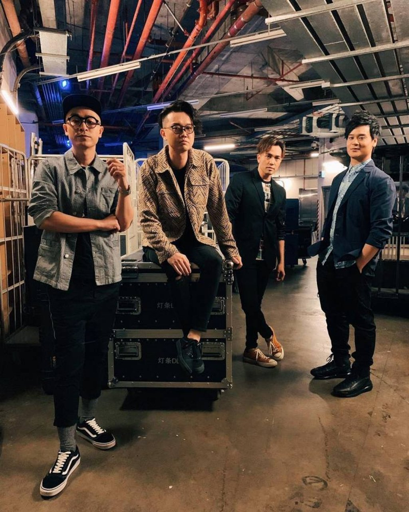
*Dear Jane’s name comes from the male equivalent of a “Dear John letter”. Photo: @dearjaneofficial/Instagram*

Consisting of members Tim Wong, Howie Yung, Jackal Ng and Nice Lai, Dear Jane was formed in 2003. The band’s name comes from the male equivalent of the “Dear John letter”, where a woman writes to tell her boyfriend or husband that the relationship is over. The name reflects a major themes in their music: the trials and tribulations of romantic relationships from a male perspective.

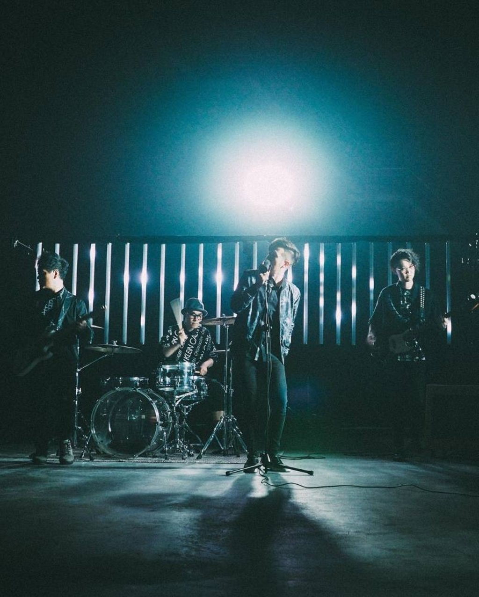
*Dear Jane’s Galactic Repairman is one of the group’s most popular songs. Photo: @dearjaneofficial/Instagram*

Initially starting out with a more pop punk sound, Dear Jane released its first album, “Dear Jane 100”, in 2006. But the group eventually ended up experimenting with different styles over the years, and greater popularity in its hometown followed. Most notably, *Galactic Repairman* was the Cantonese song with the most hits on YouTube in 2020. It is about lead vocalist Wong’s love story with his wife.

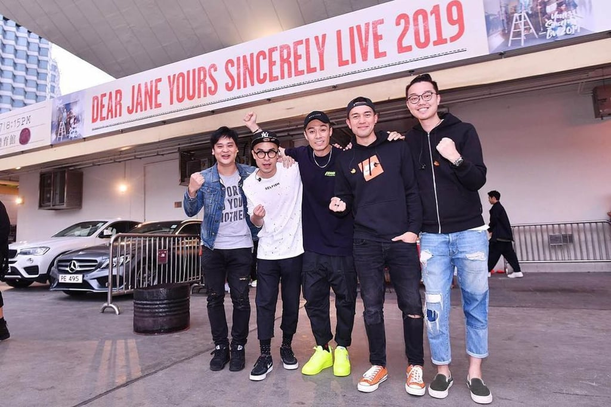
*Dear Jane posing in front of an ad for its concert, “Yours Sincerely Live” in 2019. Photo: @dearjaneofficial/Instagram*

Dear Jane recently announced on Instagram that it will host an intimate concert, performing for students at a hostel within the Chinese University of Hong Kong on August 18.

## Supper Moment

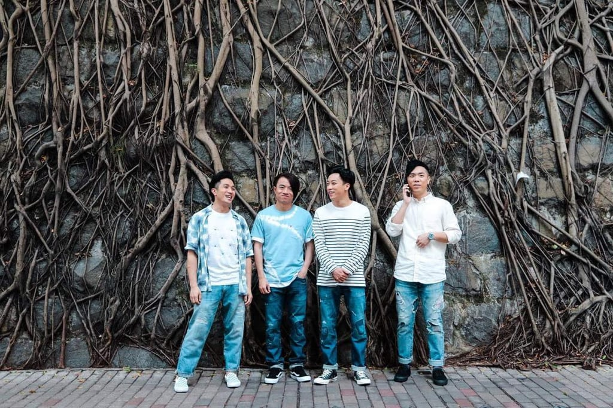
*Supper Moment was formed in 2006. Photo: @suppermomentsunny/Instagram*

Rock band Supper Moment consists of Sunny Chan, CK Cheung, Martin Leung and Hugh Chan. From 2006 to 2009, the group was underground and unfamiliar to most Hongkongers until they signed a record deal in 2010.

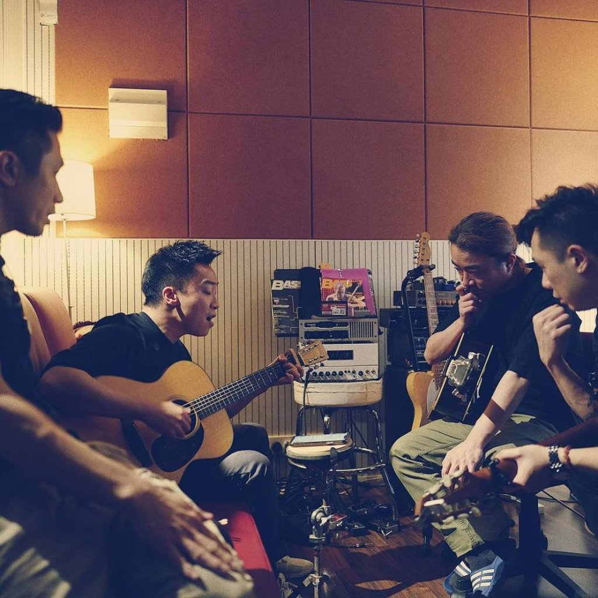
*Classic Canto-pop band Supper Moment. Photo: @suppermomentsunny/Instagram*

In 2009, the group took part in the A-Space Our Rock Story band competition and emerged as the overall winners, as well as winning best vocalist, best drummer and best original song.

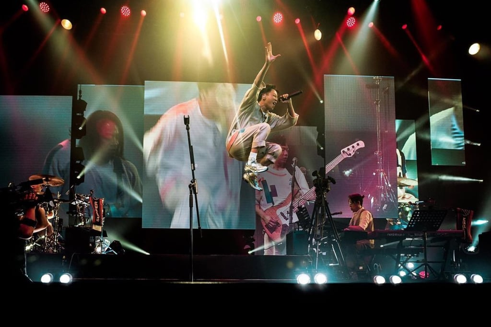
*Supper Moment held a concert recently at Star Hall in Hong Kong in June. Photo: @suppermoment/Instagram*

Aside from their concerts in Hong Kong, Supper Moment also performed in Macau, China, Taiwan, the UK and Canada, and represented Hong Kong at the Summer Sonic music festival in Japan in 2019.

In 2020 during the pandemic, Supper Moment held a virtual concert in which they promoted their most recent album, “Everything Is You”.

## Mr.

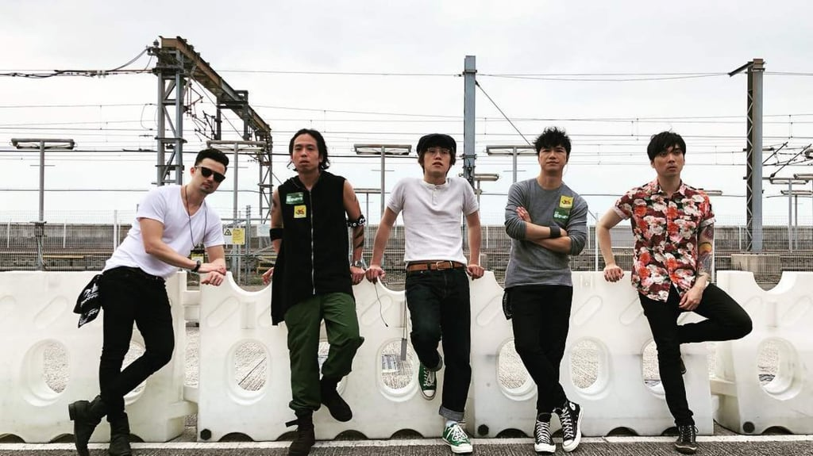
*Mr. was formed in 2008. Photo: @m1ster/Instagram*

Debuting in 2008, Mr. is made up of five members – Alan Po, Ronny Lay, MJ Tam, Dash Tam and Tom To. The group used to be called White Noise.

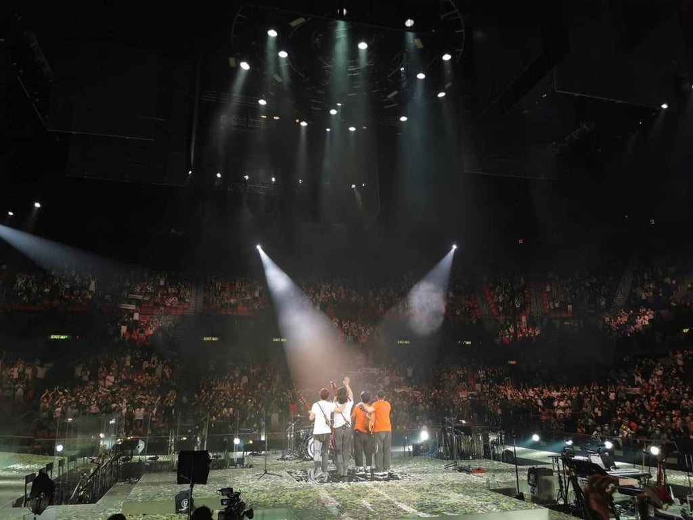
*Mr. held a concert at the Hung Hom Coliseum earlier this year in May. Photo: @mralan229/Instagram*

The group became popular in Hong Kong soon after its debut. In particular, *If I Were Eason Chan* was a smash hit, partly due to their lead vocalist Po’s vocal tone having an uncanny resemblance to Eason Chan’s.

Mr. has also worked with other Canto-pop artists such as G. E. M, Alan Tam and Kolour on concert appearances and collaborative albums.

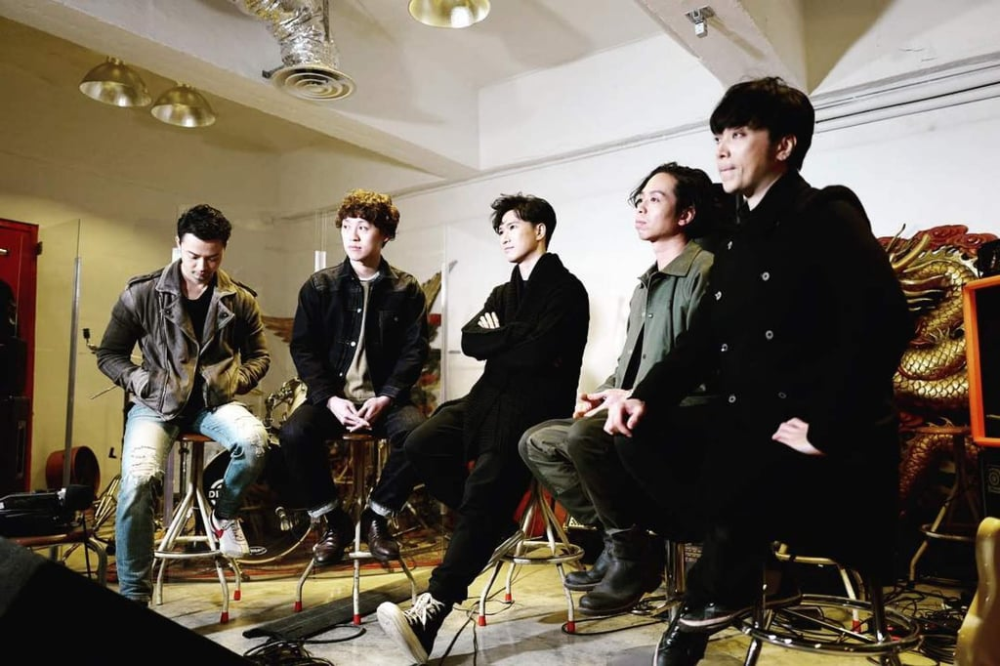
*Mr. used to be called White Noise. Photo: @m1ster/Instagram*

In 2015, the band had a dispute with its record label Universal Music. Ultimately, the members did not renew their contracts, but they reunited in 2019 and released two singles on top of holding a 10 year anniversary concert.

## C Allstar

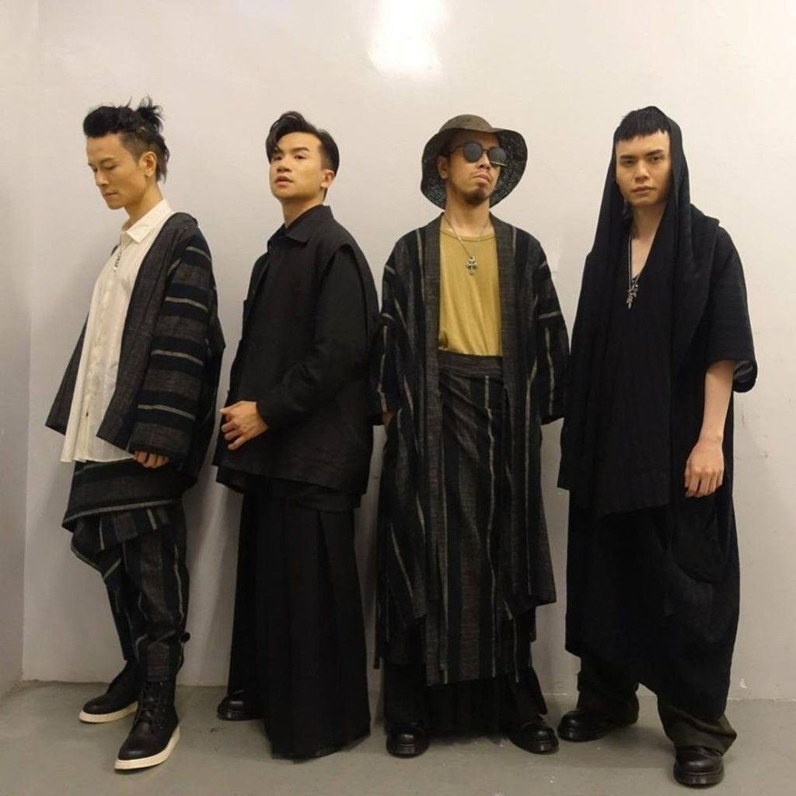
*C Allstar had a temporary hiatus from 2017 until 2020, and during those three years the members developed their own work as solo artists. Photo: @c_allstar/Instagram*

Members King Wu, Kenny Chan (“On Jai”), Andy Leung and Jase Ho (“Soul Jase”) make up C Allstar. All four joined *Star Hunt* in 2009, an online talent hunt show à la *American Idol* or K-pop’s *Superstar K*, becoming the competition’s final four. They finally joined forces as one group.

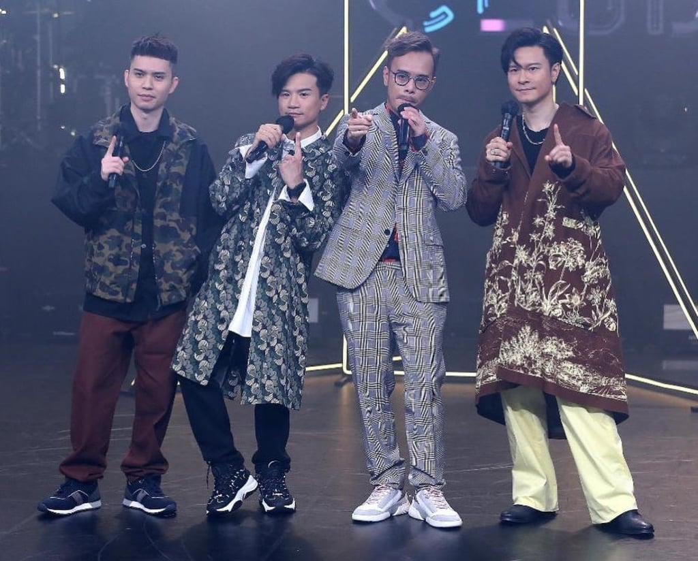
*C Allstar were able to hook in listeners with their a cappella singing. Photo: @c_allstar/Instagram*

Debuting in 2010, C Allstar stood out from the crowd with its a cappella singing. Most of its songs also radiate positive energy and bring joy during tough times. But when the group was just starting out, the members frequently busked in Mong Kok.

After a concert in 2017, C Allstar officially announced that they would disband. From 2017 to 2020, each of the group members ended up operating on a solo basis. Then the group announced on their Facebook page on January 25, 2021, that they are officially working together once again.

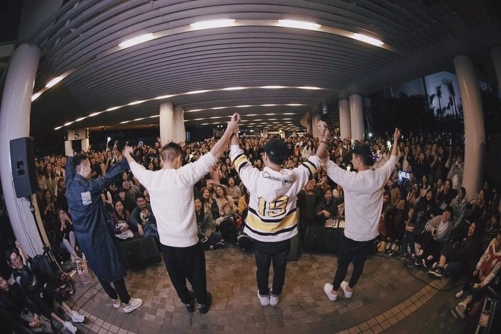
*C Allstar holds an outdoor fan meeting and concert in Tsim Sha Tsui, Hong Kong, around Christmas every year. Photo: @c_allstar/Instagram*

Every Christmas Eve, C Allstar holds an outdoor concert/fan gathering event at the Tsim Sha Tsui pier in Hong Kong. The group sings its classic hits and spends time with fans, counting down the hours until Christmas Day.

## The Wynners

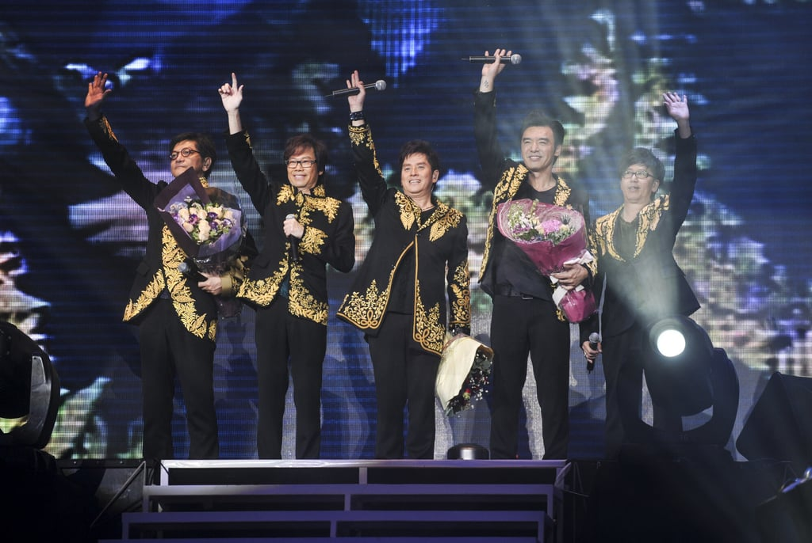
*The Wynners: Anthony Chan, Bennett Pang, Alan Tam, Kenny Bee and Danny Yip.*

Debuting in 1973, The Wynners is one of Hong Kong’s oldest boy bands. The group consists of Alan Tam, Kenny Bee, Bennett Pang, Danny Yip and Anthony Chan. The group initially started out as an English pop band and was one of Hong Kong’s most popular teen groups in the 70s.

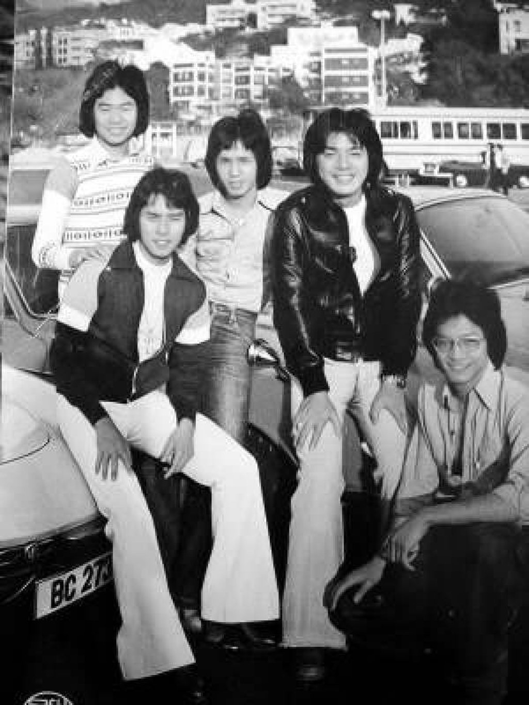
*The Wynners mainly sang English songs in the beginning of their careers, covering popular songs like Hey Jude. Photo: The Wynners/Facebook*

In 1978, some members went their separate ways to develop their own careers. Tam and Bee became popular in Hong Kong in the 80s and still have flourishing careers today. However, the group never formally disbanded, and it has held multiple reunion concerts over the years. In 2017, the band performed at the Axis Theatre in Planet Hollywood, Las Vegas.

The Wynners attend the press conference of the biopic House of the Rising Sons, posing alongside the actors who played them. Photo: 钟镇涛/Weibo

The Wynners were so influential in Hong Kong that not only did the group have its own television show on TVB titled *The Wynners Specials*, but three feature films. Most recently, their origin story was made into a film called *House of the Rising Sons*, which was released in 2018.

## ToNick

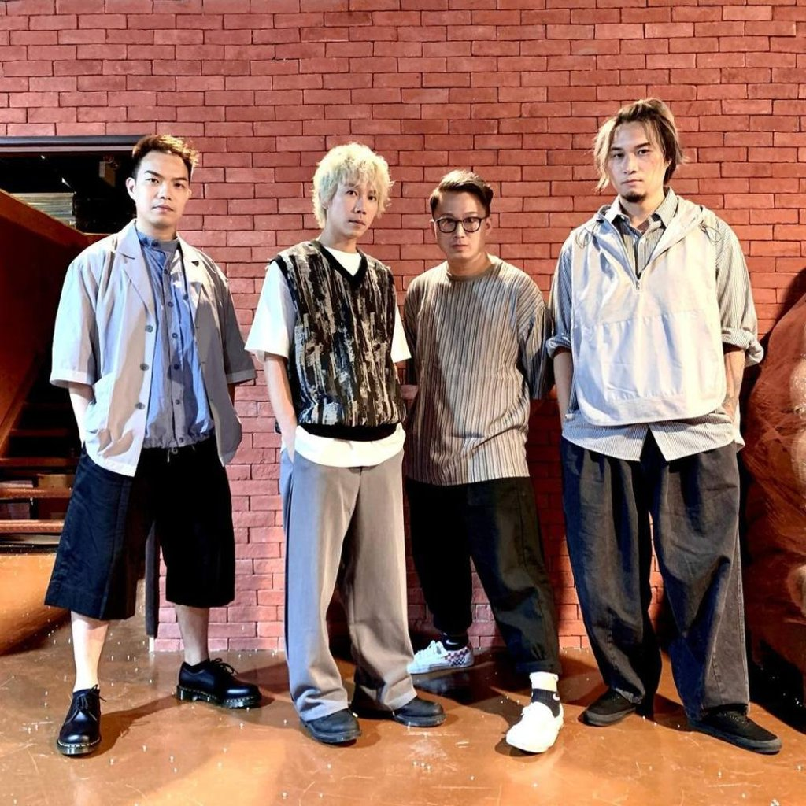
*ToNick formed their own record company 709394 Production in 2013. Photo: @tonick_official/Instagram*

Hang Chiu (“Hang Jai”), Ryan Chan, Siugwai Woo and Yip Sen-hei make up the band ToNick. The band name combines the words “tonic”, which refers the most important note in a music scale, and “nick”, meaning to scratch. Together, “ToNick” means music that can get etched into people’s memories.

*ToNick recently held the concert “Here and Now” at Star Hall in Hong Kong this May. Photo: @tonick_official/Instagram*

ToNick took part in the UMC Music Festival held by TVB in 2007 and ended up winning the competition. They also nabbed the award for best creativity. The band got noticed by song producer Chiu Tsang-hei, signing a contract with him.

The band’s song *Until the End*, featuring on the soundtrack for the film *Vampire Cleanup Department,* was nominated for best original film song at the 37th Hong Kong Film Awards.

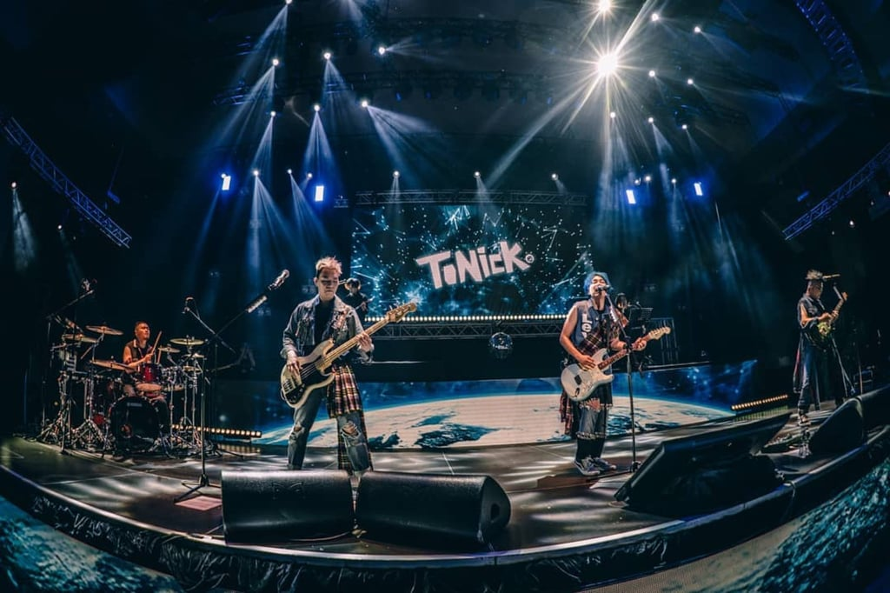
*ToNick performing at one of their concerts. Photo: @tonick_official/Instagram*

The band went on to create their own record company in 2013, named 709394 Production. Some of the members of ToNick have also performed as solo artists, such as Chiu playing in the band for fellow Canto-pop star Hacken Lee’s concert, and Woo playing keyboards and guitar in several TV shows as well as working as a composer, arranger and producer for several artists.
