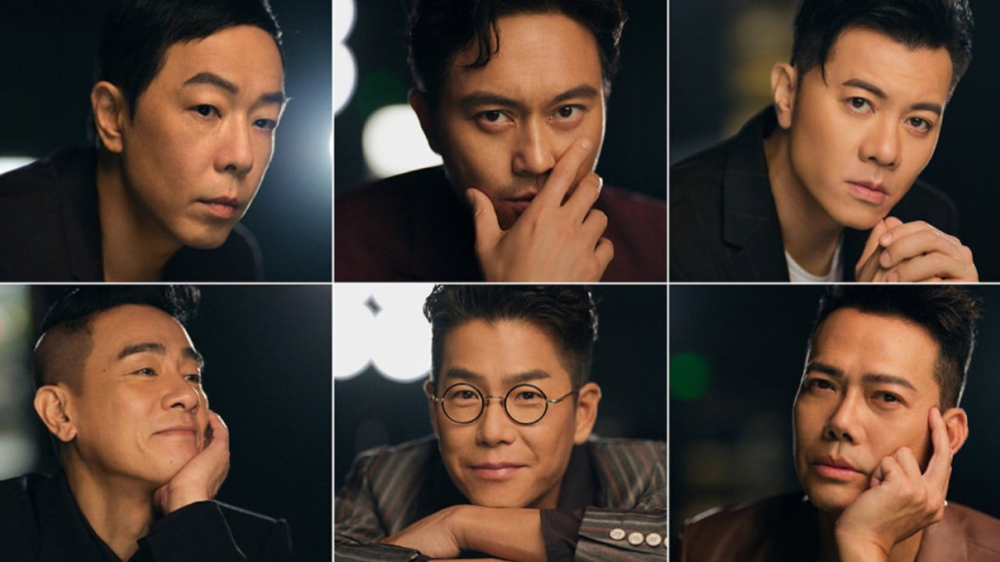
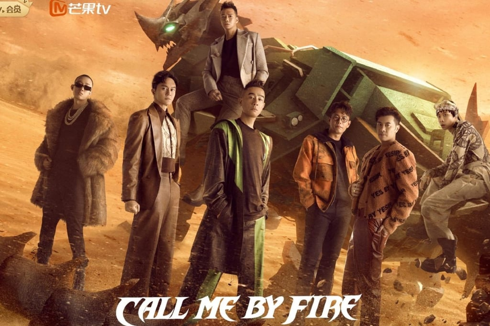
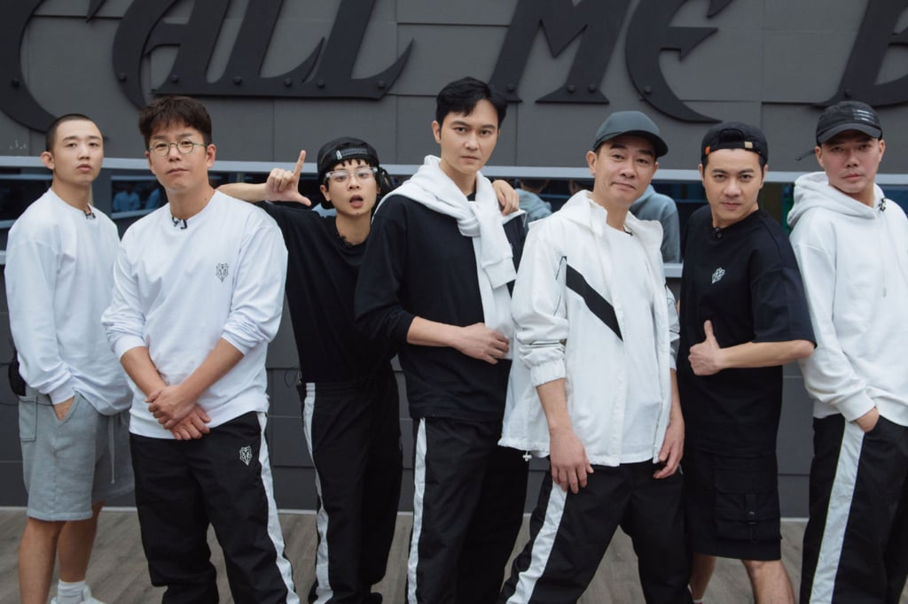
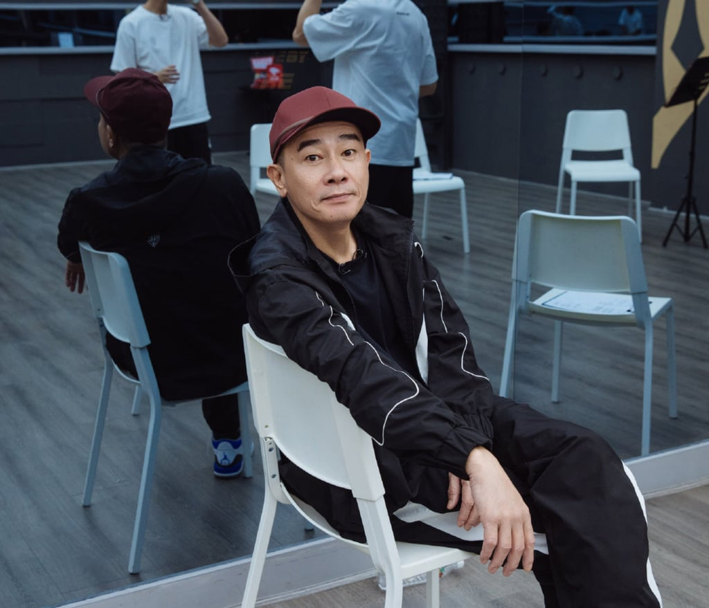
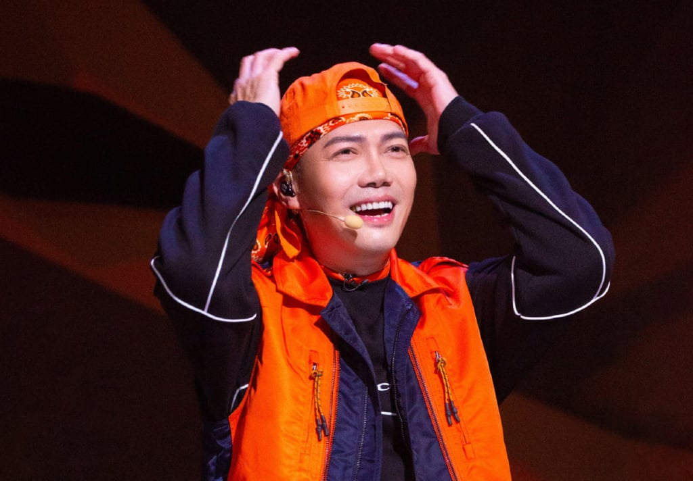
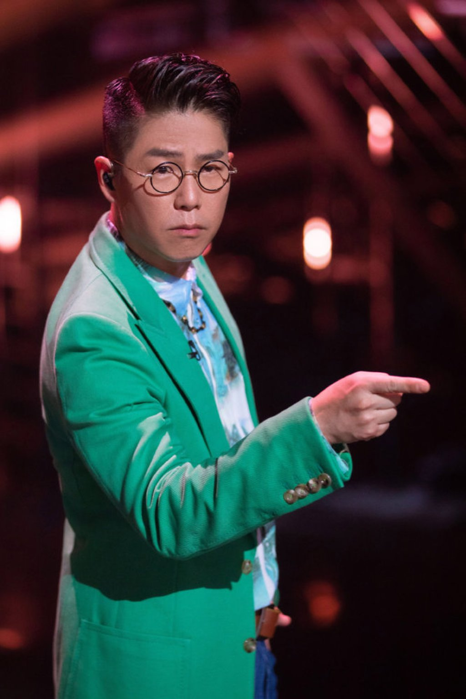
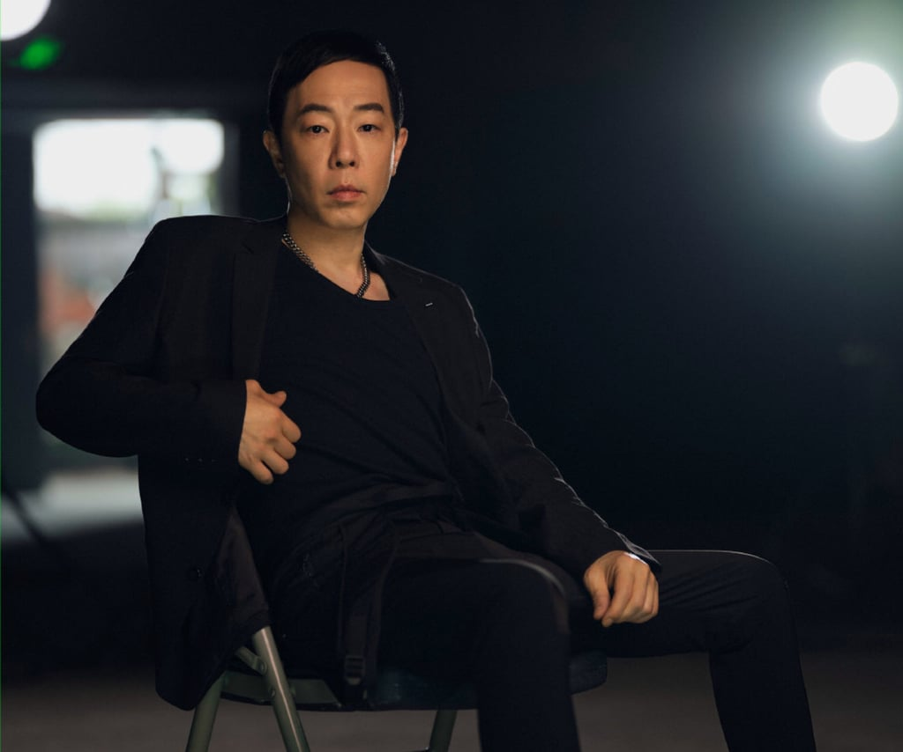
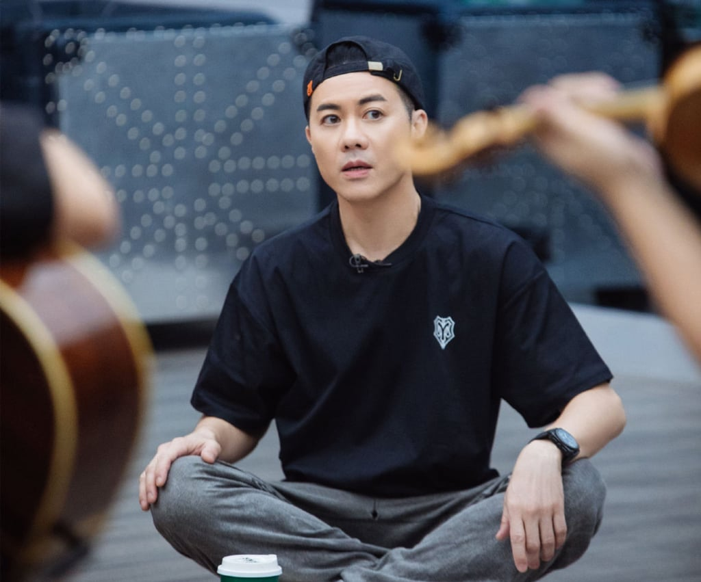
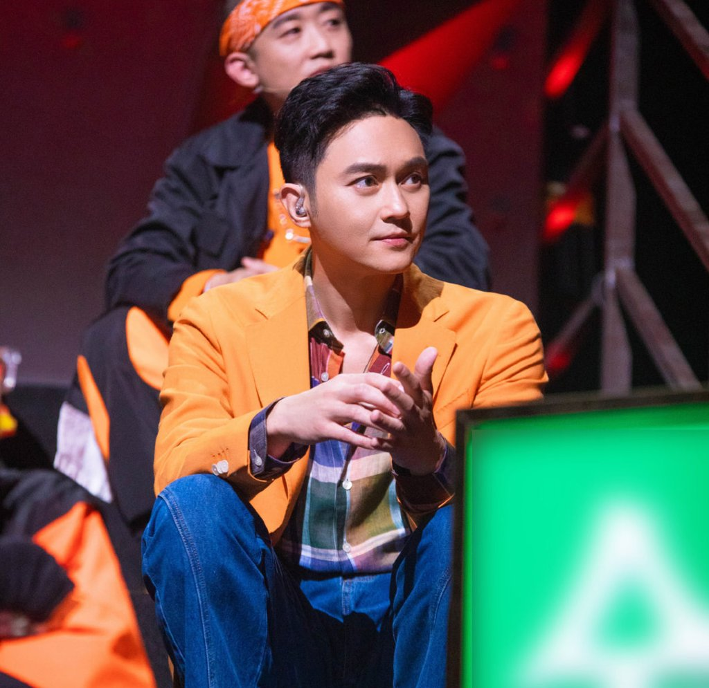

*The six seasoned Hong Kong performers competing in Call Me by Fire. Photo: Weibo*

There’s no denying that Hong Kong’s music scene has been a lot more exciting recently thanks to the rise of K-pop-esque boy band Mirror. However, for Hong Kong’s older entertainers, these days more opportunities seem to abound on the Mainland, not to mention higher pay.

*Chinese reality TV show Call Me By Fire features 33 male celebs, including six from Hong Kong. Photo: Weibo*

A case in point is this year’s hot Chinese reality show *Call Me By Fire*, which invited 33 male celebrities to take part. All of them have been in the industry for at least 10 years, but they have to compete for a spot in the final 17-member super group.

*From left to right: Gai, Jerry Lamb, Bridge, Julian Cheung, Jordan Chan, Edmond Leung and Michael Tse. Photo: Weibo*

There are six familiar Hong Kong faces in the show – all in their 50s (except Edmond Leung, who is hitting the big five-oh this November) – and rarely seen locally today. So let’s take a little trip down memory lane to remind ourselves of what made them famous in the first place, and what they’ve been up to in recent years.

## Jordan Chan

*Actor and singer Jordan Chan was one of the dads on hit Chinese TV show Baba Qu Nar (Where Are We Going, Dad?) with his son Jasper. Photo: Weibo*

He performed as a dancer before being selected as a member of boy group Wind Sea Fire in the early 90s, but Chan gained wider success on the big screen, with his acting debut in *Twenty Something* even bagging him the best supporting actor award at the 14th Hong Kong Film Awards. He later appeared in 1996’s *Young and Dangerous*, a film about a group of triad members, and the subsequent films in the series.

He [continued to act and sing](https://www.scmp.com/magazines/style/celebrity/article/3115629/hong-kong-actors-and-singers-kenny-bee-and-jordan-chan?module=inline&pgtype=article) throughout the 2000s, with his musical style shifting more towards R&amp;B and rap. In recent years, though, he’s become known for his participation in another reality show – *Where Are We Going, Dad?* with his son Jasper.

## Michael Tse

*Like several of the Hong Kong stars on this list, Tse got his start on Young and Dangerous. Photo: Weibo*

Michael Tse Tin-wah was also a former member of Wind Sea Fire. And just like Chan, Tse was in the *Young and Dangerous* film series too. Nevertheless, he stopped singing after his dance group days and focused on acting in drama series on TVB, with his most well-received role, Laughing Gor from 2009’s *E.U.,* making him a household name to a new generation of viewers.

## Jerry Lamb

*Actor, TV host and the brother of Jan Lamb, Jerry is also a contestant on Call Me By Fire. Photo: Weibo*

Known for his slightly nerdy image and for being the younger brother of famous radio DJ Jan Lamb, Jerry Lamb Hiu-fung also featured in the triad movie series alongside Chan and Tse. Besides his acting career, Lamb is also known for his quick wit as a TV host; he co-hosted the variety show *Super Trio Series* for more than 10 years.

## Paul Wong

*Paul Wong is perhaps the most respected musician of the bunch, having been part of the rock band Beyond for many years. Photo: Weibo*

The legacy of Beyond – the guitar band led by the late Wong Ka-kui which Paul Wong Koon-chung joined in 1985 – ensures the latter is well respected as a musical talent. The band released its debut album in 1986 and disbanded – for the final time – in 2005. A prolific musician with eight solo albums, Wong also composes music and lyrics for others in addition to his solo career as a singer/songwriter.

## Edmond Leung

*He may have lost at the New Talent Awards in 1989, but Edmond Leung was signed to a record label anyway, and the rest is history. Photo: Weibo*

Edmond Leung Hon-man entered show business as a contestant in the 8th New Talent Singing Awards back in 1989. He didn’t win the competition, but was nevertheless talented enough to be signed by a record label afterwards. Other than having heard his hit songs *A Man in the Closet* and *Lingering Game*, you might also have seen him co-hosting TVB’s popular variety show *Beautiful Cooking* back in 2008. He is a pretty decent footballer too, and was once on the Hong Kong youth football team.

## Julian Cheung

*Since his success with A Modern Love Story in the early 90s, Julian Cheung hasn’t rested on his laurels. Photo: Weibo*

With songs like A Modern Love Story (from his and Maple Hui’s duet album) becoming huge karaoke hits in the early 90s, Julian Cheung Chi-lam has since released over 20 albums. He even continued to perform in a handful of TVB drama series. Some of his popular roles include Guo Jing in The Legend of the Condor Heroes (a wuxia series based on the novel by Jin Yong), Man Chor in the Return of the Cuckoo, and Jayden in Triumph in the Skies. Not bad!
