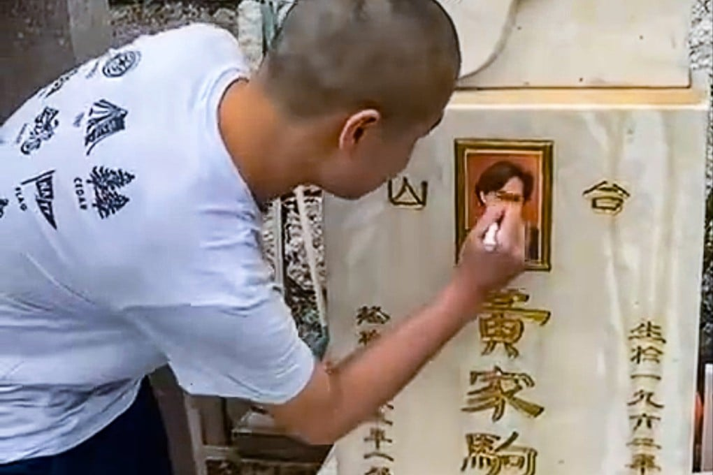
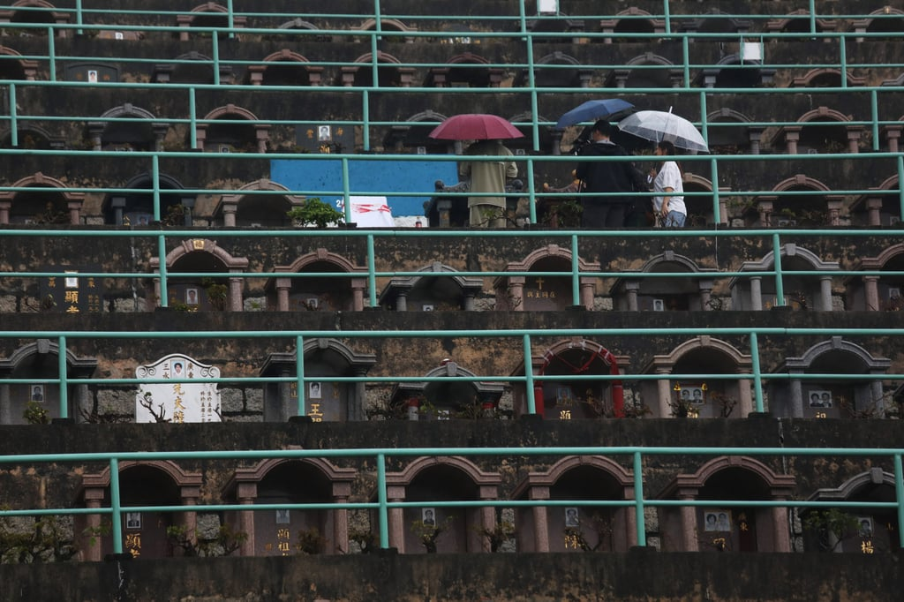
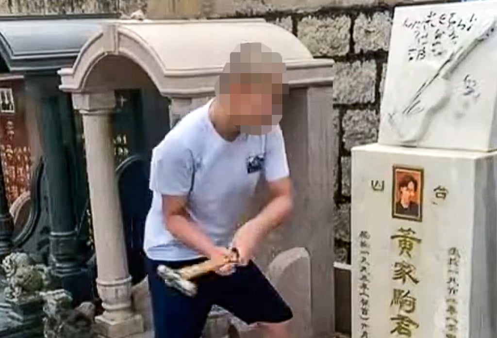

*Police arrested two people, including a 15-year-old, over the vandalism of lead singer Wong Ka-kui’s grave. Photo: Facebook*

The former manager of Hong Kong rock band Beyond has demanded “proper punishment” for two men charged over vandalising the grave of lead singer Wong Ka-kui.

Leslie Chan Kin-tim, who managed the band from 1986 to 1993, told the Post on Monday that “such sickening behaviour” was unacceptable.

“No one would accept such behaviour, no matter if you are a fan of Beyond or not,” he said. “I feel sorry for what the two young men did yesterday. However, proper punishment should be given at the end of the day.”

The two suspects were charged with a joint count of criminal damage on Monday and would be brought before Kwun Tong Court the following day, police said.

Chan also blamed the “unhealthy environment on social media” as a possible reason behind the culprits’ behaviour.

*Fans visit grave of Beyond’s lead singer, Wong Ka-kui. Photo: Xiaomei Chen*

Videos circulating online showed one man dousing the memorial plaque with what appears to be a bottle of Coca-Cola and smashing Wong’s portrait with a hammer.

Police on Sunday arrested a 15-year-old boy and a 23-year-old man in connection with the vandalism after receiving a report from staff at the Junk Bay Chinese Permanent Cemetery earlier in the day.

The attack was reportedly at least the fourth vandalism case targeting Wong’s grave in the past six years.

Detectives from the Kwun Tong criminal investigation unit are following up on the case.

On Tuesday, Wong’s tombstone was seen covered with white cloth, while many fans arrived at the cemetery to pay their respects.

A mainland Chinese man surnamed Hao said many fans were “exasperated and sad” after reading the news.

“Wong was very positive and loved peace. He is a symbol of our spirit,” he said. “To all those who treat Ka-kui like this, what I want to say is that you may not like him or his music, but you cannot hurt him.”

The late musician’s brother, bassist Wong Ka-keung, was enraged and lashed out at the vandals on Sunday.

“What kind of country is this where morality has fallen to such a level? Travelling a long distance to destroy someone else’s cemetery, what will you gain from all this? Is hurting others really your source of satisfaction?” he said in a post on social media.

*A screenshot from a clip showing a man attacking the ceremonial plaque of Beyond’s lead singer with a hammer. Photo: Facebook/Booska Kevin*

“I don’t know how to condemn you, but I am saddened by the fact that your living environment has produced such a pathetic, shameless, pitiful and detestable individual like you.

“I wonder how many more of your kind exist and thrive within our nation. With such despicable individuals, the demise of our country is not far away.”

Beyond drummer Yip Sai-wing also called the incident despicable.

“These two individuals have been arrested and must face legal consequences. Ka-kui’s spirit in heaven will not let them go unpunished,” Yip said.

Guitarist Paul Wong Koon-chung said: “When the reason behind committing such wrongful acts is to gain ‘attention’ and when we allow it to continue happening, isn’t the world cold?”

Wong Ka-kui, singer-songwriter, was considered the rock band’s core. He died at the age of 31 in Japan, after he fell off a 2.7-metre-high (8.85 feet) stage while filming a game show in June 1993.

He landed head first on the ground and immediately slipped into a coma.
