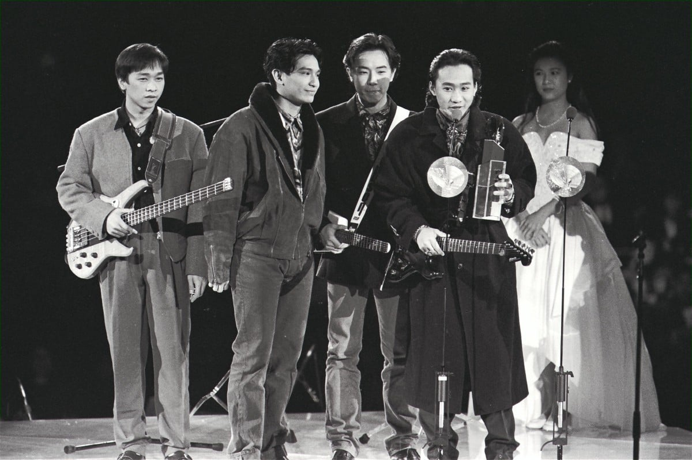
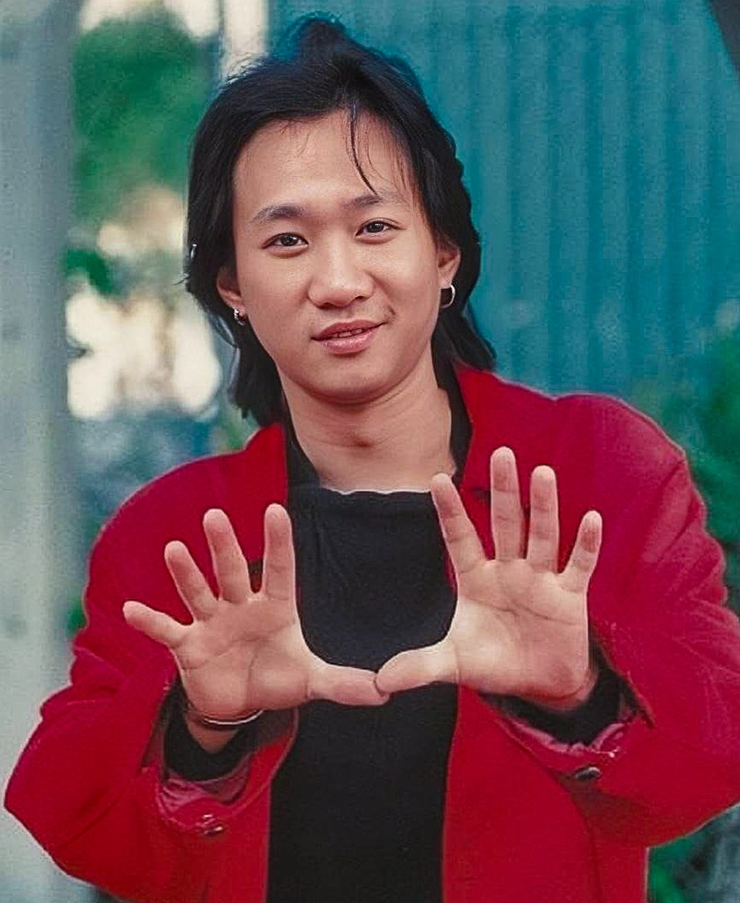
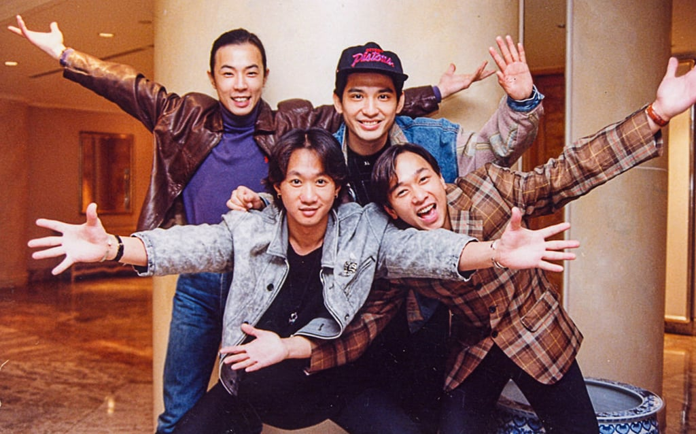
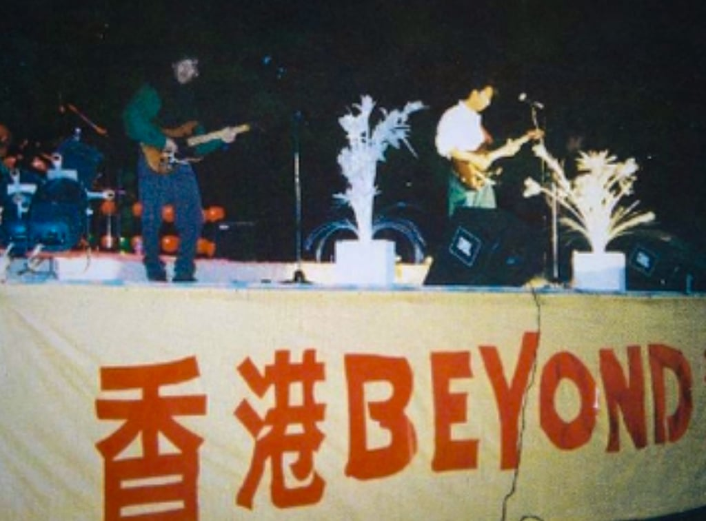

*Beyond won multiple music awards in the 1990s and continue to enjoy great popularity in Hong Kong. Photo: Xiaomei Chen*

Beyond was a Hong Kong band beyond its time, as seen from the outpouring of rage this week over the vandalism of the grave of its lead singer, who died 31 years ago.

The public, band members and loyal fans flooded social media platforms with condemnations after a man and a 15-year-old boy were arrested on Sunday for allegedly defacing the grave of the group’s singer Wong Ka-kui and pouring liquid over his memorial plaque.

Some fans, including those from mainland China, visited the grave to check the damage and tearfully pay their respects.

The group’s 1993 single, “Boundless Oceans Vast Skies”, is a Canto-rock classic and an integral part of Hong Kong’s collective memory.

A staple at karaoke parties and protests, the song’s lyrics delve into the importance of following one’s dream and living without regrets.

Brothers Wong Ka-kui and Steve Wong Ka-keung joined Yip Sai-wing and Paul Wong Koon-chung to form the band in the early 1980s. The group welcomed and said goodbye to various members over the years, before settling on its final ensemble in 1988.

*Wong Ka-kui’s musical journey started at the age of 17 when a neighbour handed him his first guitar.*

Wong Ka-kui’s musical journey started at the age of 17 when a neighbour handed him his first guitar.

He and Yip, the band’s drummer, founded Beyond in 1983 before encouraging his younger brother to join as a bassist the next year. Guitarist Paul Wong, who started out as a design student, came on board later on.

The group experimented with various styles, ranging from punk to heavy metal, and collaborated with various underground musicians.

Beyond self-financed its first concert at Caritas Centre in 1985, but initially struggled to rock the city at a time when Cantopop stars such as Alan Tam Wing-lun, Leslie Cheung Kwok-wing and Anita Mui Yim-fong reigned supreme.

But the band did manage to attract the attention of some music promoters, releasing its debut album “Goodbye My Dreams” on cassette in 1986.

The tracks’ lyrics were mostly penned by Ka-kui and blurred the lines between hard rock, new wave, post-punk and experimental.

Their music struggled to make headway among local listeners until the release of their 1988 album, “Secret Police”, which comprised more melodic tunes and pop ballads.

Veteran musician and DJ Elvin Wong Chi-chung, who was among the first DJs to play Beyond’s songs on the radio, praised Wong Ka-kui as one of Hong Kong’s greatest musical heroes.

“His voice represents youth and rebellion, especially among the grass roots and the underdogs. His presence and impact went beyond the boundaries of Hong Kong,” Elvin Wong said in a 2018 interview.

“He had a talent for fusing many different styles of music and transforming them into accessible and yet quality Canto-rock.”

*Beyond’s music struggled to make headway among listeners until the release of their 1988 album, “Secret Police”. Photo: Facebook*

While Beyond’s melodic pop in later years was slammed by some for being too commercial, Wong Ka-kui actually started writing tracks covering social issues such as poverty, peace and injustice.

Chief among these socially conscious tunes was “The Glorious Days”, a tribute to former South African president Nelson Mandela.

“Ka-kui tried to adapt foreign musical styles into his work and localise it,” Elvin Wong said in a 2008 interview.

“What I respect him for the most is that although he went through tremendous hardship, he achieved what he dreamed of and created music that everybody could connect to.”

Beyond moved towards becoming rock legends near the end of the 1980s, joining acts such as Tat Ming Pair and Tai Chi, as they offered a rock-n-roll alternative to Cantopop tracks that had dominated the charts.

The band’s music drew on their life experiences and their outlook of the world.

Tracks such as “Vast Land” and “Great Wall” celebrate China’s history and landscape, while “Amani” was written after a trip to Africa and spoke about the impact of war on children.

Beyond also set itself apart from other Hong Kong bands by striving to take its music around the world, becoming one of the first local groups to play in mainland China when it held its first concert in Beijing in 1988.

*Beyond, here seen playing at a 1988 concert in Beijing, was one of the first Hong Kong bands to perform in mainland China. Photo: Bilibili*

Beyond was extending its reach across Asia too, when tragedy struck at an overseas promotion event amid the height of the band’s fame.

The band was taking part in a Tokyo Fuji Television game show on June 24, 1993, when Wong Ka-kui and Japanese actor Teruyoshi Uchimura fell from a 2.7-metre-tall (8.85 foot) stage and suffered critical head injuries.

Uchimura survived, but Wong fell into a coma and died a week later. He was just 31 years old.

Hong Kong’s showbiz scene and his loyal fans mourned Wong’s death.

The Post ran a story on July 1 of that year under the headline “Fans pay homage to Beyond singer” that spoke of how fans held a vigil outside the band’s studio on Sai Yee Street, Mong Kok.

Two days later, the newspaper reported: “Fans of the pop band Beyond wept at Kai Tak airport last night as the body of lead vocalist Wong Ka-kui was brought back from Tokyo. More than 100 fans, mostly teenage girls, waited in the arrivals hall for … the body.”

*Beyond’s songs were often sung at mass demonstrations during the “Occupy Central” movement in 2014. Photo: Dickson Lee*

At his funeral on July 5, the Post recounted how “screaming fans broke through police barriers” as Wong’s hearse passed through Quarry Bay.

“More than 3,000 distraught fans packed the pavements, tram stops and footbridge outside the funeral parlour in King’s Road, yelling ‘Ka-kui’ and singing the band’s songs,” the paper wrote.

Steve Wong took over as lead vocalist after the tragedy, with the band carrying on as a trio. They released two albums and performed a dozen or so concerts around the world until they decided to disband in 2005 to pursue solo projects.

Beyond was only active for just a decade, but took the local music scene by storm in half the time. And while those days are in the past, their legacy lives on.
