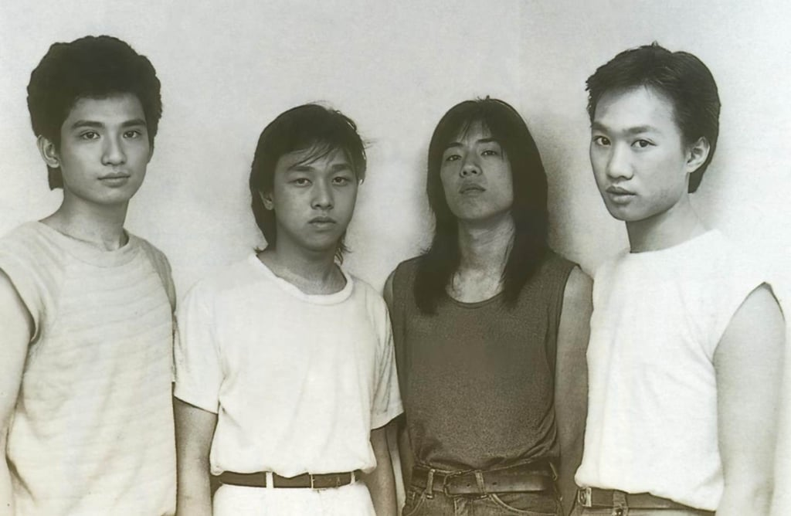

*Wong Ka-kui in a still from Because of You – Ka Kui.*

A new documentary film about Wong Ka-kui, the legendary frontman of Hong Kong’s most influential rock band, Beyond, has arrived – but few people in the general public are even aware of its existence.

Because of You – Ka Kui is packed with never-before-seen footage and intimate revelations from those who knew Wong. Yet, it is also a flawed and incomplete portrait, conspicuously missing the voices of his own brother and bandmate.

The film, one cannot help but feel, is not just a story about a rock star; it is a testament to a complicated and contested legacy, one still haunted by the bitter disputes that subsequently tore his band apart.

To understand the documentary’s shortcomings, one must first understand the band’s monumental place in Cantopop history.

*(From left) Beyond members Yip Sai-wing, Wong Ka-keung, Paul Wong and Wong Ka-kui in a still from Because of You – Ka Kui.*

Forming in 1983, Beyond – comprising lead singer Wong Ka-kui, his bassist younger brother Wong Ka-keung, guitarist Paul Wong Koon-chung (no relation) and drummer Yip Sai-wing – started as an underground indie act before hitting the mainstream.

They paved the way for other bands in Hong Kong with their mix of commercially viable love ballads, such as “Like You” and “I Really Love You”, without compromising their rock orientation.

Wong Ka-kui, the main songwriter and lyricist, wrote thoughtful yet daring lyrics that laugh at Hong Kong’s entertainment industry in “Face Giving Party” and even told gangsters to “go to hell” in songs like “Insufferably Arrogant”. This type of statement in music has rarely been duplicated in popularity in the city.

In the 10 years when Beyond was active with Wong Ka-kui at the helm, their *Party of Fate* album reached triple platinum, with many songs such as “The Grand Earth” and “The Glorious Years” topping charts and winning awards.

His death in a filming accident in Japan in 1993, at the height of their fame, immortalised him in the history of Hong Kong pop culture.

*Wong in a still from Because of You – Ka Kui.*

It is this legacy that drew a packed house to a private showing of *Because of You – Ka Kui* at Artiant Hub, a small events space in Hong Kong’s Lai Chi Kok neighbourhood that fits about 80 people, which we attended. So far, the film has only been available for viewing at a handful of these private screenings.

Produced by the band’s previous manager, Leslie Chan Kin-tim, and their drummer, Yip, the 138-minute documentary does offer some new revelations.

One of Wong Ka-kui’s ex-girlfriends, Kim Poon Sin-lai, divulges the intimate moment when the band’s breakout ballad, “Like You”, was written.

One of Beyond’s previous guitarists and a founding member of the band, William Tang Wai-him, revealed the immense pressure Wong Ka-kui was under after the song dedicated to his mother, “I Really Love You”, became a huge commercial success.

The film, which paints Wong Ka-kui as a kind yet principled person, also includes a lot of never-before-seen footage from Chan, offering intimate moments such as the band’s famous tour to Kenya, which inspired their hit song “Amani”.

*Kim Poon (right), one of Wong’s former girlfriends, speaks at a screening of the documentary film Because of You – Ka Kui. Photo: Lisa Cam*

However, the documentary is long and frustratingly flawed. The narrative is vague, with many of his friends’ quotes leading nowhere in particular. The editing, meanwhile, with its constantly changing perspectives, would make the toes curl of anyone with any experience in the area.

While the film’s tagline speaks of seeing Wong Ka-kui from the viewpoints of people who knew him – mainly those who worked with him, as well as two ex-girlfriends – it fails to convey why he was so influential, and is unlikely to convert anyone who has not heard of Beyond into a fan.

A huge void in the documentary is the lack of childhood insights and the presence of former band members, except for Yip, who described Wong Ka-kui as a musician whose skills were head and shoulders above everyone else in the band.

When did he pick up his first guitar? How did a boy growing up in Hong Kong’s low-income housing come up with such poetic and insightful lyrics? What was his mother’s reaction when one of Hong Kong’s chart-topping songs was dedicated to her? All these questions are left unanswered.

*Wong (right, back row) and Yip Sai-wing (left, back row) in a still from Because of You – Ka Kui.*

Chan is defensive on this point. “Ka-kui’s childhood or Beyond’s career history are not the theme of this documentary,” he said in an interview with the Post. “I have received feedback that it is a pretty good film even without these elements from his past.”

The film’s glaring omissions, however, are not accidental; they are the result of a long and bitter history. Beyond continued for six years after Wong Ka-kui’s death before disbanding in 1999, and the fallout is well documented.

In a searing 2014 post on mainland Chinese social media platform Weibo titled “Truth”, bassist and younger brother Wong Ka-keung stated that the only reason Beyond disbanded was that Paul Wong insisted on leaving, citing unhappiness with the distribution of income and his desire not to carry the “deadweight” of Yip any more.

In the Weibo post’s Q&A section, Wong Ka-keung also expressed that even before his brother’s death, the band realised that Chan had a clause in their contract that he would control a large part of their catalogue’s usage rights for 50 years and take a huge part of the profits.

The dispute ended up in court, with Chan accusing Wong Ka-keung of destroying his reputation. Chan later sold Beyond’s catalogue to Universal Music, only retaining usage rights to some of the songs, including those used in the documentary.

*Wong in a still from Because of You – Ka Kui.*

This acrimonious backstory directly explains the film’s limitations, and Chan admits that finding funding for the project was difficult.

“Whenever I spoke to investors, the main comments were that the participants were mainly unknowns and they’d ask why his brother Wong Ka-keung and previous band member Paul Wong aren’t part of it,” he says.

Even today, the passion for Beyond’s music persists. During the screening’s Q&A session, fans from all over China were present.

One from Inner Mongolia asked if there would be a wider release, while another from Sichuan expressed that listening to Beyond since he was young had sparked his interest in Cantopop, leading him to learn Cantonese.

Yet this devotion is contrasted by the disunity among those Wong Ka-kui left behind. In a sound clip from the documentary, he reveals his wish that his music would inspire young people in Hong Kong to form bands.

*A still from Because of You – Ka Kui.*

The irony is poignant: after 26 years and counting, there is no sign that the remaining three band members can settle their differences for a tour, or even a more well-rounded documentary.

The time for a complete telling of the band’s story is running out. If Wong Ka-kui were alive today, he would be 63. His ex-girlfriend Poon, who was a few years younger than him, feels the urgency of this fading history.

“When Ka-kui died, they lost their centre of gravity,” she told the Post. “If we don’t tell our stories of Ka-kui, we’re going to eventually get to an age where we won’t remember so much any more.”

Because of You – Ka Kui will next be screened at Damansara Performing Arts Centre, Selangor, Malaysia, on October 27; and Taipei Music Centre, Taipei, Taiwan, on November 9.
