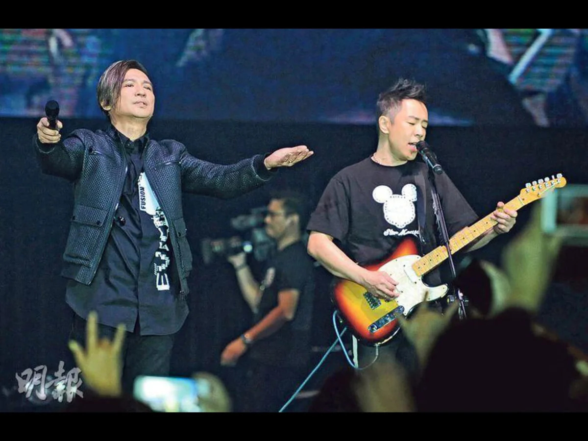

13 Jun - Beyond members Paul Wong, Yip Sai Wing, and former guitarist Lau Chi Yuen expressed happiness over the success of their show, "Ka Kui... The Love Continues Charity Concert", in celebrating the band's late vocalist Wong Ka Kui's birthday.

As reported on Mingpao News, the concert, which was held on 11 June, boasted the performances of top singers including Gigi Leung, GEM Tang, Grasshoppers, and RubberBand. Beyond themselves perform at the event, despite the absence of another member, Ka Kui's brother Steve Wong.

Speaking to the media after the show, Paul, who shared that the concert was able to accumulate a big amount of donation for charity, added, "This is truly rare. Although he is no longer with us, we can still do the things that made him happy."

Meanwhile, Lau, who is now residing in Taiwan, stated that he is happy to be reunited with his two friends for the show.

As for Steve's absence, Yip admitted that it was quite regrettable, but expressed hopes that the bassist will be able to join them in future shows.

"If there is a chance, we would like to do it every year on 10 June, as a birthday gift to Ka Kui," said Yip.

"As long as we're still here, we promise that we will do our best," Paul added.
