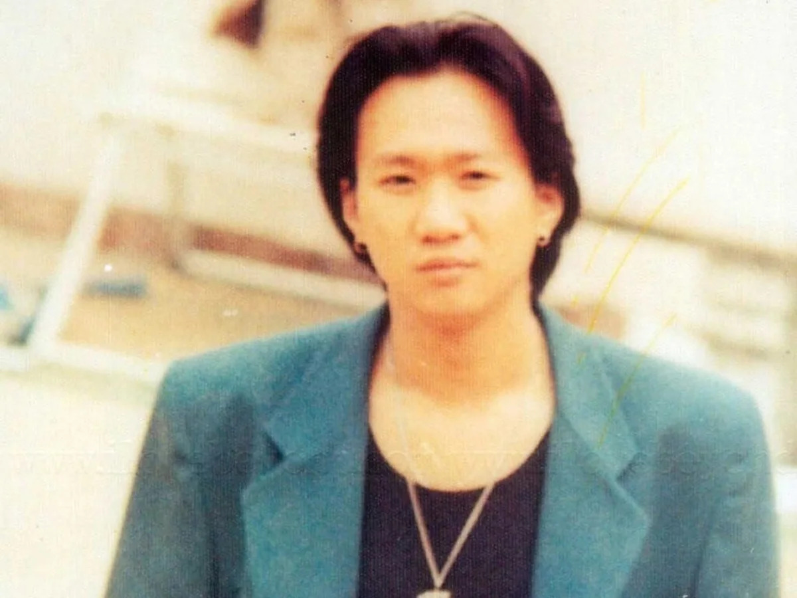

4 Jul - Fans of the late Beyond vocalist Wong Ka Kui have recently expressed anger at a mainland show for disrespecting the memory of the singer with their botched up tribute show.

As reported on Mingpao News, previously, a live programme called "Wong Ka Kui 360" was aired in mainland China, supposedly to pay respect to the singer on his 23rd death anniversary.

However, not only did the show fail to focus its topic about Wong – as it suddenly aired footage from Shanghai where fans of idol Kris Wu were waiting for the singer, supposedly to show similarities between Kris and Wong's fans – it also showed some fans singing at Wong's cemetery, while others dressed unsuitably when paying respect at his grave.

Fans of the late singer quickly bombarded the programme's message board, slamming it for the disrespect of Wong Ka Kui's resting place, as well as memory, especially since guests who were invited to the show didn't even know Beyond well as a band.

Fans even urged the producers and hosts to make public apology for the blunder.

Beyond member Yip Sai Wing also shared the same sentiment with fans online, saying, "Wong Ka Kui's grave at the Memorial Park is not the place for trouble. If you're not there to pay respect, please go away. This place is not a carnival."
