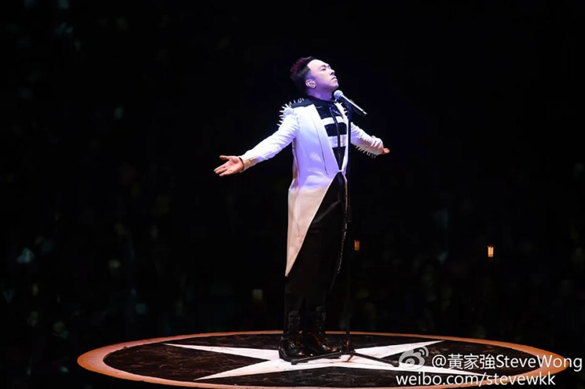

KUALA LUMPUR, Nov 14 — Singer Wong Ka Keung of rock band Beyond says his 55th birthday this year is one of his worst celebrations as Hong Kong continues to battle protesters.

In a Facebook posting on yesterday that was attached with the image of a black coloured cake, Wong urged fans not to wish him Happy Birthday but to pray for Hong Kong instead.

"Say God bless Hong Kong instead," he wrote in the post.

Local Chinese language daily China Press reported that the last time Wong had updated his page prior was on July 31.

At that time, the singer had written how heartbroken he was seeing Hong Kong's current situation with an almost similar message in, ""God bless Hong Kong."

Fans in Hong Kong praised Wong and said he was very brave to express his feelings.
