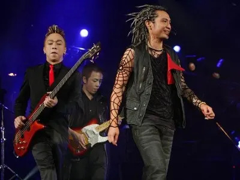

*Steve Wong claims to tell the truth about Beyond*

14 Oct – Beyond's former member Steve Wong may be starting another conflict with band member Paul Wong again, after writing a Weibo post talking about the alleged real reason behind the band's split.

As reported on ET Today, the bassist, who swore that he is writing the truth and made it his last post before closing his account permanently, said the decision to disband Beyond was first mentioned by Paul after their contract with Rock Records ended in 1999.

Allegedly, Paul Wong wanted to leave as he refused to let their drummer, Yip Sai Wing, live off him anymore.

"Paul said that he contributed a lot and it was unfair that we had to split our earnings equally, so he decided to go solo," Steve wrote.

Steve continued, "I can't say that I agree with his opinion that Sai Wing and I did not contribute, but there's nothing that I could do but to accept it."

Steve said he kept the real reason a secret for 15 years, and told the other members that their disbandment in 2005 was due to their musical differences. The bassist also extended his apology towards Yip Sai Wing for not telling him the truth.

"I also suggested to Paul that we all co-write a song about the band's history at our farewell concert in 2005. But he wrote it on his own and refused to let us participate. When both of us refused to accept his song, Paul ignored me at the concert. Last year, he told the media that the song was written to commemorate [deceased member] Ka Kui and I was the one who refused to let it be released," said Steve.

This is not the first time Steve and Paul had a row. Last year, the lead guitarist claimed that Steve was using his late brother, Wong Ka Kui, to gain publicity and attack him.
