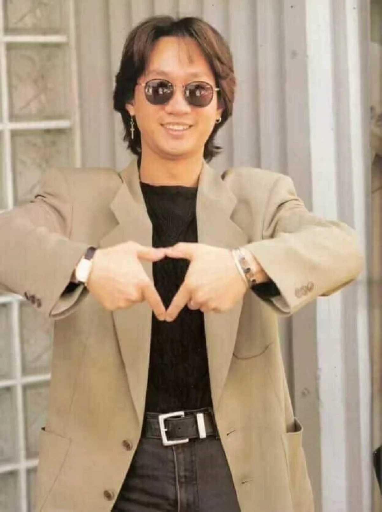

KUALA LUMPUR, July 1 — He may have died 26 years ago but the memories of Wong Ka Kui from the famous Hong Kong band Beyond lives on.

Fellow band mate Yip Sai Weng and fans posted heartfelt messages on social media in remembrance of Wong, who passed away on June 30, 1993.

Yip was among the first to post a message in remembrance of Wong in the wee hours of June 30.

He took to Chinese microblogging website Weibo and wrote "Missing Ka Kui".

Locally, fans expressed similar sentiments.

One reader said thanks to Beyond, he learned how to speak Cantonese, play the guitar and join a band.

"Thank you Beyond. Thank you Kar Kui," wrote the fan Bob Teo on Sin Chew Daily Facebook page.

Wong died a week after falling from a stage platform during an appearance at a Tokyo Fuji Television game show Ucchan-nanchan no Yarunara Yaraneba on June 24.

He was 31 years old.
