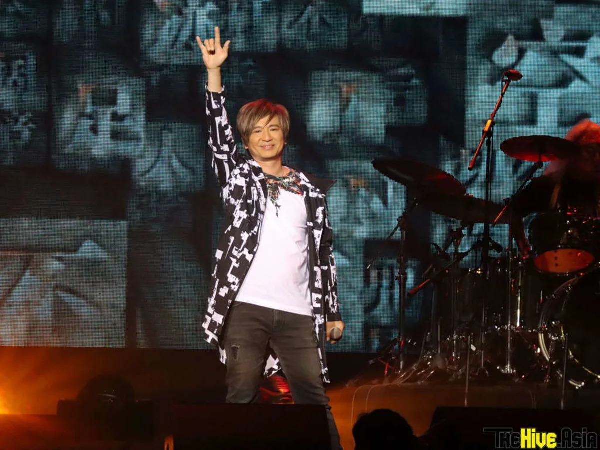
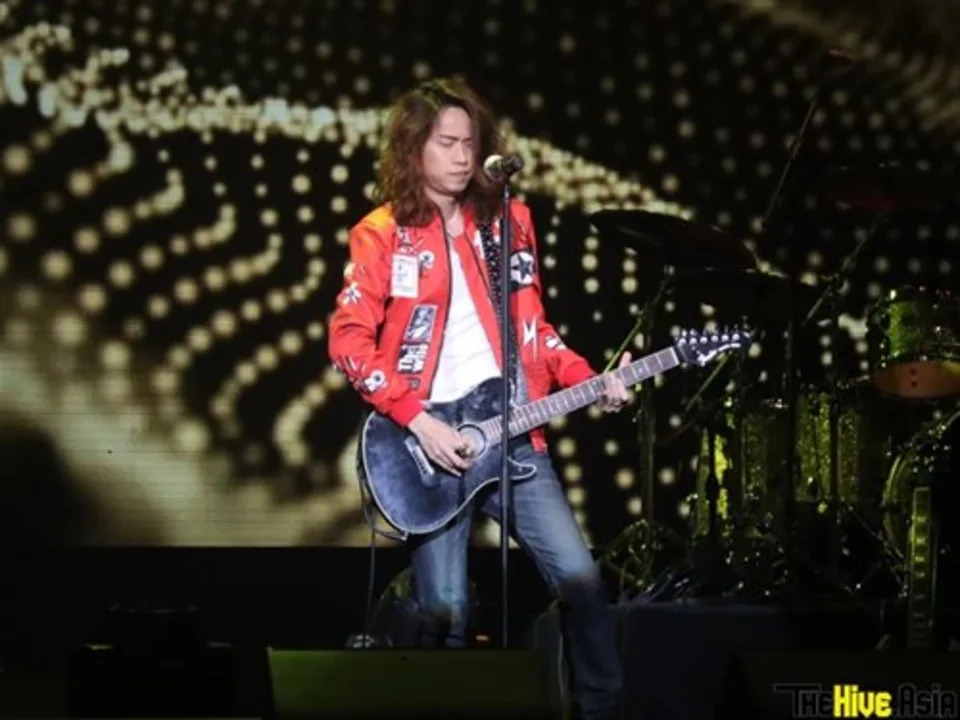
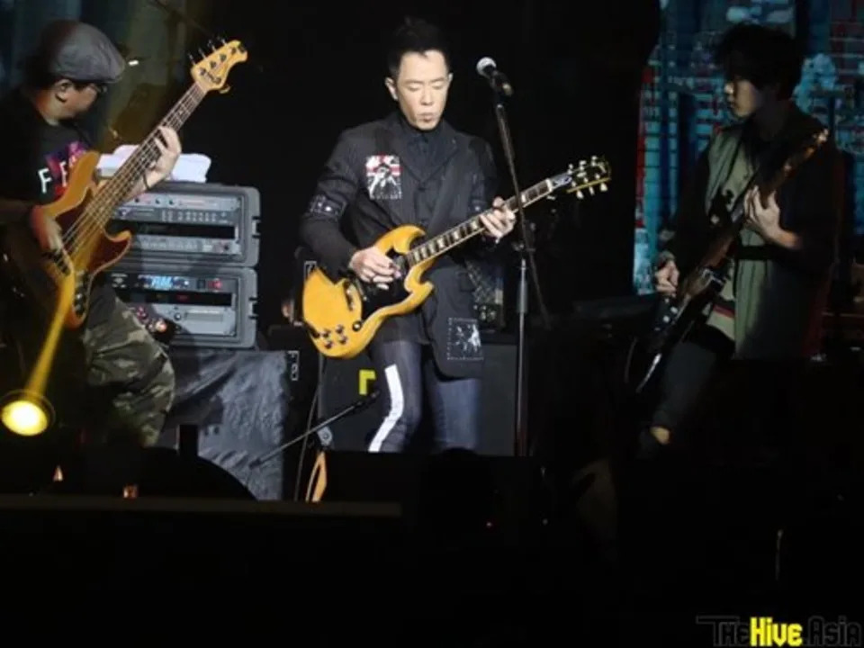
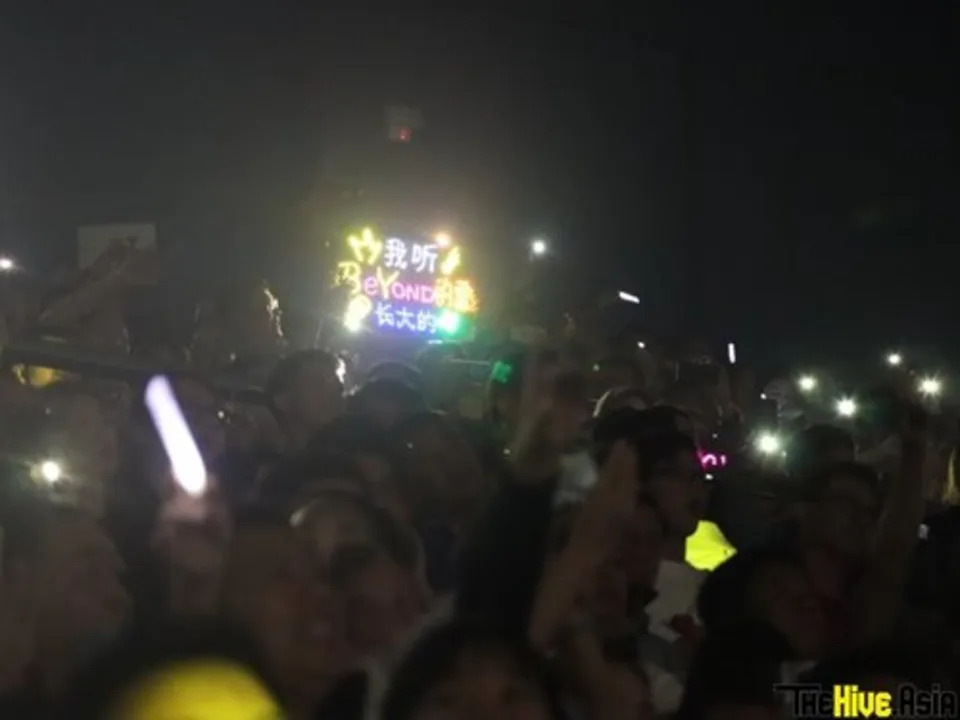

27 Aug – It's been almost four decades since Yip Sai Wing and Paul Wong debuted in popular Hong Kong rock band Beyond, but the love their fans have for them is still undoubtedly strong.

Performing to a packed crowd at Resorts World Genting's Arena of Stars last weekend, after local Cantopop rocker Alex Chia opened the show for them, the duo hit the nostalgia button hard the moment they took the stage as they performed one of Beyond's biggest hits, "Boundless Oceans, Vast Skies".

*Local Cantopop rocker Alex Chia was the opening act for Wing & Paul "Impulse" Live Concert in Malaysia.*

The song, which became the last one to be performed by the late Wong Ka Kui, their leader who passed away after a game show mishap in 1993, moved many of the fans as they either silently filmed the performance with their smartphones or loudly sang along.

The duo didn't waste time in between songs, getting right into it one after another, performing more hits such as "Yesterday's Footprints", "Loving You" and "Sad Song in the Midnight".

Fittingly, for "Days in the Past", seven of the stage's nine screens (the biggest two on either side of the stage remained showing live feed of either Wing or Paul) displayed various photos of the band during their younger days, featuring their late leader as well as fellow former member, bassist Wong Ka Keung, the younger brother of Wong Ka Kui.

*Paul flanked by his fellow guitarists.*

It was only after "Breakthrough" that the duo took a breather, they had been belting out song after song for the past half hour plus. Saving their voices, they had not talked much except to greet their fans, thank them for being with them through the decades and to occasionally introduce whichever song they were singing next.

During the short intermission, a video played, showing the duo talking about their song "Road", which they made in order to give hope and encouragement to their juniors in the music industry. They also said that it was a song that fans could easily sing along to or play on guitar.

True enough, when they came back on stage – this time Paul in a red and white striped sweater and Wing in a white vest over a black T-shirt – to perform "Road", fans sang along to it.

*One of their hardcore fans holding up a sign that said "I grew up listening to Beyond".*

The crowd didn't sing along loudly all throughout the show, but they were obviously warming up their vocals because towards the end, the whole venue was starting to sound like a karaoke bar dialed up to 100, especially when songs like "AMANI" and "I Really Love You" – the latter which received the biggest reaction when it started playing – were performed.

It was at last time to bid the fans goodbye and the duo did so by singing to them "Goodbye Ideal".

So passionate were the fans, they called out encore before the band even left the stage. Of course, it took a few moments, with more shouts of encore and ecstatic screaming from fans, before the encore stage started.

*Wing and Paul donned matching black shirts during the encore.*

Wing appeared first for his drum solo, before Paul returned to the stage to perform "I'm Angry" together. After taking a group snapshot with their fans, who by now were mostly standing, even those who were in the terraced seating could be seen standing up and dancing around by now, the duo closed the show with "Glorious Years" and a repeat of their opening song, "Boundless Oceans, Vast Skies".

Even though the band has been officially disbanded for more than a decade now, its influence remains strong and to this day is still known as Hong Kong's most legendary rock band.
