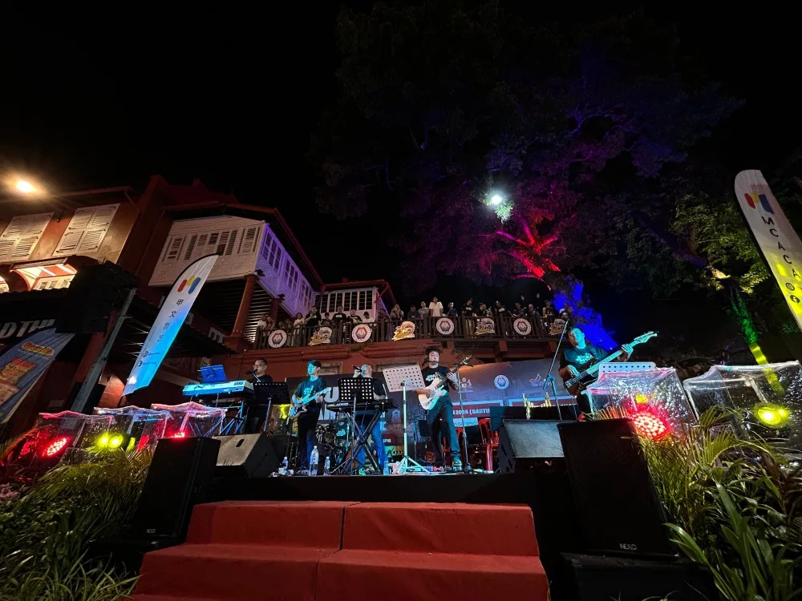

import YouTube from '@/components/patterns/YouTube.astro';

*Malay Mail*

KUALA LUMPUR, July 7 — It's been 31 years since the release of Hong Kong rock band, Beyond's Hai Kuo Tian Kong (Boundless Oceans, Vast Skies) written by its leader and co-founder Wong Ka Kui.

Wong, who was also the lead vocalist and rhythm guitarist unfortunately, never got to see just how anthemic the song would turn out, passing away after falling from a stage platform at a Tokyo Fuji television game show that same year.

<YouTube id="qu_FSptjRic" />

The band continued as a trio until 2005, however Hai Kuo Tian Kong would remain one of its most iconic releases, proven by the fact it became the first Cantonese song to hit 100 million views on YouTube in 2022, after it was uploaded by Rock Records label in 2011.

The song about freedom, passion and hope has been used on many occasions, most notably during the 2019 to 2020 Hong Kong student protests where iy was used as a protest anthem.

> @nicholesguitarist Replying to @sairolyoyopd KAUM INDIAN, BERCAKAP BAHASA MELAYU, NYANYI LAGU CHINESE. BARU SATU MALAYSIA???? #haikuotiankong #fyp #coverlagu #coversong #fypシ #foryoupage #cover #storywa #storywhatapp #laguviral #storygalau #fatherandson #bapadananak #1malaysia [original sound - NIC](https://www.tiktok.com/music/original-sound-NIC-7290505658712050433?refer=embed)

In Malaysia, the song has been imprinted in the minds of many Malaysians since, for its strong melody and signature guitar solo, most especially after it was used in a popular commercial locally in the 90s.

Today, the song has a special place in the hearts of many Malaysians regardless of ethnicity, being a staple feature in performances, from tribute shows to busker covers, delivered in multiple languages including Bahasa Malaysia and even in Dusun.

<YouTube id="Z5db98e8mTQ" />

Segamat-based rock band Finale, which was formed in 2010 has been organising Beyond tribute shows since 2012, with the most recent tribute show last month where they performed in front of the historical Stadthuys in Melaka.

According to leader and keyboardist Nick Yow, their band was heavily influenced by Beyond, and the tribute show in Melaka, Suara Amani, was also to commemorate the 31st anniversary of Wong's death.

*Finale has been organising Beyond tribute shows since 2012. — Picture courtesy of KP Photography*

"When we first started jamming, the first song was Beyond's and over the years, we played so many Beyond songs, not only because they are popular and catchy but they convey very truthful and positive messages through the lyrics.

"Our band's vision is pretty much influenced by the lead vocalist. He previously said, 'before you ask something from society, ask (yourself) first what have you contributed to the society'.

"That was the motivation for us to organise so many events which are open to the public for free. He also said, 'life is not about what you gain, it's about what you've done', and to us we can say that at least we have done something which we will never regret," Nick said.

He added that the Suara Amani was organised by them in collaboration with local NGO Melaka Creative Arts and Cultural Association along with the Melaka City Council and featured about 150 performers involved in the event.

<YouTube id="y8kke-SL6Go" />

Content creator and author Kionz Chan, 40, meanwhile said his love for Beyond prompted him to do a cover of Hai Kuo Tian Kong in Bahasa Malaysia, which he wrote on his own and shared on Youtube back in 2020.

He said that it took him two hours to write the lyrics in Bahasa Malaysia and around four hours to complete the video and sound recording for the cover.

He first heard of the song when he was nine years old, despite not being able to understand the lyrics at that time, the music has stuck with him.

"But right after I heard it on the TV, I Immediately searched for the song everywhere and when my mom brought me to Petaling Street, I would ask her to ask all the cassette shop sellers if they had that 'Peter Stuyvesant' song.

"I bought Beyond's cassettes until I found the song and only later then I found out the title and it has accompanied me since I was nine until now.

"It was also the first and only song I was able to sing in Cantonese because I can't read Cantonese. So I managed to remember the lyrics by heart," said Kionz.

Although he only knew Beyond after the passing of Wong, Kionz said that the late singer is the only artist he idolises till today, having gone all the way to Hong Kong to visit Wong's grave and having a personalised red Fender guitar to look like Wong's.

Kionz said that the positive messages of freedom and passion in the song impacted him a lot and he made the Malay version of the song to inspire more people.

<YouTube id="qPf4RNxIa2E" />

CSE Buskers from Kuantan, which comrpises of siblings and cousins, has been busking at the Kimstone Food Court since 2015 and Hai Kuo Tian Kong is amongst their favourites to perform.

Band member Haidir said that they were first introduced to the song by their guitarist, and it was a staple as apart from the song being easy to play, it was also a crowd favourite for the mainly Chinese patrons.

"Most of the crowd there really know this song, especially the Chinese, and all of them join in to sing along to the song.

"Our most memorable reaction from the crowd while playing the song was seeing their reaction to us playing it for the first time, many of them were really surprised at that time," Haidir said.

> @g.redland.garage layan molek abe ni cover lagu 海闊天空 Hai Kuo Tian Kong - Beyond #PuteraNTT #HaiKuoTianKong #Beyond #HongKong [original sound - GRedlandGarage](https://www.tiktok.com/music/original-sound-GRedlandGarage-7279575512396122881?refer=embed)

He admitted that it was initially challenging for them to perform the song at first as none of them read or spoke Cantonese.

The group which has been getting attention for their improvisations of popular songs, including its most recent attempt to perform it with a more traditional Malay delivery.

> @mamuapit #CapCut Sing along bersama pelancong dari China di Bukit Bintang...Hai Kuo Tian Kong dari Beyond @GENJIBUSKERSOFFICIAL #buskersbukitbintang #cover #coverlagu #buskerskl #buskersmalaysia #fyp #masukberanda #genjibuskers #haikuotiankong #beyondband #chinesesong #chinesesongcover [bunyi asal - Mamu Hafiz](https://www.tiktok.com/music/bunyi-asal-Mamu-Hafiz-7265138114358725378?refer=embed)

Many buskers around Malaysia continue include it in their setlist, with many videos of performances featuring a variety of Hai Kuo Tian Kong covers circulating across social media.

In September last year, a local police musical band known as NEPD (North East Police Department) Band had also became a viral sensation for their attempt in a performance in George Town, Penang.

> @ciklankerol HAI KUI TIAN KONG by BEYOND #beyond #haikuotiankong #nepdband #ipdtimurlaut #pdrmmalaysia #abanguniform #polisband [original sound - ciklankerol](https://www.tiktok.com/music/original-sound-ciklankerol-7267842893208226562?refer=embed)
