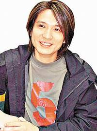

中新网11月25日电

据华商报报道，19日晚间，有知情人向记者举报，在西安一四星级酒店夜总会，Beyond乐队成员叶世荣与随行人员召坐台女狂欢。记者随后经过调查，并进行了2个多小时的追踪，发现叶世荣一行7人与5位坐台女在该酒店夜总会包间狂欢。当他们发现有记者跟踪后曾一度溜走，但随后再度回到包间，直至21日凌晨2：45，在随行人的刻意保护下，叶世荣才返回住处。

## 姗姗来迟事出有因

叶世荣等结束了晚上的演出，主办方在酒店设下庆功宴。当晚11时许，记者赶到酒店时，门外有十几个Beyond的歌迷拉着横幅在等待，只为多见叶世荣一面。而酒店的保安则讲，叶世荣早已回到自己的房间。记者来到5楼的宴会现场，一直等到11：40，艾尔肯一行才出现，但并没有见到叶世荣的身影。又等了近半小时，庆功宴上等待的人们已饥肠辘辘，只好在缺少主角的情况下开席，但中间一桌酒席一直空着。据主办方一工作人员透露，叶世荣肯定会来。昨日凌晨0：30左右，叶世荣与随行人员4人终于出现在庆功宴现场。

叶世荣的出现让现场一阵骚动，工作人员与歌迷纷纷涌上前去要求合影、签名。也就在这时，知情人向记者透露，叶世荣等刚才在楼下夜总会“会小姐”。记者随后赶至7楼夜总会，并查到9号包间，此时房间仍然有人，还有“女孩”陪伴。有来回穿梭的服务员称，刚才Beyond成员来过，里面有个戴帽子的最面熟(当日仅叶世荣一人戴帽)，这会儿吃饭去了，等会儿还会再来。在经过简单询问之后，记者又返回5楼，这时，忙了一晚上的叶世荣显然也饿了，连吃几口菜又喝了点酒。其间，他不断微笑着满足大家的要求，态度非常谦和。就在这个过程中，他也接受了本报记者的独家访问。他说此次一起到西安的一共7人，包括自己新乐队的吉他手和公司的助手等。

## 避开视线与坐台女狂欢

次日凌晨1：20，叶世荣等人就餐完毕，离开宴会现场，匆匆进了电梯，记者想跟进却被挡在了电梯外。只剩下公司一位工作人员与一位女士交谈甚欢。随后记者以找人为由来到7楼KTV9号包厢前，门外插的服务卡片上写着，“9人，散客”。趁服务生开门的瞬间，记者看到了先前见过的一位小姐。让人意外的是，包厢里突然冒出一个人，并很快把门带上了，这个人正是叶世荣的经纪人李龙。记者客气地提出想要叶世荣专辑的资料，但他的脸色有些变了，“你们上楼去，让人给你们到房间取！”

为进一步求证叶世荣此时究竟在哪儿，记者再次回到庆功宴现场，打断了依旧在谈话的公司人员。这一次，他很爽快地带记者来到22楼的一个房间，“你们进来吧，没别的人！”这个先前登记为叶世荣的房间，里面根本没有他的身影。与此同时，叶世荣的一位好友也到了房间。“你给他打电话吧，给李龙打也行，他们在一起！”公司人员显然不愿意说出他们的去处，“是不是在7楼？”记者的试探让公司的人有点尴尬，“是7楼的夜总会吧！”

直到此时，记者终于证实，匆匆离开庆功会的叶世荣并非真的是为赶早班飞机而提前回房休息，他和经纪人李龙就在7楼的包厢里。

## 发现记者后曾中途溜走

记者拿到资料后迅速下楼等待消息。这时接到知情人的最新消息，叶世荣等人知道记者曾去包间“打扰”过后，中途曾悄悄离开。但是他们“侦察”一番后又折回了包间。不过这时他们提高了警惕，服务生证实，对方不断有人出来巡视，连服务生敲门也得不到对方回应。

凌晨2：45，记者再度上楼，目睹叶世荣一行买单回房。此时他们更像是“打游击”，待叶世荣随身人员出门左顾右盼一番，然后前往电梯口打开电梯门。这时叶世荣紧随在两位同伴身后，低头快步走入电梯。未能拍到照片的记者只好回到楼下，5分钟后，曾经在该包房服务的两位“女孩”分别乘出租车离去。而这时，还有一女两男三位歌迷在酒店门口等候，准备在当天早晨叶世荣离开西安时再看上他一眼。

## 叶世荣向“坐台女”报名“阿du”

记者下午又从知情人处获悉，当晚该包房在凌晨0时左右开放，先后有7个男人到房间唱歌，共召进6名坐台女。这些女孩也从其他人口中得知自己陪伴的就是叶世荣及他的随从。但叶世荣却告诉坐台女说自己的名字叫“阿du”，这些女子都坐在包间内男子的腿上，并陪伴他们唱歌聊天。直到凌晨2：40分，对方准备买单，并有人有意带坐台女回房间，给了她们小费，有两位收到200元，其他4四位每人300元，但并未有人随他们回房。

## 叶世荣行踪时间表

-   凌晨0：30，叶世荣出现在酒店5楼就餐；
-   0：35，记者收到消息，前往7楼夜总会调查，有人证实，“Beyond乐队”的人在9号包间唱歌，此时已下楼吃饭。记者发现，包间内仍然有人，其中有几名女孩。
-   1：20，吃完饭的叶世荣及助手下楼，记者欲跟随取相关资料，在电梯口被阻挡，对方乘电梯上到7楼。
-   1：30，记者到酒店22楼叶世荣的房间，按门铃无人应答，但房间里传出电视的声音。
-   1：35，记者到7楼夜总会敲9号包间门，遇到叶世荣助手从包间出来，并让记者自行上楼取资料。
-   1：40，记者随叶世荣另一随行上到22楼，房间无人，随行人告知记者叶世荣与另一助手在一起。
-   1：50，记者下楼获悉，得知有人发现叶世荣一行曾离开包间，后又折返。
-   2：00，由于身份暴露，记者只得在楼下等候消息。据知，对方相当警惕，一会有人出来看一下。服务员敲门也得不到回应。
-   2：40，知情人通过电话告知记者，叶世荣一行准备买单，费用听似710元。
-   2：50，叶世荣在众多随行人的保护下匆匆走进电梯。
-   3：01，在该酒店
