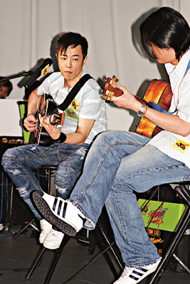

资料图片

中新网5月13日电

据香港媒体报道，黄贯中出席由萧芳芳为“护苗基金”筹备了两年时间才完成的“护苗初中教育课程”揭幕活动，他亲自为为“护苗基金”教育动画写了主题曲《别轻视我》，他透露花了一天时间作这首歌，包办作曲、填词及主唱。黄贯中笑言全因萧芳芳的诚意，对方每次都会亲笔传真与他联络，加上又是帮年轻新一代，令他无法拒绝，故一口便答应了。

黄贯中自爆读初中时对性最好奇，由于父亲是做玩具生意的，他记得有一次他们三兄弟找到父亲的七彩避孕套，以为是气球便拿来吹，令到父亲很尴尬，但父亲因为比较保守，当时没有向他解释，只称将来到他长大了个便会明白。

问到黄贯中将来若有儿女如何跟他们讲性？他表示要视乎子女的年纪，但会以他们能明白的方法讲解，如果儿子问自己怎样出生，他就会拿出拍下太太的生产过程的录像带给他看。追问他计划何时生育？黄贯中表示要看缘分，不过他跟朱茵都很喜欢小孩子，只是目前未有时间和能力照顾，他又自觉将来会是个值得子女信任的爸爸，彼此相处就像朋友一样。
