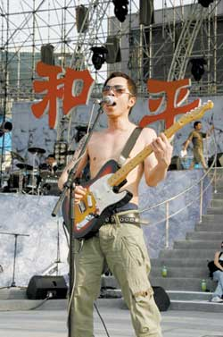

黄贯中 李方宇/摄

中新网7月1日电

今晚，万众瞩目的《和平的天空》摇滚演唱会就要在工人体育场火爆上演了。据北京娱乐信报报道，昨天下午，北京的天气酷热无比，可是工人体育场露天舞台上的气氛却比天气还要热。崔健、唐朝、黑豹、黄贯中等参演乐队和歌手在这里提前进行了彩排和预热。

第一个彩排的是二手玫瑰，由于《嫂子颂》是他们原来演唱过的拿手歌曲，因此演唱起来得心应手。唐朝的《要学那泰山顶上一青松》由于是京剧唱段，所以改变起来有些难度。为了突出京剧味道，除了唐朝原有的乐队之外，他们还请来了京剧乐队的乐师们。在京剧曲牌的配合下，丁武将这个唱段演唱得高亢嘹亮。而黑豹的一首《啊，朋友再见》，同样让人听着为之振奋。

作为本场演出惟一的港台歌手，黄贯中即将演唱的《游击队之歌》格外引人注目。昨天，在场的观众终于见识了这支摇滚版的《游击队之歌》。为了让自己的彩排更加尽兴，黄贯中索性赤膊上阵，光着上身挎着吉他和他首次亮相的“汗”乐队卖力地演唱。

一首Beyond的经典歌曲《大地》，黄贯中用普通话进行演绎，同时他还演唱了“汗”乐队自己的一首新歌。节奏强劲的《游击队之歌》在体育场上空响起，全场为之一振。除了其中部分旋律作了简单变调之外，基本上保留了这首歌曲的原貌，由于加进了摇滚节奏使得它听起来非常带劲和充满震撼力。
