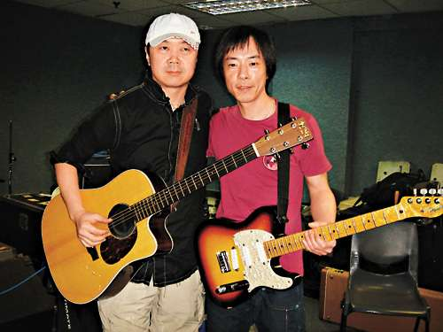

崔健与黄贯中正在彩排（大公网图）

中新网3月22日电

据香港媒体报道，崔健与黄贯中(阿Paul)二位摇滚乐手将携手合作，于本周五晚举行的ifpi颁奖礼音乐会，届时他们将会献唱四首歌曲。昨日二人首次为演出作彩排，阿Paul表示，早在八八年Beyond到北京演出时，已认识崔健，至今已十八年了，之后他们偶然都会在后台碰面，不过从未合作过，这次是他首次跟崔健合作。

崔健表示，来港之前，他没有为这次演出作任何准备，现在亦是第一次彩排。阿Paul好欣赏崔健这位中国摇滚大哥，他表示，二十几年来，崔健一直屹立不倒，是一个好前卫的音乐人。首度与中国摇滚大哥崔健合作，问阿Paul会否怯场？他有信心表示，当然不会，音乐是不用怯的。

那么他会否尽地主之谊，带崔健去玩呢？当阿Paul问崔健要不要去玩时，崔健就说有好多工作要做，没有时间去玩，况且曾来港多次，这次在舞台上玩就可以。
