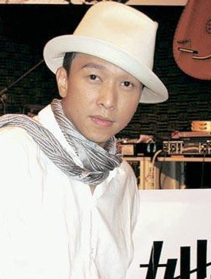

黄家强。

## 推出首张国语专辑《她，他》

在Beyond时代，黄家强和Beyond所演绎的歌曲影响了整整一代人，也是华语乐坛永恒的经典。单飞之后，本周日晚8时，黄家强将带着个人首张国语专辑《她，他》做客广东电视公共频道《最爱主打星》，讲述专辑背后的音乐故事。对于重组乐队，黄家强表示自己是比较自由的音乐人，只想做自己的音乐。

## 单飞就是想做自己的音乐

Beyond的解散至今仍是不少乐迷心中永远的痛。而在黄家强心中，那段光辉岁月已成往事。在接受记者采访时，黄家强表示现在与乐队的其他成员其实很少联系，他说：“解散就是因为现在我们都成熟了，在音乐上都有了自己的坚持，现在不常联系，是因为大家都很忙，而且我也非常享受现在这种有很大空间去做自己喜欢的音乐的日子。”

对于新专辑取名《她，他》，黄家强表示：“因为专辑里面有一首歌是《她，他》，内容是讲人与人之间关系很复杂，几个她跟几个他，很多人，他们感情上的互动很复杂，其实我觉得自己专辑里面的歌曲也是蛮复杂的，类型太多，我自己看着都有些头痛，因为我要排，这首跟这首顺不顺，很难排，每首歌都不同，没有联系的感觉，所以我干脆就把他们简单化，用她和他来代替。”

## 拒绝吻戏怕老婆看见

黄家强在歌迷心中的形象一直停留在当年那个在演唱会上歪戴棒球帽、一身金属饰物的摇滚少年上。而这次造访《最爱主打星》，一身西装的他举手投足之间毫不介意展示岁月在自己身上留下的痕迹。在“真心话大冒险”的环节，他被要求与女主持毛毛来一场吻戏，一心整蛊的粉丝对黄家强隔山打牛式的吻很是不满，而黄家强则一本正经地解释说：“换做是以前，我肯定抱过来就亲了，我曾经也是浪子来的嘛。现在结婚了，不能这样了，被老婆看见就糟糕了。”
