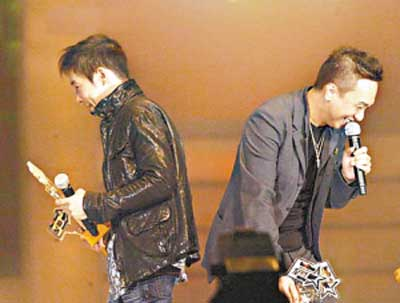
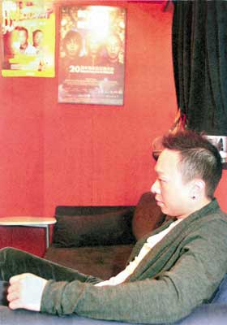
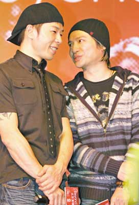

之前黄家强、Paul在颁奖礼上同场碰头，二人互当对方透明。

## 黄家强首度披露与阿Paul兄弟成陌路始末

黄贯中(Paul)踢走黄家强、偕叶世荣以Beyond名义到内地举行Beyond双杰演唱会，Paul和家强这对“冤家”为此掀骂战，家强指责黄贯中与世荣不应以Beyond名义开演唱会，黄贯中则反驳家强早就以Beyond名义在内地开过演唱会。

黄家强与黄贯中23年兄弟情反目，冰冻三尺非一日之寒， 有人认为是为了一个女人：2003年阿Paul与朱茵在苏梅度假被狗仔队偷拍，家强一度被指是放料的幕后黑手；有人认为是音乐路的分歧：1999年阿Paul坚持单飞让Beyond一度散伙，兄弟从此生下嫌隙。

日前，黄家强在香港旺角的音乐工作室接受香港媒体记者的访问，首度披露自己跟阿Paul成为陌路的始末。“由哪一天开始，他再不理睬我呢？是2005年Beyond开告别演唱会……”

黄家强的音乐工作室里挂着2003年纪念Beyond二十周年演唱会的海报。

## 续缘展望：Beyond兄弟缘，可有再续的一天？

连日来的隔空对骂，受伤的不单是两位当事人，还有一班追随Beyond多年的乐迷。假若真有一天，阿Paul突然主动开腔，要求再次重组Beyond，家强不假思索：“我无事，我一定愿意！我觉得那首歌(《Beyond的故事》)是很小的事，没必要像小孩子那样玩杯葛！”

阿Paul回应 对于Beyond能否重组，阿Paul显得悲观。阿Paul承认自己心里矛盾，一方面有心再续兄弟缘，但又放不下家强一些伤人的言语。“以目前的关系，我觉得(重组)很难！其实我不抗拒玩Beyond的音乐，但面对这样的环境，在乐队不可以发表自己的意见，一切已失去意义，继续下去只是作秀，我只有专心做好自己的音乐！”

叶世荣回应 一直做和事佬的世荣则认为，做人要向前看，现实环境令他们不可能留恋逝去的日子。“我们花了三年时间做自己的事业，一下子要调节到之前的合作模式，必须要时间慢慢磨合。”对于Beyond会否重组，叶世荣表示，“我抱乐观态度，但不会是短期内的事，现在距离2005年的告别演唱会，不过两年多三年时间，就让我们三个先发展自己的音乐吧！我估计，复合起码是三四年后的事！”

## 2003年处男事件，家强愿说声对不起

2006年7月，家强补摆结婚喜酒，Paul竟没有到贺，还对记者说：“我要去北京帮我的狗找老婆！”让家强觉得很受侮辱。曾有报道说，阿Paul与黄家强反目是为了一个女人——朱茵。2003年10月，阿Paul与朱茵在苏梅度假被狗仔队偷拍，家强一度被指是放料的幕后黑手，令两人关系雪上加霜。家强说，“可能他一时不开心，便将责任推卸在其他人身上，但她(朱茵)已澄清了不是我报料”不过事发后家强对记者的一句玩笑话令阿Paul的心内留下一条刺：“可能阿Paul还是处男呢！”家强坦承：“我当时只是开玩笑！认识多年，认为他能接受，我愿意说声‘对不起’！”

阿Paul回应 提到家强认定因为“处男事件”而开罪兄弟，阿Paul语带轻松，不怒反笑：“我根本不记得有这回事！别看我外表火爆，其实我有血有肉、有情有义，绝对不会为了女人，更加不会为音乐！”“男人的事由男人搞定，牵涉那么多人，你以为是八婆吗？相比起处男事件，我真正介怀的，实在何足挂齿！”

## 1999年阿Paul单飞，Beyond一度散伙，家强介怀已久

令家强耿耿于怀的是，阿Paul在1999年坚持要作个人发展，执意解散Beyond。1999年，Beyond一度拆伙；2002年底，阿Paul提出重组，2003年举行Beyond二十周年演唱会。当时家强已有感觉，与阿Paul的合作，不像以前。“(他)比以前难商量，但可能我自己也难相处，我不能只说他的不是，他有他的执著、我也有我的执著，但我始终觉得，每人拿三首自己的歌出来，然后凑够一张唱片，这样算是夹band吗？”

阿Paul回应 阿Paul也说出当年自己面临两难的局面：“他(家强)不愿相信，事实却是当时的老板陈少宝跟我谈了很久，他只肯签我，不要家强与世荣！但我跟他说，你签我，可不可以一起签了Beyond？其实当时我自己也很矛盾，不知道怎么做自己的音乐，很迷惘！”

阿Paul最后还是选择散伙，他说：“很多乐队都会有个人作品，大家可能没有留意，Beyond第一个出个人大碟的，不是我，而是叶世荣！见到阿荣出碟，其实我很替他开心，不明白因何矛头总指向我！我觉得很无辜！”

“Beyond双杰北京演唱会”即将在年初举行， 黄贯中与叶世荣来北京宣传。

## 细述八年不合 | 2008年双杰演出，家强不满阿Paul利用Beyond招牌

“Beyond双杰北京演唱会”乃整件事的导火线。黄家强说：“最初，其实没有太大感觉，直至我上网，看到广告写着‘重现Beyond经典金曲 再现光辉岁月演唱会’，我会觉得这个宣传有点过分。”家强冷静地表达个人观点：“如果到时真的唱尽Beyond经典金曲，我反而不介意，因为没有欺骗观众，但去到现场，原来只是唱自己的歌，就不要被主办单位利用这种手法宣传！谭咏麟会不会用温拿的名义开演唱会？任何一位成员也不会这样做，除非五个人一起开唱，这是个人操守的问题！”

记者问，自从2005年告别演出以后，三人有没有一个共识——不能随意利用Beyond这个金漆招牌？“没有共识，应该是识做！”家强介怀的是，被指两年前曾与世荣在内地举行一个“Beyond演唱会”。“话我有份，其实只是世荣一个！你要做，我没有作声，还要说我先做了，要我忍让到什么程度才会开心？”

叶世荣回应 叶世荣首先强调：“这个不是Beyond重组演唱会，我和阿Paul准备会唱独立发展之后自己唱片的歌，但当中会有点唱环节，想听什么歌，我们尽量满足歌迷！”他认为，利用“Beyond双杰”作演唱会名堂，并无不妥。

阿Paul回应 我调查过，Beyond第一次上内地宣传没我份，另一次就看杂志见到Beyond内地开秀，当时也没我，只有家强、世荣和陈慧娴，但我都没说什么！用Beyond名义不应该，我又不是第一个！

## 2005年告别演出，为写一首歌，多年兄弟成为陌路

当日，家强敞开心扉，将埋藏三年的秘密，完全公开。“由哪一天开始，他再不理睬我呢？是2005年开告别演唱会，当时我们准备写一首叫《Beyond的故事》的主题曲，我跟他(阿Paul)说，希望这首歌由我们三个人一起创作，或许我跟他先写旋律，然后作词；两日后，他拿出一首歌，曲词写好，而且已经做好，我很奇怪：不是跟你讲过，我们一起写的吗？他不断地说：你先听，听完觉得好不好再说！”

“争拗就在这里——就算曲不让我们参与，词也可以让我们参与吧！大家都有Beyond的故事，为什么只是你一个人去剖白呢？他不断叫我听完再讲，听又怎样，不听又怎样？我要强调的是，你要写其他所有的歌我都没所谓，但我只坚持这一首(《Beyond的故事》)，希望大家可以合作！我以为只是合作不来，最多不做这首歌，怎知第二天碰面，他不再理睬我，直到现在！我尝试跟他打招呼，他每次都把脸转过去。当时演唱会仍在继续，很多工作上的事需要沟通，但他依然不理我！”家强说，因为阿Paul不肯再做大马演唱会，Beyond告别演唱会提前在新加坡站作结。

而在此之前，家强也感觉到阿Paul的不满，家强说：“2003年，创作《无间道Ⅱ》主题曲(《长空》)，电影公司催歌，连预告片都送来了，我本来不想做第一个，但见没有人行动，刚巧我有feel(感觉)，回家作了一首歌，叫他(阿Paul)填词，但他不肯。到录结他时，他又趁礼拜日我休息，自己录了，不让我听，又不让我改。这样你做你的、我做我的，还算是合作吗？”

阿Paul回应 有关《Beyond的故事》所起的争端，黄贯中心平气和地道出与家强反目的关键：“如果乐队要讲资格、分大小，又怎样继续下去？”阿Paul清楚记得，2005年的一个晚上，家强说了许多伤尽他心的说话。“他说，我是乐队最‘细’的一个，比他迟一年入队，所以我没有资格说话！有什么意见尽量可以提出，但他说出这样的说话，我很伤心！小时候，你会觉得是小孩子脾气，但长大了，讲一句说话都可以好有杀伤力！他是家驹弟弟，当家驹走的时候，他对我说，要尽量照顾他、体谅他、顺他的意思，但要讲资格，我实在接受不了……我觉得，自己对不起家驹！”

至于拒绝合作《无间道2》主题曲的事，阿Paul澄清：“既然他有feel(感觉)，不如自己做好整首歌，我觉得这很正常！其实当时我都有feel，但我尊重他的意见，即使电影公司reject(拒绝)他的第一个版本，我也不会拿出自己的作品替代，坚持让他继续修改，并不觉得委屈。”
