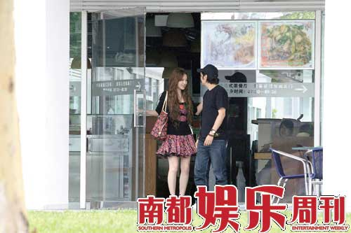
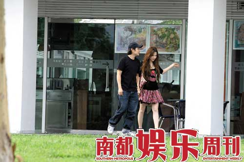
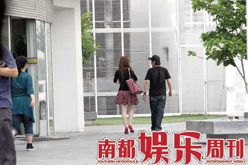

叶世荣和徐立甜蜜下午茶结束后离开，叶世荣身着黑衣黑裤，头戴黑色鸭舌帽，打扮低调。

叶世荣自2002年与意外去世的前女友举行冥婚后，感情生活似乎一片空白， 只是在2007年，被拍到与一酷似杨怡的美女拖手。同时，叶世荣在接受香港记者访问的时候表示希望多存老婆本，准备在2010年结婚。但是不久后“翻版杨怡”被媒体曝出劈腿照，这段恋情似乎又一次无疾而终。而日前，叶世荣出现在北京建外SOHU某港式茶餐厅内，被拍到与一内地美女亲密共度浪漫的下午茶时光。

## 十指紧扣浪漫下午茶

当天下午三点，叶世荣身着黑衣黑裤，头戴黑色鸭舌帽，打扮低调，与两名疑似工作人员的女子，坐在茶餐厅的角落。大约半小时后，一名身材苗条，长相甜美的靓女与叶世荣打了个招呼，然后顺势在他身边的位子坐下。对面的工作人员似乎训练有素，立刻起身离开，坐到了临近的桌子上。

此女子现身后，叶世荣立马来了精神。殷勤地张罗了一大桌子饮料和小吃。两人开始边喝下午茶边聊天，谈笑风生，气氛甚佳。该女子似乎比较内向，很少开口说话，大多数时候只是面带微笑，含情脉脉地注视着叶世荣，偶尔轻轻点头，或者羞涩一笑。叶世荣满面春风，看似心情不错。一直口若悬河，滔滔不绝，时而手舞足蹈，时而哈哈大笑。

徐立比较内向，很少开口说话，只是听叶世荣在说。

其间，可能是阳光太过刺眼，该女子频频举手遮挡住眼睛。随后叶世荣叫来服务员吩咐了两句，便拉着该女子的手，走到了背光的另外一桌，拉开凳子，等该女子坐下后，自己才就座，十分绅士。换了位置后，两人显得比刚才更加亲密，时不时四目相交，还频频地窃窃私语，犹如热恋的情侣一般，默契十足。

大约一个多小时后，两人面带笑容，十指紧扣走出了茶餐厅。此时路上似乎有人认出叶世荣来。在路人指指点点下，女子似乎有少许尴尬，主动松开手，加快步伐，与叶世荣保持了一定的距离。两人先后进入车库，然后一前一后开车离开。

## 女主角原是爱乐团前主唱

通过仔细比对，记者发现与叶世荣行为亲密的女子酷似内地知名乐团“爱乐团”的前主唱徐立。于是记者在第一时间向徐立所在经纪公司的宣传总监梁小姐求证。梁小姐告诉记者，徐立和叶世荣确实认识，至于两人相交到什么程度，就不得而知了。而且这是艺人的私事，不方便过问，也不会干预。

叶世荣和徐立面带笑容，十指紧扣走出了茶餐厅。不过两人在路人的注视下终于松开手。

之后记者又联系上了事件的女主角徐立，她亲口向媒体证实了前一天下午和叶世荣耳鬓厮磨两小时的女子正是自己。徐立透露和世荣认识后，两人就一直保持很频繁的交往。经常在一起吃饭、聊天，有很多共同话题，也有很多共同喜好。“他和我想象中很不一样，一点架子都没有，很平易近人。每次和他聊天我都蛮开心，感觉和同龄人一样。我们都是做音乐的人嘛，所以经常有说不完的话。而且他会跟我讲一些人生哲理，我以前也发生过一些事情，所以对我很有帮助。而且我特别喜欢幽默、有智慧的男人，世荣哥就是这种人。”言语中不乏钦慕之情。当被记者问及两人关系的时候，徐立显得谨慎起来，说这是他们两个人的事情。现在不方便向媒体说太多。

## 叶世荣爱对方因有“福气”

第二天，记者终于拨通了叶世荣北京的电话。香港艺人打太极的功力，从来都不是盖的。虽然没有明确地肯定两人之间是情侣关系，但他毫不掩饰自己对徐立的好感，不仅对其大加赞赏，还称其是自己的有缘人。他不愿意再提及曾经那段让他肝肠寸断又刻骨铭心的感情，原因是怕会因为媒体的报道而又勾起女方亲人的锥心之痛。他希望生活能一直向前看，感情亦是。并且说自己非常喜欢小孩，随着年纪的增长，越来越渴望稳定，十分向往温馨的家庭生活。还表示随后就将搬来北京，不排除以后将在北京安家落户的可能性。

Beyond成员之一的叶世荣依旧从事着音乐事业，不知道和徐立的结合算不算“强强联合”？

## 访谈 | 徐立就是一个有“福气”的女孩子

南都娱乐：老婆去世以后，2007年才传出你有新的恋情。是因为女方劈腿，所以导致恋情无疾而终吗？

叶世荣：我说一个故事，你就明白了。沙滩上有一具尸体，有一个人觉得可怜，就脱下自己的衣服给他盖上，然后走了。后来又有一个人，看见了这具尸体，就挖个坑把他埋了。其实在这段感情中，我就是第一个人，和她的缘分还太浅，她的真命天子是别人。

南都娱乐：被拍到和徐立在餐厅里举止亲密，你们是什么关系呢？

叶世荣：我们在一年前就认识了，是在一个慈善晚会上认识的。我觉得这个女孩子比较善良，又有爱心，而且我们很谈得来。至于说是什么关系嘛，我只能告诉你，我们未来发展的空间还很大，呵呵。自从发生了以前的很多事情后，我就变得越来越懂得珍惜了。

南都娱乐：你的女友必须具备什么条件呢？徐立符合吗？

叶世荣：这个女孩子一定要有“福气”。我所说的“福气”不是指外表，而是性格。比如：脾气温和，有原则有立场，不物质至上，要懂得信任人、尊重人。在我眼里，徐立就是一个有“福气”的女孩子。

徐立“原爱乐团主唱”

南都娱乐：那年龄会不会是两人交往的障碍啊？

叶世荣：我觉得不会。只要两个人有缘，又互相喜欢，什么都不是问题。

## 叶世荣未婚妻7年前意外身亡

2002年，叶世荣的未婚妻许韵珊在香港家中突然意外身亡，叶世荣以丈夫的身份治丧。后来谈起此事，叶世荣的表情似乎已经很平静。但是，还戴在左手无名指上的那一枚婚戒，却证明叶世荣对这段感情仍未忘怀：“我还戴着戒指，是因为我还把她当老婆。”他说，戒指是葬礼那天他亲自戴到她手上的，“我们已经相处了7年，也说好了要结婚。我不管外面的人说这是冥婚还是什么，总之我答应了她，就要完成这个心愿”。

采写 马克

摄影 郑少分
