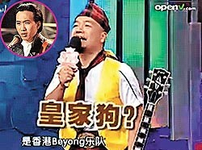

中新网9月30日电

香港前摇滚乐队Beyond的已故主唱黄家驹，日前在内地综艺节目中竟遭嘉宾主持恶搞。因戏称黄家驹为“皇家狗”，遭到众多Beyond粉丝反击。

香港媒体报道，在上周五(25日)于四川卫视播出的《天下笑友会》节目里的其中一个环节“谁是下一个小沈阳”中，担任嘉宾主持的大兵及棒棒糖，一唱一和地恶搞已故Beyond主唱黄家驹为“家狗”、“家猪”，据悉，在节目中，棒棒糖自称要模仿“皇家狗”弹奏Beyond经典名曲《真的爱你》，大兵纠正他是家驹时，棒棒糖竟反问“猪”和“狗”不都是畜生吗？当他弹奏完该曲后，兴奋到大蹦大跳，大兵竟说：“当年黄家驹在日本演出，就这么蹦蹦死的。”

节目播放后，遭到全国的Beyond粉丝的攻击，将偶像比作畜生的说法大为光火。粉丝表示这种既不好笑，又对死者不尊重，网友小小荧说：“笑开得太过了吧，真是拿低级无知当有趣。”
