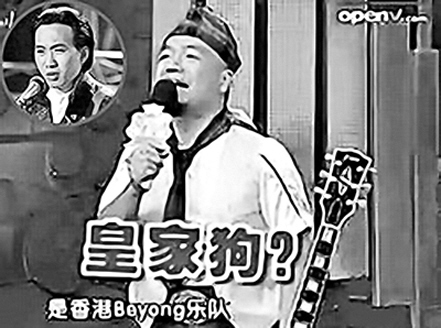

《天下笑友会》节目视频截图

9月25日，四川卫视《天下笑友会》节目中，主持人大兵和一个叫“棒棒糖”的嘉宾，用侮辱的言语调侃著名乐队Beyond中已逝音乐人黄家驹，遭到网友抗议，要求该电视台道歉。前日，四川卫视在其官网上挂出说明，就此事件向公众致歉。

## 现场：嘉宾读“驹”为“狗”

在25日四川卫视播出的《天下笑友会》“谁是下一个小沈阳”环节中，嘉宾“棒棒糖”称要演唱香港Beyond乐队“黄家狗”的《真的爱你》，这时主持人大兵再问一次，“那个叫什么？”“黄家狗。”“黄家驹是死了，不死也会被你气死。”大兵再次纠正嘉宾的语音错误，但该嘉宾依然坚持自己的错误读法，“猪(驹)和狗不一样都是畜生啊。”当他弹奏完该曲后，兴奋得又蹦又跳，大兵竟说：“当年黄家驹在日本演出，就这么蹦死的。”

## 观众：节目对死者不敬

节目播出后引发强烈震荡，尤其是在内地人数众多的Beyond歌迷，对这种极其低俗的“笑果”无法接受，称这是对逝者极大的不尊重。在Beyond的贴吧中，要求四川卫视道歉的帖子数量激增，“在节目中公开向黄家驹以及全国歌迷道歉，道歉时间不低于20分钟，态度要诚恳，并在节目下方循环播放滚动字条道歉”。多家网站、贴吧里，网友开始对当时的嘉宾“棒棒糖”展开大规模“人肉搜索”，强烈要求此人公开道歉。

## 电视台：网站发声明道歉

鉴于网上的声音越来越大，节目组已经紧急起草一份情况说明，前天已发在四川电视台的网站上，声明中承认嘉宾的言语有不当之处，并做出道歉。

## 大兵：只是玩笑不需道歉

但是该节目的主持人大兵在接受媒体采访时表示：“每个人都有开玩笑的权利，可能有时候玩笑会不妥，开玩笑的一方不要太过分，被开玩笑的一方或者身边的人不要太过于计较，没有人是故意要伤害别人的。这就是一个玩笑。”至于是否会公开就事件道歉，大兵说“不需要”。
