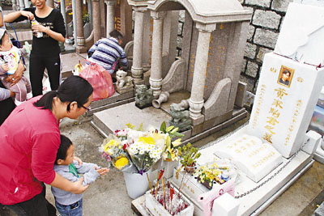

中新网4月6日电

清明节时，黄家驹位于香港的墓地十分热闹，墓前放满不少鲜花，去年家驹的墓地曾遭人破怀，其家人已经作出维修，原本家驹碑上的黑白相片也换上另一张彩色照。

香港“文汇报”消息，黄家驹，一班忠实歌迷依然在清明节去扫墓，其墓地曾经遭到破怀现已得到修葺，吉他墓碑已重新刷上油漆，碑上也换上一张彩色相片，歌迷又摆放着迷你吉他伴着家驹，墓前有歌迷带来的鲜花、信件、朱古力等物品，坟场方面也特设多个箱仔供歌迷摆放香烛、祭品。
