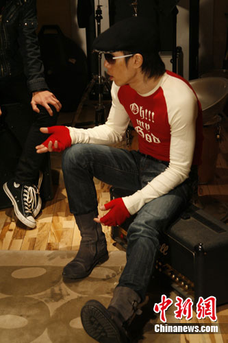

黄贯中侃侃而谈

中新网11月15日电

香港著名摇滚音乐人黄贯中日前在北京监制“红牛新能量音乐计划”合辑五《黄贯中&沈黎晖自选辑》。14日主办方组织了媒体探班活动， 46岁的黄贯中不仅大谈对摇滚乐的理解，更不服老地说：“给我一把吉他，我会比谁都年轻。”

## 解读摇滚乐：很和平很美好

近日，黄贯中胞弟黄贯其在成都一酒吧演出时，被场内斗殴的人群误伤左手，提到弟弟的伤情，黄贯中指着虎口叹息：“他现在缝针出院情况还好，但当时伤口能看见骨头，弹吉他的都知道，这对他影响很大。”对于大众对摇滚乐容易引发歌迷冲动的质疑，黄贯中强调说：“怎么会！摇滚乐强调的是和平，和冲动没有关系，是流氓闹事而已。摇滚人的内心都很纯净，激情都在音乐中释放。摇滚乐很美好。”

## 回忆摇滚30年：曾被爸爸打

探班当天，入选合辑的能量乐队旅行团，以及今日立秋、9 in summer、bigger bang、指人儿、卡木堂等乐队进棚录音，并与黄贯中展开对音乐的交流，有乐手表示从小就喜欢摇滚乐，这让监制黄贯中很兴奋，他更透露自己小时候的趣事，黄贯中笑言小时候最早买木吉他，发现音质不对后，凑钱买了把“9手”的旧电吉他，插在家里的音响由于音量太响导致音响损坏，挨了爸爸的一顿打。

## 不承认代沟：给我吉他,一样年轻

采访中，黄贯中大赞内地有太多好乐队，并希望通过合作把他们推向国际。他欣慰地说：“以前摇滚乐都是地下的，这样不公平，摇滚乐其实是流行音乐，一种有态度的东西，现在能被人们发现和重视，很好。”46岁的他坦言和年轻乐手没有代沟，他说：“给我一把吉他，我比他们还年轻！有人问我多少岁，我说46岁，他说我骗他，其实我就是玩摇滚，多摇滚就这样啦！”

黄贯中与入选歌手沟通

黄贯中与能量乐队旅行团
