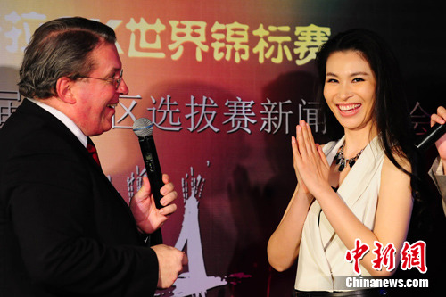
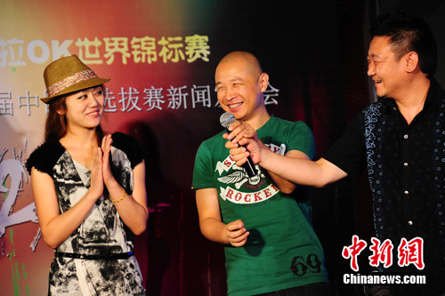

中新网6月23日电

22日，诞生于美国的KWC卡拉OK世界锦标赛在北京举办启动仪式。歌手张瑶、音乐人王童语等人助阵启动仪式。据悉，今年是KWC和中国地区的首次合作，本届大赛的决赛城市设在爱尔兰的都柏林，各国选手最终将在都柏林进行最后的角逐。

此次KWC登陆中国还请来明星评审团，潘粤明、爱戴、瞿颖、叶世荣、张瑶等明星云集，更有著名音乐人小柯、金牌制作人王童语等音乐巨匠坐镇，为大赛保驾护航。

KWC是卡拉OK世界锦标赛(Karaoke World Championships)的英文缩写，大赛主要面向非专业的卡拉OK爱好者，在全世界范围选拔最有影响力及号召力的男女K歌手，大赛自2003年成立起就定位于为非专业选手打造亲民平台的国际音乐赛事，足迹遍布世界四个大洲，四十二个国家。今年KWC将在在中韩两国设立赛区，为每一位参赛选手打造充满欢乐的专业歌唱竞赛平台。
