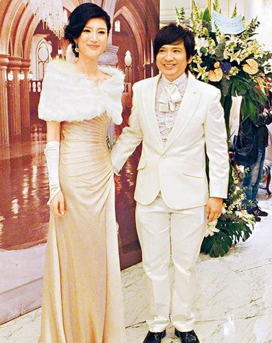
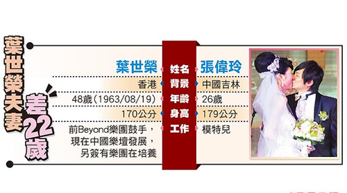

Beyond鼓手叶世荣（右）昨在北京甜蜜成婚。图片来源：台湾《苹果日报》

中新网12月28日电

据台湾《苹果日报》消息，2005年解散的Beyond乐团鼓手叶世荣，昨日在北京迎娶26岁模特儿张伟玲，48岁的叶世荣与女友相差22岁。婚宴上虽有用Beyond歌曲当菜名，但Beyond另两位团员黄家强、黄贯中都未受邀请，两人昨透过媒体恭喜他，黄家强则承认：“有点失望。”

1983年成军的香港Beyond乐团，是香港最具代表性乐团之一，1993年主唱黄家驹在日本录节目时出意外身亡，2005年宣布解散后，鼓手叶世荣转往内地发展，昨婚宴席开30桌，穿白西装的叶世荣十分低调，不但谢绝采访，就连Beyond团员黄贯中及黄家强也没被通知，到场的艺人就只有叶世荣发掘的乐队EVER。而黄贯中日前到台湾演唱，相恋10年的朱茵爱相随，不过两人未有结婚打算。

昨晚叶世荣婚宴，新娘虽比他高半个头，但叶世荣走到哪里都牵着新娘的手，看得出来对新娘十分疼爱。鼓手出身的叶世荣在现场放置一套鼓，并安排数名音乐学校受训的小朋友表演，他也上场表演一段来娱乐宾客。

叶世荣夫妻 差22岁 图片来源：台湾《苹果日报》
