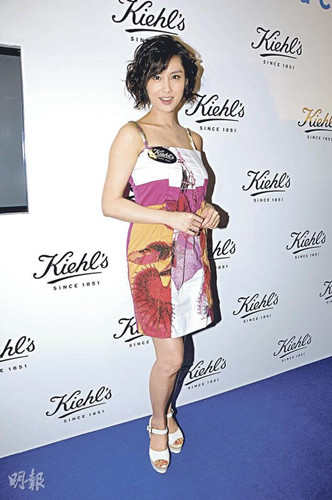

图片来源：香港《明报》

中新网2月14日电

据香港《明报》消息，盛传怀孕的朱茵昨日出席活动，她以一头短发配衬松身裙，孕味甚浓，不过她接受访问时肯定地说“我绝对无宝宝”。问她是否验过孕？朱茵笑说：“我一定等婚后才生小孩，而且一直对结婚抱随缘态度。”

朱茵不欲多谈传患病的罗慧娟，反而替传婚变的老友梁小冰辟谣，她说：“小冰与陈家辉排除难关结婚，我对他们的婚姻有信心，可能绯闻是误会。”

朱茵自言男友黄贯中一样占有欲强和敏感，所以一向言行避忌，她笑说：“我怕未讲绯闻，便有血案，那就不好了。认识他的人都不会对我有非分之想，他赶走我的狂蜂浪蝶。”
