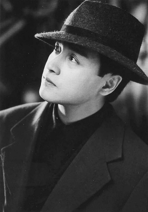
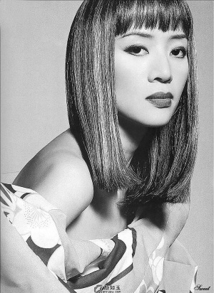
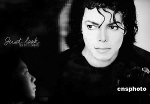
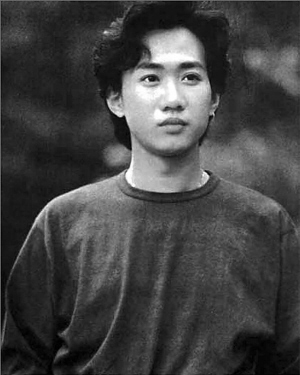
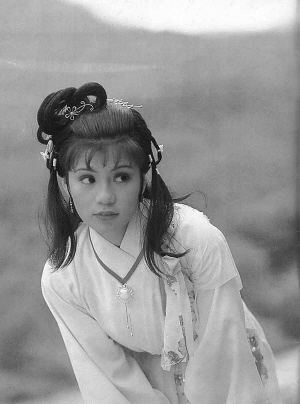
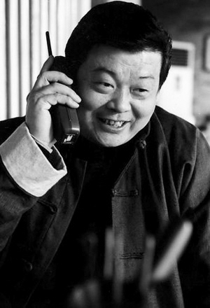
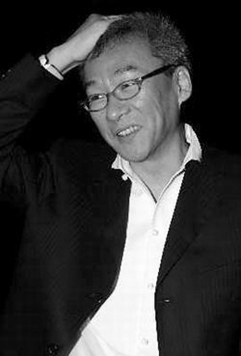
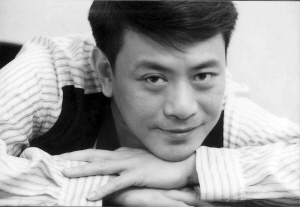
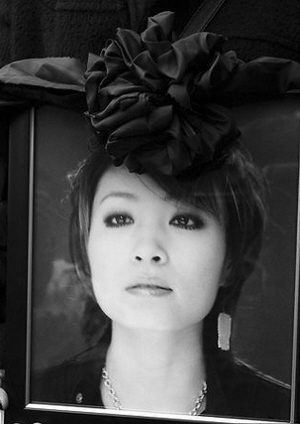
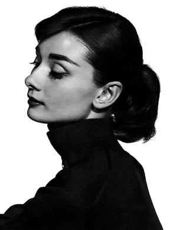

春暖花开，天清地明，清明节不是忌日，不是鬼节，不是追悼会，既有祭扫故人的离别泪，也有踏青游玩的欢笑声。但不管是踏青还是扫墓，总有一些人值得你追忆……他们生前曾像一束光，照亮过我们的一段旅程，他们的离去，惊动了我们的青春，让我们更加懂得生命。在插柳的季节，让我们以笔为香，遥祭那些年爱过的明星……

## 张国荣(1956-2003) | 生或者死，都要完美而独特

虽然已经很多年了，但是那个夜晚，所有的细节好像都刻在了脑海。当听到“张国荣跳楼啦”这个消息，第一感觉是个愚人节玩笑，而后马上意识到这是个事实。于量找出“哥哥”1997年红馆演唱会碟片一遍一遍地看，怎么都觉得不可思议：那个世间再无第二的男子，那个娇媚却不带猥琐的娘味的男子，他怎么就纵身一跃结束了自己的生命呢？

想起张国荣，脑海里总是闪出《纵横四海》里他潇洒地转身走开，对着背后一挥手的样子；想起《霸王别姬》里上了油彩的脸。他的魅力和情感很明晰地就可以通过细微的动作传递出来，连背影也能告诉你一种感情。表演这种东西，真的是一种天赋。这是可遇而不可求的。

自此之后，“愚人节”再也不是原本的愚人节。有人说，张国荣选择在愚人节离世，是想要跟世人开个玩笑吗？他怎么想的，永远成谜。不管是生抑或是死，他都要完美而独特。

## 梅艳芳(1963—2003) | 华丽的告别，歌者永恒

那年年底，正在忙于娱乐圈的年终盘点，电脑上突然跳出了一个消息，说香港娱乐圈的明星都跑到医院去看望梅艳芳。当时就有一种不祥的预感，但依然心存侥幸……第二天一早，所有的媒体都是梅艳芳的怀念专题，娱乐圈里当得起“天后”称号的女人，又少了一个。

怎么也忘不了在电视上看到她告别演唱会的最后几个镜头。她穿着华丽的婚纱，背影孤单落寞，却异常坚强。音乐响起，她慢慢走进了台阶后的那扇门，背影从舞台上消失了，但却留在了大家心里。

就在那一场演唱会，梅艳芳哽咽着说她嫁给了舞台，然后泪如雨下。那时的她已经病入膏肓,但她却用行动证明了那句话：歌者永恒。

## 杰克逊(1958-2009) | 愿天堂里没有误解

还记得2009年得知迈克尔·杰克逊突然去世的消息时，头脑一片空白，只是不断感慨为何一段传奇就这样骤然落幕。我印象最深的MJ，不是那个在舞台上光芒四射的天才，而是台下那个更温柔、更充满善意的大男孩。也许公众曾误解他，也许媒体曾“妖魔化”他，但他却用爱回馈着这个社会：一个人支持世界上39个慈善救助基金会，是全世界以个人名义捐助慈善事业最多的人。可惜这一切大多数都是在MJ死后才为人所知。而那些让MJ生前备受困扰的“丑闻”，不少也是在他死后才得以澄清。

天堂里有了MJ，不愁没有好音乐。但愿在天堂里的MJ，也不要再有被误解的痛苦。

## 黄家驹(1962-1993) | 闪光灯下从不迷失

变故发生在1993年的夏天，见过很多上了位就变得非常奢华的人，可录影里的黄家驹让我印象深刻。他曾痛批香港是娱乐圈，不是乐坛。不管红或不红，他都不像其他明星那样衣着鲜艳。他极力淡化自己在乐队中的突出位置，队友演唱时，家驹常有意无意地退后或走开，让灯光不聚焦他。

## 翁美玲(1959-1985) | 她在天国，愿一切都好

那个冰雪聪明、娇俏可爱的“黄蓉”，在那个娱乐资讯匮乏的年代，给我们带来了快乐。那年夏天，一个同学告诉我，“黄蓉”死了。我当时脑子就蒙了，眼泪也刷刷落了下来。不满10岁的我，第一次感受到一个自己“认识的人”的离世所带来的悲痛和惋惜。

后来，我渐渐长大，也会偶尔想起翁美玲以及她自杀的原因。情海无舟，缘尽十八。无论如何，希望她在天国，一切都好。

## 傅彪(1963-2005) | 演绎卑微中的壮美

如果说哪个演员演小人物在我心里留下了不可磨灭的记忆，傅彪当仁不让。傅彪一生演戏演得几乎全是小角色，一生唯一一次获奖也是金鸡奖最佳男配角。他演的这些个小人物、小配角，戏都不多，却演出了卑微的人如何经历生活的酸甜苦辣，观众们也从这些卑微里看到了壮美。

傅彪踏实演戏，从不炒作，也很少宣传。我曾经在北京发布会上见过一次傅彪，他就像邻居家的老大哥，前前后后地忙活，仿佛他就是一个工作人员。跟记者采访聊天时，一点架子也没有，非常朴实实在，让人心生信任和亲近。

## 杨德昌(1947-2007) | 想继续听他在电影中骂人

看杨德昌不能让人高兴，他几乎把所有的电影都弄成悲剧。《独立时代》、《麻将》流露出对整个社会特别绝望的态度。他总是揭露现代人的无聊和无耻，他总是很愤怒很辛辣，有时对于观众来说简直就是教训的口吻。传说中的杨德昌很凶，就像吴念真的儿子所说的，“杨德昌伯伯爱电影大过爱人”。

## 罗文(1944-2002) | 爱惜自己，好好生活

缅怀罗文。在上世纪80年代流光溢彩的香港歌坛，像他一样能够与张国荣争辉、与梅艳芳斗妍，令张学友礼敬三分的艺人，真的不多。

可就是这样气韵不凡的人，在57岁，人生正当盛年之时，就因绝症去世。他太勤奋了，以至于像蜡烛一般在两端同时燃烧自己，让大家在痛心之余，完全无语。

随着年纪增加，我默然明白到：罗文的离去其实给了大家一个很好的启示——爱惜自己，也等于爱惜所有爱着我们的人。所以，再一次听到罗文美妙的歌声时，我会产生一个与之完全不相干的念头：给我一个好身体，我一定好好生活，真的。感谢罗文！

## 陈琳(1970—2009) | 女人之间友谊常在

记得当时的报道说，陈琳被发现在闺蜜家跳楼身亡，当警察来到楼上闺蜜家调查时，闺蜜正在做早餐，毫不知情——到底是因为什么样的男人让一个女人连闺蜜为她煮的早餐也不吃，就决绝地离开？死者长已矣，这个问题不会有答案，但当时在我的内心却激荡起这样的涟漪：很多时候，男人不靠谱，女人还是要和女人做朋友。

## 奥黛丽·赫本(1929—1993) | 永远的赫本，永远的女神

和很多人一样，看《罗马假日》被其中青春甜美的公主“秒杀”。因为电影院里一个半小时的惊艳，后来还专门买了她的传记。这是我现如今仍经常拿出来翻翻的一本书，除了她最经典的清纯形象，赫本步入中晚年后虽然眼角布满皱纹，但素颜依然优雅。那时的赫本，倾心于慈善事业，将她的美与爱播撒到贫穷地区孩子的眼里、心里。

1993年，赫本因癌症离开人世，让无数影迷为之扼腕落泪。当时还只是初中生的我，虽然过了很久才得知她已经离世的消息，但却深信，再不会有人如她一般美丽——不是漂亮，是美丽。
