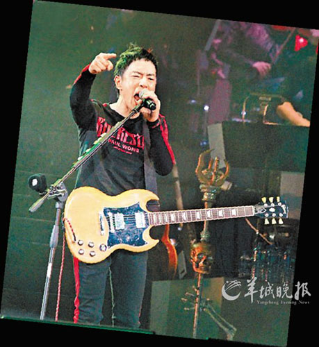

黄贯中

据香港媒体报道，黄贯中前日现身香港书展为自己的新书举行签名会。据悉，书内收录了其女友朱茵和爱犬藏獒的照片。黄贯中透露，等朱茵肚子里的宝宝出生时，他会陪女友进产房并拍照。“朱茵叫我用心做事。她的肚子越来越大，脾气也越来越大，我不想她受刺激，所以尽量不让她看负面报道。”黄贯中此言是针对自己近日与某香港记者爆发的骂战。

刚刚结束红馆演唱会的黄贯中，因不满香港某记者写其演唱会上座率只有七成的报道，吐槽称该媒体在访问他的时候，更多的是关心八卦娱乐问题，“连一条有关音乐的问题也没有问过，我用了大半生玩音乐，换来的是这样，十分心痛！”而该媒体记者也不甘示弱，在报纸上撰写评论，抱怨黄贯中对待记者不够礼貌，并无理指责和骚扰其同事。连日来，黄贯中和该记者的骂战不断升级，7月17日凌晨1:08，黄贯中直接在微博喊话该记者：“星岛日报辣子，子棠，我已忍无可忍，你心肠狠毒，还不准支持我的好记者说句公道话，算什么记者？”他还称，多年来该记者“挑拨Beyond成员，令爸爸气得中了风，意图推翻我事业，诅咒我妻儿……”并质问该记者：“十年前你已一直搞我，我有什么得罪你？为何要怀恨十年？”情绪激动之余，黄贯中更爆出狠话威胁对方小心挨打：“常有人说君子报仇十年未晚，有仇不报非君子。有些娱记说我是烂仔，以为可以抹黑我，但我不气，因为我不会报仇，我只会向不公义的(事)立时反击，是本能反应，不懂记仇，更不会笑里藏刀。为何要怀恨十年？为了做报仇的君子？我就宁做个顶天立地光明磊落的滚烂仔！君子这两字实在害人不浅，要算账就现在算。”

看到曾经的队友深陷骂战漩涡，Beyond另一成员黄家强于7月18日1:54发微博，呼吁当事人冷静处事，不要令Beyond蒙上污点。其后黄贯中转发该微博，反问黄家强：“当你的妻儿被如此诅咒也无感觉？”两人之间火药味十足。而在家安胎的朱茵则发微博力挺爱郎：“你曾经说过把所有运气用在我身上，我很想告诉你 ，我也把我的幸福全部押在你身上，你永远是我的战郎。”向来对朱茵呵护有加的黄贯中，随即回复：“放心吧，有我在，没有人可伤害你和我们的宝宝的。”日前，黄贯中在香港出席某活动时又放言：“我已经退了二十步，无法再退，家人被骂我不出声就是傻瓜！”
