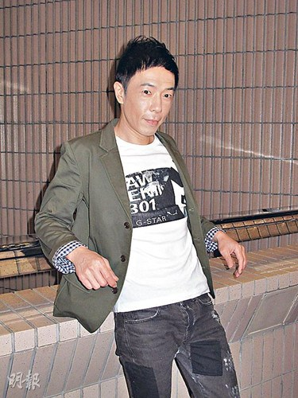

图片来源：香港《明报》

中新网9月19日电

据香港《明报》消息，黄贯中昨日出席活动时，表示将于11月23日到台北演出一星期，由于演出日子撞正朱茵的预产期，所以非常担心，准备要随时缩短行程返港陪产。他透露朱茵的肚子已很大，但身材及样子都没变，可算是得天独厚！提到孩子性别，黄贯中继续口密，更拒绝透露婴儿房的颜色主调及朱茵的肚子形状。

随孩子快将诞生，黄贯中表示心情既紧张又兴奋。至于二人的婚礼？黄贯中表示会待孩子出世后3个月，朱茵成功收身后才举行，届时高调还是低调地进行则留给女友决定。问朱茵能否于产后3个月就收身成功？他说﹕“我对她有信心。女人要减肥，决心比核弹还要大！”
