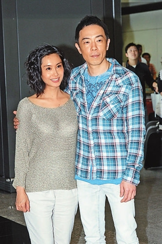

图片来源：香港《大公报》

中新网10月25日电

据香港《大公报》消息，朱茵与黄贯中的“小龙女”出生了，朱茵已跟宝宝回家。今天是朱茵的生日，但荣升爸爸的黄贯中因为连日来都要为电影《古惑仔》开工，故无暇发布宝宝的相片，相信也未有时间特别为朱茵庆祝。黄贯中的助手Ada表示他下次见到记者，便会跟大家分享做爸爸的感受。贯中昨日为电影开工，透露宝宝重六磅多，并称朱茵是剖腹生产的，又透露跟朱茵早已注册结婚。
