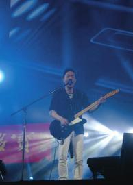
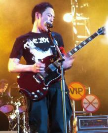

中国好声音官方微博贴出的黄贯中参与跨年的照片。

昨日，前Beyond乐队成员黄贯中跨年夜被浙江卫视“遗忘”的消息，成为娱乐圈的焦点话题。虽然浙江卫视方面多番解释，仍挡不住众多Beyond乐迷为偶像叫屈。

## 爆料：黄贯中跨年夜被遗忘

1日凌晨2点，黄贯中乐队成员麦文威在微博中爆料，称主办方浙江卫视完全不尊重黄贯中和乐队成员，在倒数计时时刻没有叫黄贯中上台，更在黄贯中及乐队没有出场时就宣布晚会结束。工作人员开始清理舞台，摄影师也停止拍摄后，黄贯中及乐队坚持上台，为没有离开的歌迷继续演出，并对歌迷致歉。黄贯中本人也于1日7点多发布微博称，“我在疑惑的舞台上奏起了吉他，音乐把那些正离场的人群拉回来，场地的大灯都已打开，摄录也停了，连工作人员都在我背后撤了，我的团队都疯了，但我没有让音乐停下，我怒，但不沮丧，甚至庆幸自己拥有这种音乐，它叫摇滚乐。”

## 回应：未邀请艺人嘉宾参加

对此事件引起的各种猜测，浙江卫视总编室副主任许继锋1日回应称，浙江卫视跨年晚会主题是《中国好声音》学员对战，并没有邀请艺人和嘉宾参加。至于黄贯中的到场，许继锋说可能是由这次晚会的执行方灿星公司的邀请，“但不是作为浙江卫视跨年演唱会的表演环节出现，也没有在浙江卫视上播出的要求。”许继锋还表示，浙江卫视在之前的各种宣传渠道，都没有提到过黄贯中作为特别嘉宾亮相这个说法。

## 声明：有人在利用此事炒作

1日深夜，浙江卫视官方微博声明称：浙江卫视跨年晚会的宣传从来没有“黄贯中担任特别嘉宾”的提法，故明显有人在利用此事炒作，抹黑浙江卫视，我们保留追究当事者责任的权利。

电视制作人陈伟则晒出台本照片称：图片中的台本很明确：1、执行团队本来就是将黄贯中先生的新年表演安排在跨年晚会直播结束后的；2、黄贯中先生并非浙江卫视跨年晚会的表演嘉宾。

虽然主办方多番解释，这一事件仍引起众多Beyond乐乐迷的不满。截至昨日下午5点，黄贯中的微博收到评论留言近17000条，众多乐迷安慰黄贯中“我们支持你，不要伤心。”

综合《京华时报》等

星微博

## @老占Lo-Jim(麦文威)

我们愤怒了！主办单位完全沒有尊重Paul和我们……1.倒数时刻完全没有人叫Paul 一起上台，我们呆坐在后台……2.我们还未出场司仪已对观众说再见和出字幕……全场观众以为完了开始离开……3.工作人员已开始清理舞台，摄影师更放下拍摄器材……我们不理继续努力完成演出，在此对不起各位歌迷……1月1日02:12

## @黄贯中

这就是新年的第一天：“我在疑惑的舞台上奏起了吉他，声音把那些正离场的人群拉回来，场灯关了，摄录也停了，连工作人员都在我背后撤了，我的团队都疯了，但我没有让音乐停下，我怒，但不沮丧，甚至庆幸自己拥有这种音乐，它叫摇滚乐。”谢谢上苍给我那么好的歌迷和这一月一号。1月1日07:18

## @浙江卫视中国蓝

1.  浙江卫视跨年晚会是以“中国好声音”“对战”主题的演唱会，不是明星拼盘式演出，没有邀请除“好声音”学员之外其他艺人参加演出。
1.  黄先生应该是由节目执行灿星团队邀请担任现场表演嘉宾，事先也没有要求浙江卫视在跨年节目中播出。
1.  浙江卫视跨年晚会的宣传从来没有“黄贯中担任特别嘉宾”的提法，故明显有人在利用此事炒作，抹黑浙江卫视，我们保留追究当事者责任的权利。

1月1日23:49
