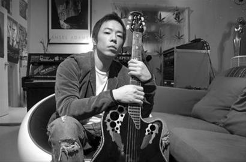

黄贯中在被“遗忘”后坚持登台演出

前Beyond乐队成员黄贯中这个跨年夜却过得有些闹心——身为嘉宾被邀请去电视台的跨年晚会，结果却遭遇“遗忘”，直到直播结束他和乐队仍未被请上台演出。黄贯中1日凌晨通过微博吐槽此事后，随即排上跨年大战囧事榜首，并引发歌迷强烈不满。

昨日深夜，结束了湖南卫视《我是歌手》即将于本月18日开播的首期节目录制后，黄贯中在长沙接受本报记者专访时，首度开口回应跨年演出“被遗忘”的乌龙事件。与微博上透出的“怒火”相比，昨晚的黄贯中心情已经平复，被问及事件的来龙去脉以及是否收到邀请方的道歉时，黄贯中“一笑而过”，并称“没有要求对方道歉”，他还颇为调侃地表示，要感谢出现这个状况，让自己有机会感受特别的体验。

## 微博怒曝被“遗忘”

1月1日凌晨，黄贯中乐队的成员麦文威发微博称，浙江卫视“中国好声音跨年演唱会”的特别嘉宾黄贯中被“遗忘”，直到主持人宣布晚会结束也未能上台，最后黄贯中和乐队成员在工作人员已开始收拾场地的情况下，坚持为没有离开的歌迷演出，并连唱十首歌曲。随后，黄贯中也发微博证实了此事，“我的团队都要疯了，但我没有让音乐停下，我怒，但不沮丧，甚至庆幸自己拥有这种音乐，它叫摇滚乐。 ”此事一出，网友们纷纷指责主办方太不尊重艺人。

黄贯中“被遗忘”事件发生后，浙江卫视以及“好声音”制作团队(灿星制作)一时成为网友炮轰的对象，不过双方都表示，黄贯中不在演出邀请之列。浙江卫视称，该台的跨年晚会没有邀请除“好声音”学员之外其他艺人参加演出，黄贯中应该是由节目执行方灿星制作邀请的，事先并没有要求浙江卫视在跨年节目中播出。而灿星制作则表示，是演出现场的酒店之前邀请了黄贯中进行跨年演出，“各方协调明确，好声音跨年演出结束以后黄先生的演出才开始，黄先生演出内容不进入浙江卫视跨年直播。 ”

昨晚，星空卫视通过官方微博发表致歉声明称，“2012年底星空卫视与澳门一家酒店商讨举办新年演唱会，并通过酒店邀请了黄贯中先生。与此同时由浙江卫视和上海灿星联合制作的‘浙江卫视《中国好声音》跨年演唱会’也与这家酒店商讨共同举办。各方协调，在浙江卫视跨年演唱会全部结束之后，由星空卫视转播黄贯中先生在同一场地进行的新年演出。由于现场技术、设备、人员沟通出现了问题，对后一场演出预告不足，加之前场演出结束后，黄贯中先生的乐队需要重新调试乐器，现场约有20分钟左右的时间没有任何舞台演出串联，导致部分观众因不清楚情况提前离场，星空卫视直播信号也不能中断如此长的时间，黄贯中先生的演出最终没能在星空卫视进行转播。在此，星空卫视特向黄贯中先生致以诚挚的歉意，同时，也向受到影响的浙江卫视深深道歉！ ”

## 没要求电视台道歉

黄贯中跨年演出“被遗忘”事件涉及到的浙江卫视、制作方灿星与星空卫视，最初说法并不一致，导致事件升级，引发更多歌迷不满，并强烈要求电视台向艺人道歉。

昨晚，刚刚结束《我是歌手》首期节目录制的黄贯中，在接受采访时显然已经从最初微博上的“愤怒”转为淡然，态度也有了180度大转弯，“我自己不介意，也没要求电视台道歉，这也不是我需要烦恼的事情。”至于是否会继续追究责任，他表示，那是经纪人以及公司跟电视台方面的事，黄贯中甚至笑说“自己都已经忘了这件事”。

而当记者请他讲述下跨年当晚乌龙事件的过程时，黄贯中尽管有些回避，但还是坦言，“虽然当时可能有点惊讶，但是我不相信歌迷们会就这样离开我，结果(开唱后)又看到很多歌迷走回来，那种感觉很特别，很感动。可能很多歌手都不会有这种经历，就是你可以用音乐把已经快要离场的观众给叫回来。所以我反而还要感谢出现这个状况，让我有这样一个机会，可以在舞台上感受这种经验。”他同时表示，“到处演出都可能出状况，每一个人承担起自己的责任，对我的音乐不影响，就没有大的困难。 ”

## 工作太忙遭朱茵投诉

每次来内地演出，黄贯中必唱的曲目中肯定少不了《海阔天空》，昨晚录制《我是歌手》时同样如此，对此，黄贯中表示每次唱这首歌都会有一种奇怪的感觉，“有开心在里面，中间又有许多不开心，百感交集，久久不能平复。 ”

尽管入行多年，但黄贯中依然保持着对音乐的热爱和激情。虽然工作太辛苦，也曾令他想放弃音乐，但最终还是放不下，“在家待了一个月，就觉得浑身不舒服，好像生了病一样，结果还是拿起吉他，弹起了钢琴在家里玩音乐。没有音乐，我会死，其实我拥有一个全世界最好的职业，既可以玩音乐，又可以赚到钱，太美好了，所以现在不想改变了。 ”

如今已经升级当爸爸的他，也在新年为自己安排了大量工作。“这次回去就要拍电影了，还有一些除了音乐之外的工作。 ”为此，他遭到了太太朱茵的投诉，“老婆投诉为什么每天都在工作，我说作为男人，当然每天都要工作啊。 ”
