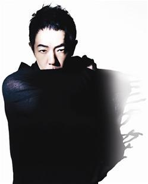

跨年夜之后，一个尴尬的“被遗忘”事件，让舆论聚焦到一贯低调的黄贯中身上。

被邀请当演出嘉宾，却被“遗忘”在后台，这一事件的离奇和尴尬，使得浙江卫视遭到黄贯中歌迷排山倒海般的谴责。前日，一封星空卫视的道歉函让“遗忘门”的是非对错终于厘清，而参与湖南卫视新节目《我是歌手》录制的黄贯中也首次面对媒体，感谢那些让自己被遗忘的人，“他们给了我一次前所未有的舞台体验。”

## 责任厘清 | 星空卫视致歉浙江卫视躺枪

1日凌晨，黄贯中在微博突然向歌迷致歉，“在电视机前白等一晚的朋友们，我黄贯中万分对不起你们，再次向你们谢罪！”原来，应邀在澳门跨年夜表演的他走上舞台时发现，场灯开了，录影停了，观众走了，自己被遗忘了……这条微博一日内被转发、评论数万次，几乎所有留言都将矛头指向黄贯中演出前的直播团队浙江卫视，不过，浙江卫视随后发布声明，表示他们是躺着中枪。

3日晚，始作俑者星空卫视终于道歉并在微博还原事件真相：是他们邀请了黄贯中参与新年演出，不巧与浙江卫视好声音跨年演唱会撞期，协调后几方达成一致，在浙江卫视跨年结束后，星空卫视继续转播黄贯中的演出。但由于当天沟通出现问题，加之对后一场演出预告不足，在20分钟的乐队准备时间里，部分观众不清楚状况离场，星空卫视直播信号也因不能中断太久而停播。

## 松了口气 | 现场收获感动黄贯中不烦恼

真相终于还原，“遗忘门”确是事故而非“炒作”。黄贯中心态已然恢复平静，“这其实不是我要去烦恼的事，我说完就完了，我不会要求谁道歉，要解决也是经纪人去联系解决，但这可能已经升华到他们跟电视观众和歌迷间的问题。”

他说，不管现场出现怎样的突发状况，自己在每个场合演出都是带着一百分的热情，虽然当时的情形令出道30年的他感觉讶异，但音乐继续，“也有人等着我，也有人冲着舞台走过来，我怎么可能走，怎么可能离开呢？而且我心里喜欢玩摇滚，就想，‘好哇！反正我是来玩音乐的！’结果有些人是离开又走回来的！那种感觉很特别，很感动。如果不是（这次的事），我不会收获这种感动。所以我其实应该感谢那些人！”
