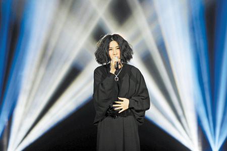
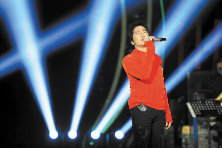

尚雯婕

齐秦

自从上周五湖南卫视重磅音乐节目《我是歌手》播出以来，记者的电话就被打爆，许多朋友纷纷来问究竟是谁被淘汰了？接下来他们要唱什么歌？其实，这些问题根本不需要问，因为出于保密的需要，并未参加第二期节目录制的记者们也不知道答案。不过22日晚，《我是歌手》第三期开录，记者前往探班，多方打探，终于挖到一点蛛丝马迹，以飨读者。

## 观众评审 | “千万不要喊我爱你”

22日晚，记者跟随观众评审进入《我是歌手》录制现场，真是人山人海，热闹非凡，中选前来的观众都十分兴奋，有一位女士告诉记者，通过报名通道投递资料后，芒果台打了3个电话回访确认，终于来到现场当评委，“那肯定开心不，最喜欢齐秦哒”。

开录前，暖场的导演十分细致地给现场观众上起了“培训课”，由于录制现场是全live配置，歌手进入场内之后每人都有十秒钟的适应期调整状态，因此导演特别告诫：“到时候好安静的，千万别趁着这个时候喊‘我爱你’啦，吓死人的啦。”

除了禁止“表白”，一名合格的观众评审还需要遵循以下几条：鼓掌要够劲，最好能持续20到30秒，“鼓励歌手”；鼓励现场观众全情投入，只要不影响到歌手演唱，翩翩起舞、挥手、晕倒都在可允许范围内；最后也是最重要的，现场观众必须记住自己是评委，不是粉丝，听完歌要对自己的投票负责。

## 修改赛制保密“被淘汰的那位”

《我是歌手》每两期会淘汰一名歌手，而谁将会是第一位被淘汰的呢？不得不说，芒果台实在太“狠”了。22日第三期录制现场，导演组将赛制修改为7+1模式，除了7位要继续PK的歌手外，被淘汰的那位也需要一起进行返场演唱，同样进入投票名单。所以在现场你根本不知道谁在继续比赛，谁是在进行返场表演，一切只能等节目播出的时候才能尘埃落定。

不过，有了前两期节目的铺垫，歌手们在第三期的表现也是“拼了”，除了第一期之外，歌手都要改编演唱别人的歌曲。当晚，陈明和黄绮珊两位歌坛大姐大十分令人惊艳，陈明以一袭黑色蕾丝长裙上场，抒情开唱间或起舞，一改往日风格，气质颠倒众生；而黄绮珊也带来一首改编自惠特尼·休斯顿演唱的英文经典歌曲，配以长发披肩，长裙飘飘，演唱一如既往兼具细腻情感和超强爆发力，引得记者座位前排的两位老外观众边唱边跳，最后更带头起立鼓掌。

## 歌手接受采访自曝“排名顺序”

当晚录制结束后，歌手们又来到化妆间接受记者采访。出于保密的需要，“排名顺序”和“演唱曲目”都被小心翼翼地设置为“敏感词”，而歌手也对前两期的成绩秘而不宣。不过，当晚心情轻松的“小哥”齐秦在采访中不小心说漏嘴，表示在第一期中排名第一的他，第二期投票结束后排名降到了第五名，而与齐秦同时接受采访的尚雯婕则开玩笑表示：“我愿意跟你换”。言下之意，似乎尚雯婕的排名还在齐秦之后。

经过了一轮淘汰之后，歌手们也对这个节目有了更多的理解和看法，面对“如果被淘汰会不会觉得面子上过不去”的问题，沙宝亮就表示“到这里要放弃论资排辈的想法”，齐秦则笑对自己的排名称：“长江后浪推前浪，前浪死在沙滩上。”齐秦还透露，第一期节目播出后，熊天平等圈中好友都给自己打过电话，而这个舞台令自己十分享受，更向记者表示好友钟镇涛、辛晓琪等实力唱将都可以来上节目。

谁被淘汰了？幕后花絮有哪些？第三期演唱曲目是什么？以下是推测猜谜时间：

-   据“舞美师”微博爆料，第一位被淘汰的“竟然是我很喜欢的，大意外，很多人要哭死”，并表示“1号人物怎能就此谢幕，气愤”、“首场营造的神秘紧张怀旧感而让节目发酵为主因，后面没了这个靠什么？”网友由此推断，首位被淘汰的可能正是曾为Beyond乐队成员之一的歌手黄贯中。不过，22日晚录制结束后，黄贯中以“身体不适”为由并未接受采访，是否被淘汰不得而知。
-   由于感冒影响嗓音，首期节目排名垫底的陈明在二期、三期节目中奋起直追，由于每天只能喝粥养病，录制两个星期以来，清瘦不少的陈明自曝体重急速降低3公斤。而工作人员则透露，从来长沙到22日晚，陈明其实已经瘦了4.5公斤，看来，唱歌不失为减肥的好方法之一。
-   同样据“舞美师”爆料，第一位替换登台的歌手是被誉为“催泪歌神”的台湾歌手杨宗纬，由于同样的保密原因，记者只能告诉你们，杨宗纬当天演唱的曲目是天后王菲的一首情歌，歌名为表现庄重严肃情绪的“两个zhi”。
-   至于其他歌手唱了什么改编曲目呢？沙宝亮选择了一首李谷一唱过的湖南民歌《浏阳河》，羽泉则演唱了《不再年轻的boys》，陈明则和金志文合作将《我爱的人哭了》和《因为想你我生了病》结合在一起，令人耳目一新。“小哥”齐秦则唱了《张家老三的曲调》，“黄妈”黄绮珊演唱了电影《保镖》的主题曲。

图片均为湖南卫视提供。
